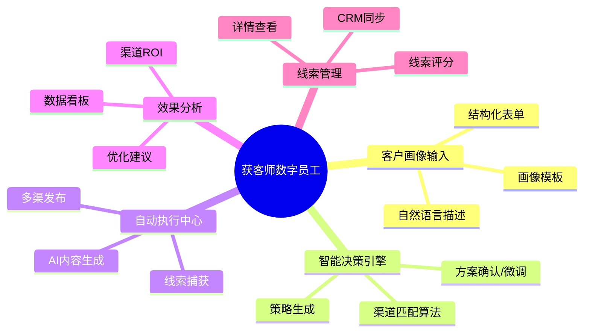
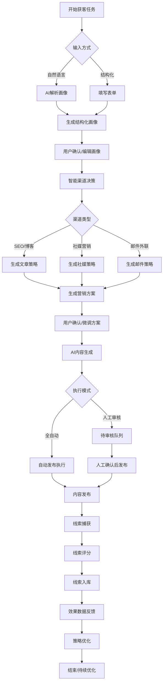
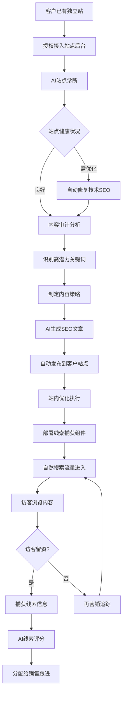
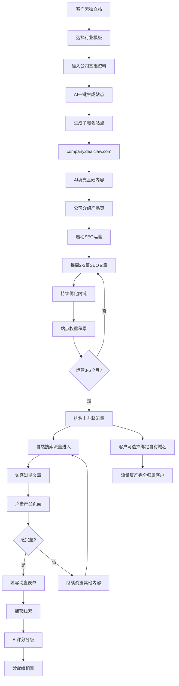
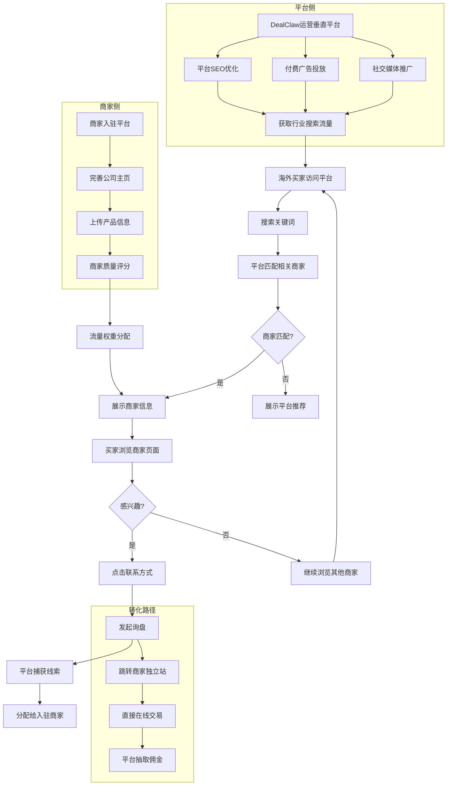
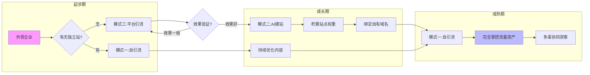
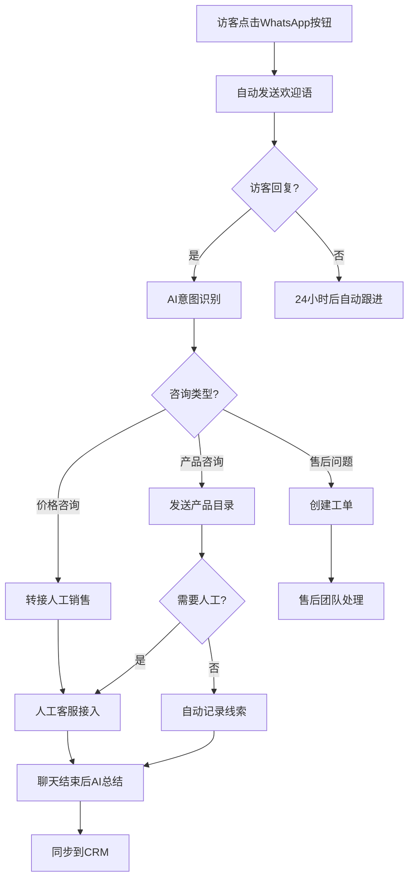
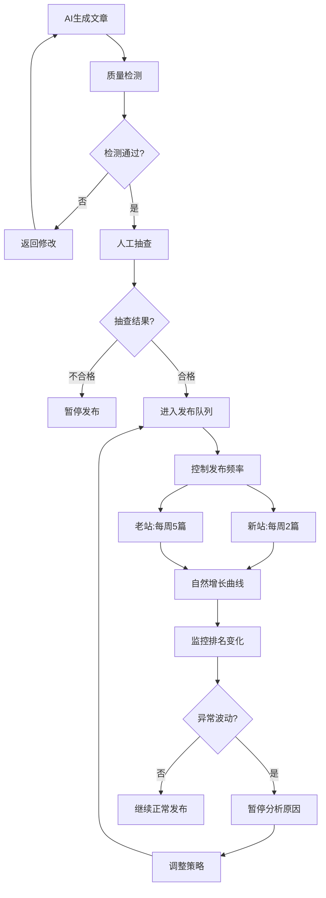
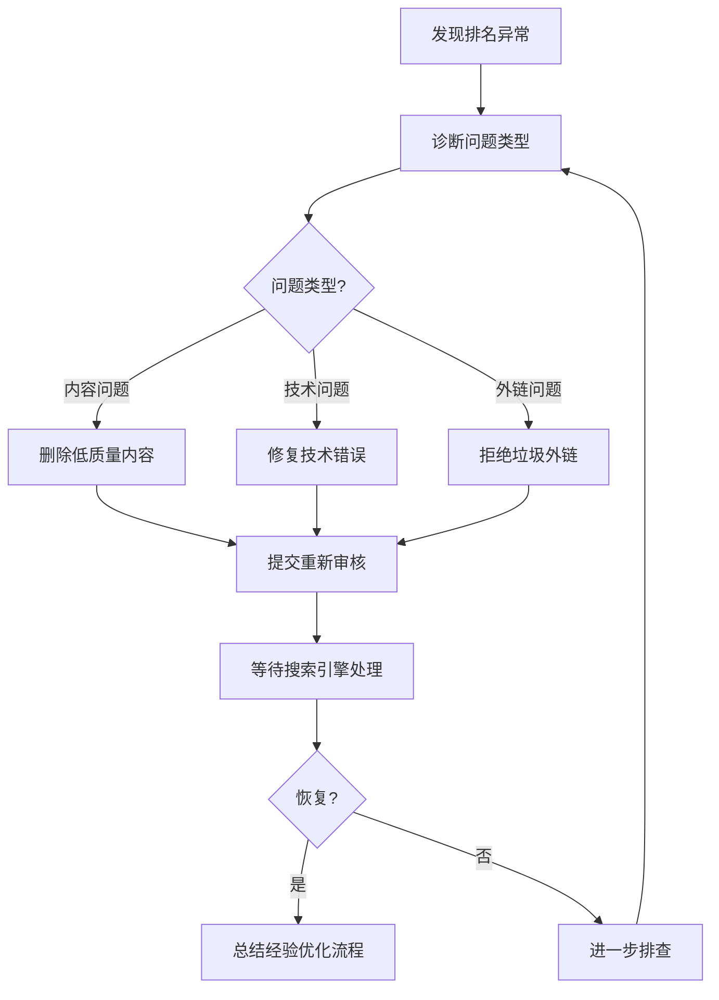

# DealClaw 获客师 - 产品需求文档 (PRD)

## 1. 文档信息

| 字段 | 内容 |
|-----|------|
| 产品名称 | DealClaw 获客师数字员工 |
| 文档版本 | V1.0 |
| 编写日期 | 2026-03-25 |
| 编写人 | Product Team |
| 最后更新 | 2026-03-25 |

## 2. 项目背景

### 2.1 业务目标
	
外贸行业获客环节存在显著的人力浪费和效率瓶颈：
- **Outbound 营销**：邮件、电话等打扰式营销转化率低，人力成本高
- **Inbound 营销**：SEO、社媒等内容营销需要专业知识和持续投入
- **渠道选择困难**：企业不清楚哪种渠道适合自己的目标客户
- **执行落地难**：营销方案制定后，内容生产、发布、运营需要大量人力

**目标**：打造AI驱动的获客师数字员工，实现从目标客户定义到线索获取的全自动执行。

### 2.2 目标用户

| 用户类型 | 用户画像 | 核心诉求 |
|---------|---------|---------|
| 外贸企业主 | 中小型外贸公司老板/合伙人，年营收1000万-1亿 | 低成本、高效率获取精准客户线索 |
| 外贸业务员 | 负责客户开发和维护的业务员 | 减少重复劳动，专注于高价值客户跟进 |
| 外贸市场专员 | 负责公司营销推广的专员 | 专业营销能力增强，一人可管理多渠 |

### 2.3 核心价值主张

> **"告诉获客师你要找什么样的客户，AI自动决策最优渠道、生成内容、执行获客，你只管跟进线索。"**

## 3. 产品架构

### 3.1 功能架构图



### 3.2 用户角色定义

| 角色名称 | 角色描述 | 主要权限 |
|---------|---------|---------|
| 企业管理员 | 公司账号所有者，可管理所有资源 | 全部功能权限，成员管理 |
| 营销执行者 | 负责具体获客任务执行 | 创建任务、查看数据、管理线索 |
| 查看者 | 仅查看数据和报表 | 只读权限 |

## 4. 核心业务流程



## 5. 详细功能说明

### 5.1 客户画像输入模块

#### 5.1.1 自然语言输入

| 字段 | 说明 |
|-----|------|
| **功能编号** | F-01 |
| **功能描述** | 用户用自然语言描述目标客户，AI自动解析为结构化数据 |
| **前置条件** | 用户已登录并创建获客任务 |
| **优先级** | P0 |

**页面元素**：

| 元素 | 类型 | 说明 | 校验规则 |
|-----|------|-----|---------|
| 描述输入框 | 多行文本 | 引导用户描述目标客户 | 最少20字符，最多1000字符 |
| AI解析按钮 | 按钮 | 触发AI解析 | 输入非空时可用 |
| 示例提示 | 文本链接 | 展示示例描述 | 点击填充示例 |
| 解析结果卡片 | 卡片组 | 展示解析出的结构化字段 | 可编辑 |

**交互逻辑**：

1. 用户在输入框中描述目标客户
2. 点击"AI解析"按钮，显示加载状态
3. AI解析完成后，展示结构化结果（地区、行业、公司规模、决策人角色等）
4. 用户可编辑任何解析结果
5. 确认后进入下一步

**异常处理**：

| 异常场景 | 处理方式 |
|---------|---------|
| AI解析失败 | 提示"解析失败，请尝试结构化输入"，提供表单入口 |
| 解析结果不完整 | 标记缺失字段，提示用户补充 |

---

#### 5.1.2 结构化表单输入

| 字段 | 说明 |
|-----|------|
| **功能编号** | F-02 |
| **功能描述** | 通过表单字段精确描述目标客户画像 |
| **前置条件** | 用户选择"结构化输入"方式 |
| **优先级** | P0 |

**表单字段**：

| 字段名 | 类型 | 选项/说明 | 必填 |
|-------|------|----------|-----|
| 目标地区 | 多选 | 北美/欧洲/东南亚/中东/南美/大洋洲/其他 | 是 |
| 目标行业 | 单选 | 下拉选择行业分类 | 是 |
| 公司规模 | 单选 | 初创(<10人)/小型(10-50)/中型(50-200)/大型(200+) | 是 |
| 年采购额 | 范围 | 滑块选择范围 | 否 |
| 决策人角色 | 多选 | 采购经理/CEO/产品经理/其他 | 是 |
| 业务类型 | 多选 | 批发商/零售商/品牌商/制造商 | 否 |

---

#### 5.1.3 画像模板库

| 字段 | 说明 |
|-----|------|
| **功能编号** | F-03 |
| **功能描述** | 提供常见外贸客户类型的快速模板 |
| **优先级** | P1 |

**模板示例**：
- 美国户外用品批发商
- 欧洲电子产品零售商
- 中东建材进口商
- 日本美妆品牌方

---

### 5.2 智能决策引擎

#### 5.2.1 渠道匹配算法

| 字段 | 说明 |
|-----|------|
| **功能编号** | F-04 |
| **功能描述** | 基于客户画像智能推荐最优营销渠道组合 |
| **前置条件** | 客户画像已确认 |
| **优先级** | P0 |

**渠道匹配规则**：

| 客户画像特征 | 推荐渠道 | 权重 |
|-------------|---------|-----|
| B2B/决策人为高管 | LinkedIn + SEO博客 | 高 |
| 北美市场 | LinkedIn + 邮件外联 | 高 |
| 消费品/零售 | Facebook + Instagram | 高 |
| 专业/技术产品 | SEO博客 + LinkedIn | 高 |
| 新兴市场 | WhatsApp + Facebook | 中 |

---

#### 5.2.2 营销策略生成

| 字段 | 说明 |
|-----|------|
| **功能编号** | F-05 |
| **功能描述** | 基于渠道组合生成具体执行策略 |
| **优先级** | P0 |

**策略内容**：
- 渠道组合及优先级
- 内容类型建议（文章主题、社媒形式等）
- 发布频率建议
- 预期获客周期
- 预算建议（如适用）

---

#### 5.2.3 方案确认与微调

| 字段 | 说明 |
|-----|------|
| **功能编号** | F-06 |
| **功能描述** | 展示AI生成的方案，允许用户调整 |
| **优先级** | P0 |

**可调整项**：
- 启用/禁用某个渠道
- 调整渠道优先级
- 修改内容方向
- 调整发布频率
- 设置预算上限

---

### 5.3 自动执行中心

#### 5.3.1 AI内容生成

| 字段 | 说明 |
|-----|------|
| **功能编号** | F-07 |
| **功能描述** | 根据策略自动生成各类营销内容 |
| **优先级** | P0 |

**内容类型**：

| 类型 | 说明 | 输出格式 |
|-----|------|---------|
| SEO博客文章 | 长文，800-2000字 | Markdown/HTML |
| LinkedIn帖子 | 专业社媒内容，150-300字 | 纯文本 |
| 邮件模板 | Cold email序列 | 邮件格式 |
| 图片/视频脚本 | 社媒配图/视频脚本 | 文本描述 |

---

#### 5.3.2 内容审核与发布

| 字段 | 说明 |
|-----|------|
| **功能编号** | F-08 |
| **功能描述** | 全自动发布，支持人工抽查 |
| **优先级** | P0 |

**发布渠道（MVP）**：
- WordPress/自建博客（SEO）
- LinkedIn 个人主页 + Company Page
- 邮件发送系统

**执行模式**：
- **全自动模式**：AI生成后直接发布（默认）
- **抽查模式**：随机抽取部分内容人工确认
- **全审核模式**：所有内容需人工确认后发布

---

#### 5.3.3 内容日历

| 字段 | 说明 |
|-----|------|
| **功能编号** | F-09 |
| **功能描述** | 管理内容发布计划和历史 |
| **优先级** | P1 |

**功能**：
- 日历视图查看已发布和待发布内容
- 拖拽调整发布时间
- 批量操作（暂停、删除、重新生成）

---

### 5.4 线索管理

#### 5.4.1 线索捕获

| 字段 | 说明 |
|-----|------|
| **功能编号** | F-10 |
| **功能描述** | 自动捕获各渠道的潜在线索 |
| **优先级** | P0 |

**捕获来源**：
- 网站表单提交
- 邮件回复
- LinkedIn私信/评论
- 文档下载留资

---

#### 5.4.2 线索评分

| 字段 | 说明 |
|-----|------|
| **功能编号** | F-11 |
| **功能描述** | AI评估线索质量和购买意向 |
| **优先级** | P0 |

**评分维度**：
- 公司匹配度（行业、规模、地区）
- 行为信号（访问页面、停留时长、互动次数）
- 联系信息完整度

**评分等级**：
- 🔥 热门（90-100分）：立即跟进
- ⚡ 高意向（70-89分）：优先跟进
- 💡 中意向（50-69分）： nurturing
- 📌 低意向（<50分）：持续观察

---

#### 5.4.3 线索详情

| 字段 | 说明 |
|-----|------|
| **功能编号** | F-12 |
| **功能描述** | 查看单个线索的完整信息和互动历史 |
| **优先级** | P0 |

**展示信息**：
- 公司信息（名称、网站、规模、行业）
- 联系人信息（姓名、职位、邮箱、电话）
- 来源渠道
- 互动历史（访问记录、邮件往来、社媒互动）
- AI评分及理由

---

#### 5.4.4 CRM同步

| 字段 | 说明 |
|-----|------|
| **功能编号** | F-13 |
| **功能描述** | 线索导出到外部CRM或内置CRM |
| **优先级** | P1 |

**支持导出**：
- CSV 批量导出
- API 对接（Salesforce, HubSpot, Zoho等）
- 内置简单CRM功能

---

### 5.5 效果分析

#### 5.5.1 数据看板

| 字段 | 说明 |
|-----|------|
| **功能编号** | F-14 |
| **功能描述** | 展示获客任务的核心数据指标 |
| **优先级** | P0 |

**核心指标**：
| 指标 | 说明 |
|-----|------|
| 展示/曝光 | 内容被展示的次数 |
| 点击率 | 点击内容链接的比例 |
| 访客数 | 独立访客数量 |
| 线索数 | 获取的线索总数 |
| MQL数 | 营销合格线索数（评分>70） |
| 转化率 | 访客→线索→MQL的转化漏斗 |
| 获客成本 | 单个线索的平均成本 |

---

#### 5.5.2 渠道效果对比

| 字段 | 说明 |
|-----|------|
| **功能编号** | F-15 |
| **功能描述** | 对比不同渠道的ROI表现 |
| **优先级** | P1 |

**对比维度**：
- 各渠道线索数量
- 各渠道线索质量（平均评分）
- 各渠道获客成本
- 各渠道转化周期

---

#### 5.5.3 优化建议

| 字段 | 说明 |
|-----|------|
| **功能编号** | F-16 |
| **功能描述** | AI基于数据给出策略调整建议 |
| **优先级** | P1 |

**建议类型**：
- 渠道调整建议（增加/减少某渠道投入）
- 内容方向建议（哪些主题效果更好）
- 发布时机建议（最佳发布时间）
- 预算分配建议

---

## 5.6 渠道执行详细设计

### 5.6.1 SEO博客获客 - 三种引流模式

获客师提供三种 SEO 引流模式，满足不同阶段外贸企业的需求：

#### 模式一：商家独立站自引流（Bring Your Own Site）

**适用客户**：已有独立站（WordPress/Shopify/自建站）的外贸企业

**核心逻辑**：
```
客户已有独立站 + 历史内容
    ↓
获客师接入站点后台（API/插件）
    ↓
AI 分析现有内容质量和排名情况
    ↓
制定内容优化策略 + 新增 SEO 文章
    ↓
自动发布到客户独立站
    ↓
自然搜索流量 → 客户独立站 → 线索捕获
```

**执行细节**：

| 环节 | 具体执行 | 客户价值 |
|-----|---------|---------|
| **站点接入** | WordPress Application Password / Shopify API / 自定义 API | 无需迁移，直接使用现有站点 |
| **站点诊断** | AI 扫描现有页面 SEO 评分、加载速度、移动适配 | 发现优化机会 |
| **内容审计** | 分析历史文章排名、流量、转化效果 | 识别优质内容方向 |
| **内容策略** | 基于诊断结果，制定新增文章计划（每月 8-12 篇） | 补齐内容短板 |
| **站内优化** | 自动优化标题、Meta、内链、图片 ALT、Schema | 提升整站 SEO 评分 |
| **线索捕获** | 在客户独立站部署弹窗、表单、ChatBot | 流量转化为线索 |

**计费方式**：基础服务费 + 按效果付费（线索数量）

**业务流程图**：



---

#### 模式二：AI 搭建独立站 + 引流（All-in-One）

**适用客户**：没有独立站、想快速启动 SEO 获客的外贸企业

**核心逻辑**：
```
客户无独立站
    ↓
获客师一键生成专业外贸独立站
    ↓
AI 自动填充行业内容（公司介绍、产品页、博客）
    ↓
持续发布 SEO 文章获取搜索流量
    ↓
子域名站点积累权重和排名
    ↓
客户可选择绑定自有域名
    ↓
自然搜索流量 → 独立站 → 线索捕获 → 分配给销售
```

**执行细节**：

| 阶段 | 具体执行 | 说明 |
|-----|---------|------|
| **站点创建** | 自动生成子域名站点：`company.dealclaw.com` | 5分钟完成部署 |
| **模板选择** | 提供外贸行业专属模板（B2B展示型） | 专业设计、响应式布局 |
| **基础内容** | AI 生成：公司介绍、产品页、联系我们、About Us | 基于客户提供的基础资料 |
| **SEO 架构** | 自动生成 XML 站点地图、Robots.txt、Schema 标记 | 技术 SEO 就绪 |
| **持续运营** | 每周 2-3 篇 SEO 文章，持续优化站内链接 | 3-6 个月积累权重 |
| **域名绑定** | 支持客户绑定自有域名（CNAME 配置） | 品牌资产归属客户 |

**站点所有权**：
- 基础版：站点托管在 DealClaw 平台，客户使用子域名
- 高级版：客户可绑定自有域名，内容可导出迁移

**计费方式**：建站费用（一次性）+ 月度运营服务费 + 效果付费

**业务流程图**：



---

#### 模式三：垂直行业平台引流（Marketplace Traffic）

**适用客户**：希望借助平台流量、快速获取曝光的外贸企业

**核心逻辑**：
```
DealClaw 运营垂直行业站点（类似国际版1688）
    ↓
平台持续投入 SEO/广告获取行业流量
    ↓
入驻商家获得平台内专属页面和展示位
    ↓
平台发布行业内容，嵌入商家信息和产品
    ↓
搜索流量 → 平台 → 分发到入驻商家页面
    ↓
买家在平台内询盘或跳转商家独立站
```

**平台形态**：

| 维度 | 设计 |
|-----|------|
| **站点定位** | 垂直行业 B2B 采购平台（如 outdoor-dealclaw.com） |
| **目标买家** | 海外批发商、零售商、品牌商 |
| **内容策略** | 行业报告、采购指南、供应商推荐、产品对比 |
| **流量来源** | SEO（长尾关键词）+ 付费广告 + 社交媒体 |

**商家入驻权益**：

| 权益等级 | 包含内容 |
|---------|---------|
| **基础入驻** | 公司主页 + 产品展示 + 接收平台询盘 |
| **内容露出** | 平台文章中插入商家产品/案例 |
| **首页推荐** | 行业首页 Banner + 优质供应商专区 |
| **专属流量** | 为商家定制 Landing Page，独占流量 |

**流量分配机制**：
- 搜索词匹配：买家搜索"户外用品批发商"→ 展示相关入驻商家
- 地域分配：根据商家目标市场分配对应地区流量
- 质量评分：平台根据商家响应速度、成交率分配流量权重

**计费方式**：
- 入驻年费（基础展示）
- 点击付费（CPC，买家点击商家页面）
- 成交佣金（通过平台成交抽取 3-5%）

**业务流程图**：



---

#### 三种模式对比

| 对比维度 | 模式一：自引流 | 模式二：AI建站 | 模式三：平台引流 |
|---------|--------------|---------------|----------------|
| **前提条件** | 已有独立站 | 无站点 | 有无站点均可 |
| **启动速度** | 1-3 天 | 即时 | 1-3 天审核 |
| **品牌展示** | 强（自有域名） | 中（可绑域名） | 弱（平台内页面） |
| **流量归属** | 完全自有 | 完全自有 | 平台分配 |
| **长期价值** | 高（资产积累） | 高（资产积累） | 中（依赖平台） |
| **获客成本** | 低 | 中 | 中-高 |
| **适合阶段** | 成熟期企业 | 起步期企业 | 快速验证期 |

**模式协同**：
- 客户可从模式三（平台引流）快速起步，积累经验和案例
- 再转向模式二（AI建站），建立自有品牌阵地
- 最终升级为模式一（自引流），完全掌控流量资产

**三种模式协同演进图**：



**客户旅程地图**：

| 阶段 | 推荐模式 | 目标 | 周期 |
|-----|---------|-----|-----|
| **验证期** | 模式三 | 快速验证市场需求，获取首批线索 | 1-3 个月 |
| **建设期** | 模式二 | 建立自有品牌阵地，积累搜索权重 | 3-6 个月 |
| **成熟期** | 模式一 | 完全掌控流量，降低获客成本 | 6 个月+ |

---

### 5.6.2 社媒营销（LinkedIn）- 执行细节

（原有内容保持不变...）

---

### 5.6.3 WhatsApp Business 整合 - 执行细节

#### 功能定位

WhatsApp 作为高转化率的即时通讯渠道，与 SEO/社媒形成互补：
- **SEO/社媒**：获取流量和初步线索
- **WhatsApp**：即时沟通、快速转化、建立信任

#### 账号接入方式

| 接入方式 | 适用场景 | 功能限制 |
|---------|---------|---------|
| **WhatsApp Business API** | 企业级客户，批量消息 | 需Meta官方授权，支持自动化 |
| **WhatsApp Business App** | 小微企业，人工为主 | 限制自动回复，需手机在线 |
| **WhatsApp Cloud API** | 推荐方案，云托管 | 官方支持，稳定可靠 |

**接入流程**：
1. 客户在后台提交 WhatsApp Business 账号申请
2. 平台协助完成 Meta 官方认证（Business Verification）
3. 配置 Webhook 接收消息回调
4. 后台集成聊天界面，支持多客服协作

#### 后台聊天功能

**统一收件箱（Shared Inbox）**：

| 功能 | 说明 |
|-----|------|
| **消息分配** | 自动分配给在线客服，支持转接 |
| **标签管理** | 标记客户意向（高/中/低）、行业、阶段 |
| **快捷回复** | 预设常见问题回复模板 |
| **AI辅助** | 实时翻译、回复建议、情绪分析 |
| **聊天记录** | 永久保存，支持搜索和导出 |

**自动化工作流**：



**防封号策略**：

| 风险点 | 防护措施 |
|-------|---------|
| **新号营销** | 新注册账号前30天限制发送量，模拟正常用户行为 |
| **群发限制** | 遵守WhatsApp官方限制（每日最多1000条模板消息） |
| **举报风险** | 提供退订选项，及时响应客户屏蔽请求 |
| **内容审核** | AI预审消息内容，避免敏感词和垃圾信息特征 |

#### 与获客流程的整合

| 场景 | 触发方式 | 自动化动作 |
|-----|---------|-----------|
| **网站访客** | 独立站嵌入WhatsApp按钮 | 点击后自动发送预设欢迎语+产品资料 |
| **社媒互动** | LinkedIn私信引导 | 自动回复"请加WhatsApp详细沟通"+链接 |
| **邮件回复** | 客户回复邮件表示兴趣 | 自动发送WhatsApp联系邀请 |
| **表单提交** | 线索表单填写手机号 | 自动发送感谢消息+资料包 |

**线索评分增强**：
- 主动发起WhatsApp对话的线索 +20分
- 对话超过5轮的线索 +15分
- 要求报价的线索 +30分

---

### 5.6.4 SEO 防封号与风控机制

#### 搜索引擎惩罚风险识别

**常见封号/惩罚原因**：

| 风险类型 | 具体表现 | 后果 |
|---------|---------|------|
| **内容农场** | 大量低质量、重复、AI痕迹明显的内容 | 整站降权、收录下降 |
| **关键词堆砌** | 标题/正文过度优化、不自然的关键词密度 | 页面降权、排名消失 |
| **隐藏文本** | 用户看不见但搜索引擎能看见的内容 | 手动惩罚、移除索引 |
| **外链 spam** | 购买低质量外链、链接农场 | 外链失效、站点降权 |
| **技术作弊** | 站群、 doorway pages、cloaking | 严重惩罚、域名拉黑 |

#### 内容质量保障体系

**AI内容检测与优化**：

| 检测项 | 标准 | 优化措施 |
|-------|------|---------|
| **AI痕迹检测** | 使用GPTZero等工具检测AI生成概率 | 超过70%时进行人工改写 |
| **原创度检测** | Copyscape查重，确保原创度>90% | 重复内容重新生成 |
| **可读性评分** | Flesch Reading Ease分数>50 | 调整句子长度和词汇难度 |
| **E-E-A-T评估** | 专业性、权威性、可信度检查 | 添加作者署名、引用来源 |

**内容发布节奏控制**：



#### 技术SEO安全规范

| 规范项 | 安全做法 | 风险做法 |
|-------|---------|---------|
| **站点结构** | 清晰的URL层级，合理内链 | 大量重复页面、死链 |
| **页面速度** | 优化图片、使用CDN、延迟加载 | 过度使用JS、大体积资源 |
| **移动适配** | 响应式设计、移动优先 | 隐藏内容、跳转劫持 |
| **Schema标记** | 合理使用结构化数据 | 虚假标记、误导搜索引擎 |
| **robots.txt** | 正确引导爬虫 | 错误屏蔽重要页面 |

#### 多站点风险隔离

**站群防护策略**：

| 策略 | 实施方式 |
|-----|---------|
| **IP分散** | 不同站点使用不同服务器IP |
| **域名隔离** | 避免使用相同域名注册信息 |
| **内容差异化** | 同主题站点内容去重率>80% |
| **外链独立** | 站群间不互相链接 |
| **流量隔离** | 不同分析账号、不共享代码 |

**监控预警系统**：

| 监控指标 | 预警阈值 | 响应动作 |
|---------|---------|---------|
| **收录量** | 单日下降>30% | 立即停止发布，诊断原因 |
| **排名** | 核心词排名下降>10位 | 检查页面是否被惩罚 |
| **流量** | 自然流量下降>50% | 全站检查，必要时暂停 |
| **索引状态** | 被移除索引的页面 | 立即修复并重新提交 |

#### 应急响应机制

**惩罚恢复流程**：



---

### 6.1 性能要求

| 指标 | 要求 |
|-----|------|
| 页面加载时间 | ≤ 3s |
| AI解析响应时间 | ≤ 5s |
| 内容生成时间 | ≤ 30s |
| 并发任务数 | ≥ 100 |

### 6.2 安全要求

- [ ] 用户数据加密存储
- [ ] API密钥安全管理
- [ ] 操作日志记录
- [ ] 敏感操作二次确认

### 6.3 兼容性要求

| 维度 | 支持范围 |
|-----|---------|
| 浏览器 | Chrome 90+, Safari 14+, Edge 90+ |
| 设备 | PC, Tablet |
| 分辨率 | 1920×1080, 1440×900, 1366×768 |

## 7. 迭代规划

| 版本 | 包含功能 | 预计时间 |
|-----|---------|---------|
| **MVP** | 画像输入、SEO三种模式、LinkedIn渠道、内容生成、线索管理、基础看板 | 8周 |
| **V1.1** | 邮件外联、WhatsApp整合、画像模板、渠道对比、CRM对接 | 6周 |
| **V1.2** | SEO风控系统、AI内容审核、多语言支持、A/B测试 | 4周 |
| **V2.0** | 更多社媒渠道（Facebook/TikTok）、高级分析、数字员工市场 | 6周 |

## 8. 附录

### 8.1 术语表

| 术语 | 解释 |
|-----|------|
| Outbound | 主动式营销（邮件、电话等） |
| Inbound | 被动式营销（SEO、内容营销等） |
| MQL | Marketing Qualified Lead，营销合格线索 |
| Cold Email | 陌生邮件外联 |
| nurturing | 线索培育，持续互动提升意向 |

### 8.2 参考文档

- OpenClaw 框架文档
- 外贸行业获客最佳实践
- 各社媒平台API文档

---

*文档结束*
