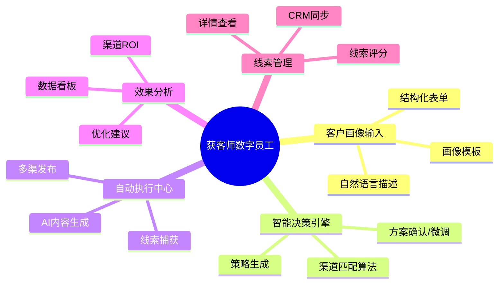
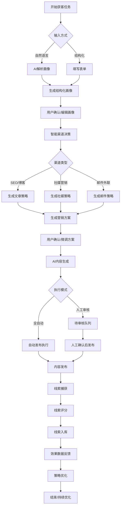
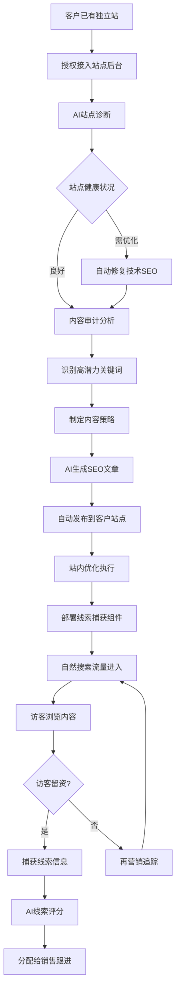
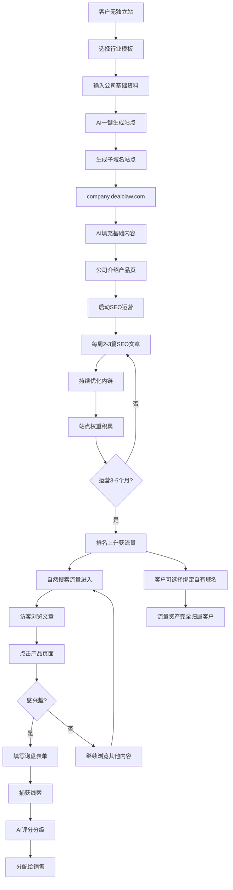
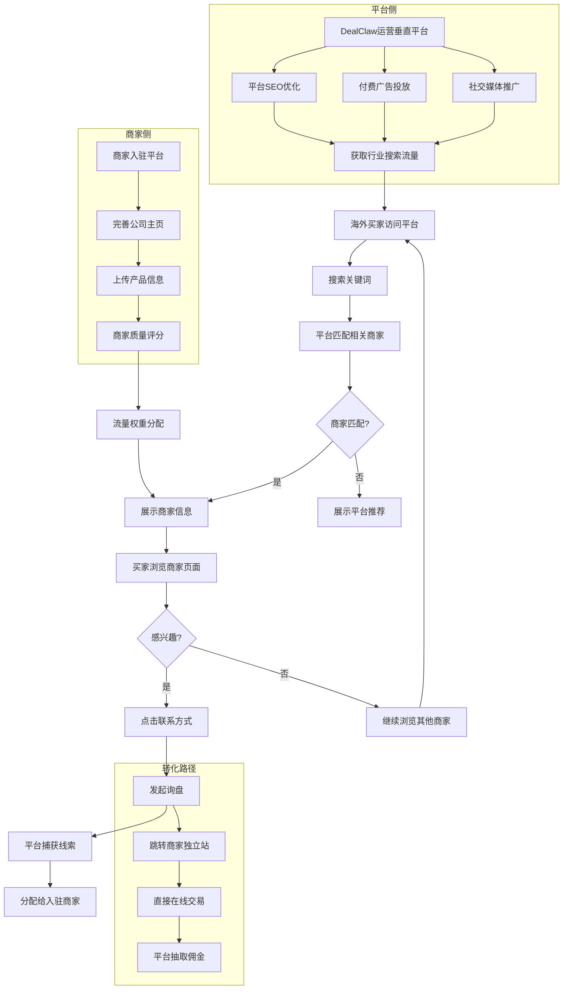
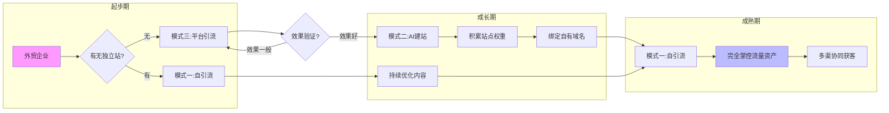
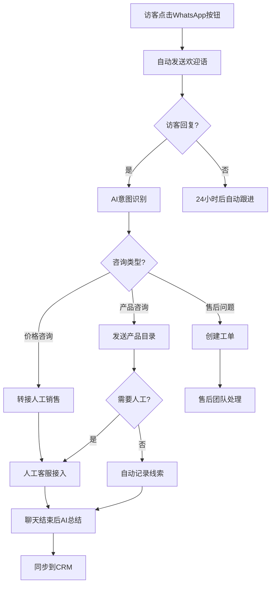
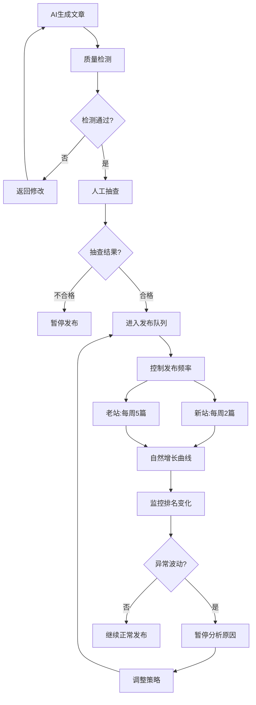
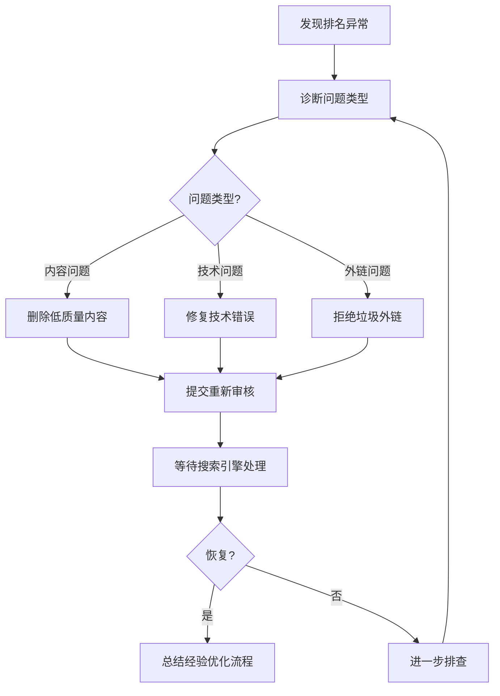
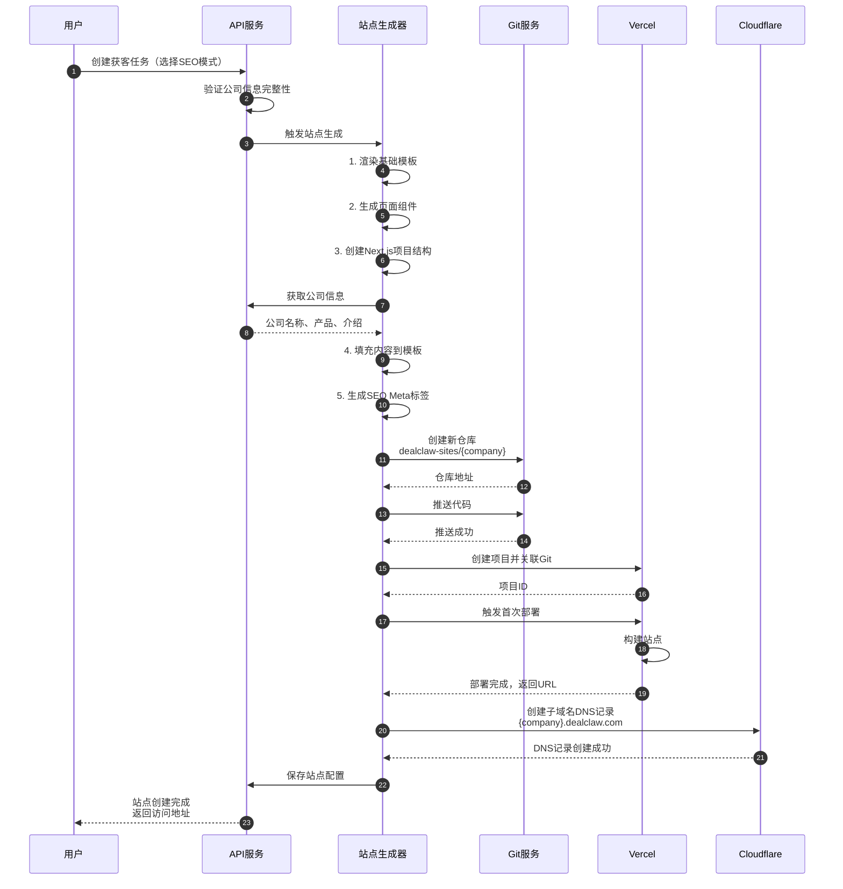

# DealClaw 获客师 - 产品需求文档 (PRD)

## 1. 文档信息

| 字段 | 内容 |
|-----|------|
| 产品名称 | DealClaw 获客师数字员工 |
| 文档版本 | V1.0 |
| 编写日期 | 2026-03-25 |
| 编写人 | Product Team |
| 最后更新 | 2026-03-25 |

## 2. 项目背景

### 2.1 业务目标
	
外贸行业获客环节存在显著的人力浪费和效率瓶颈：
- **Outbound 营销**：邮件、电话等打扰式营销转化率低，人力成本高
- **Inbound 营销**：SEO、社媒等内容营销需要专业知识和持续投入
- **渠道选择困难**：企业不清楚哪种渠道适合自己的目标客户
- **执行落地难**：营销方案制定后，内容生产、发布、运营需要大量人力

**目标**：打造AI驱动的获客师数字员工，实现从目标客户定义到线索获取的全自动执行。

### 2.2 目标用户

| 用户类型 | 用户画像 | 核心诉求 |
|---------|---------|---------|
| 外贸企业主 | 中小型外贸公司老板/合伙人，年营收1000万-1亿 | 低成本、高效率获取精准客户线索 |
| 外贸业务员 | 负责客户开发和维护的业务员 | 减少重复劳动，专注于高价值客户跟进 |
| 外贸市场专员 | 负责公司营销推广的专员 | 专业营销能力增强，一人可管理多渠 |

### 2.3 核心价值主张

> **"告诉获客师你要找什么样的客户，AI自动决策最优渠道、生成内容、执行获客，你只管跟进线索。"**


## 3. 功能清单

### 3.1 功能总览

| 功能编号 | 功能名称 | 所属模块 | 优先级 | 所属迭代 |
|---------|---------|---------|-------|---------|
| F-01 | 自然语言画像输入 | 客户画像 | P1 | MVP+ |
| F-02 | 结构化表单输入 | 客户画像 | P0 | MVP |
| F-03 | 画像模板库 | 客户画像 | P1 | MVP |
| F-04 | 智能渠道匹配V2 | 智能决策 | P1 | MVP+ |
| F-10 | 线索捕获 | 线索管理 | P0 | MVP |
| F-11 | 线索评分V1 | 线索管理 | P1 | MVP |
| F-12 | 线索详情 | 线索管理 | P0 | MVP |
| F-13 | CRM同步 | 线索管理 | P1 | V1.0 |
| F-14 | 三渠道数据看板 | 效果分析 | P0 | MVP |
| F-15 | 渠道ROI对比 | 效果分析 | P1 | V1.0 |
| F-16 | AI优化建议 | 效果分析 | P1 | V1.0 |
| F-17 | 模式一：自引流 | SEO渠道 | P1 | MVP+ |
| F-18 | 模式二：AI搭建独立站 | SEO渠道 | P0 | MVP |
| F-19 | 模式三：垂直平台 | SEO渠道 | P1 | V1.0 |
| F-20 | 邮箱列表导入 | 邮件外联 | P0 | MVP |
| F-21 | 邮件模板生成 | 邮件外联 | P0 | MVP |
| F-22 | 邮件发送执行 | 邮件外联 | P0 | MVP |
| F-23 | 邮件统计 | 邮件外联 | P0 | MVP |
| F-24 | WhatsApp Cloud API接入 | WhatsApp | P0 | MVP |
| F-25 | 统一收件箱 | WhatsApp | P0 | MVP |
| F-26 | AI意图识别 | WhatsApp | P0 | MVP |
| F-27 | 自动化工作流 | WhatsApp | P0 | MVP |
| F-28 | 快捷回复模板 | WhatsApp | P1 | MVP |
| F-29 | 聊天标签管理 | WhatsApp | P1 | MVP |
| F-30 | 基础内容生成 | SEO建站 | P0 | MVP |
| F-31 | 基础SEO | SEO建站 | P1 | MVP |
| F-32 | 线索表单 | SEO建站 | P0 | MVP |
| F-33 | 邮件序列 | 邮件外联 | P1 | MVP+ |
| F-34 | 建站模板选择 | SEO建站 | P1 | MVP+ |

### 3.2 MVP Core（6周）功能清单

| 模块 | 功能 | 优先级 | 验收标准 |
|-----|------|-------|---------|
| **客户画像** | F-02 结构化表单 | P0 | 支持邮件+WhatsApp+SEO三种场景字段 |
| | F-03 画像模板库 | P1 | 至少3个：B2B批发、品牌商、零售商 |
| **邮件外联** | F-20 邮箱列表导入 | P0 | CSV上传，自动去重验证 |
| | F-21 邮件模板生成 | P0 | AI生成3种场景模板 |
| | F-22 邮件发送执行 | P0 | 批量发送，防垃圾邮件策略 |
| | F-23 邮件统计 | P0 | 发送/送达/打开/回复率 |
| **WhatsApp高级** | F-24 Cloud API接入 | P0 | 官方API稳定连接 |
| | F-25 统一收件箱 | P0 | 多客服消息分配 |
| | F-26 AI意图识别 | P0 | 识别产品/价格/售后意图 |
| | F-27 自动化工作流 | P0 | 欢迎语→意图识别→自动回复/转人工 |
| | F-28 快捷回复模板 | P1 | 10个预设模板 |
| | F-29 聊天标签管理 | P1 | 高/中/低意向标记 |
| **SEO AI建站** | F-18 子域名站点 | P0 | company.dealclaw.com格式 |
| | F-30 基础内容生成 | P0 | 公司页+产品页+2篇博客 |
| | F-31 基础SEO | P1 | Meta标签、Sitemap |
| | F-32 线索表单 | P0 | 联系表单，数据进线索库 |
| **线索管理** | F-10 线索捕获 | P0 | 邮件回复+WA消息+网站表单 |
| | F-11 线索评分V1 | P1 | 规则评分（互动行为+信息完整度） |
| | F-12 线索详情 | P0 | 完整互动历史 |
| **效果分析** | F-14 三渠道看板 | P0 | 各渠道线索数、转化率对比 |

### 3.3 MVP+（+3周，共9周）功能清单

| 功能编号 | 功能名称 | 说明 |
|---------|---------|------|
| F-01 | 自然语言画像输入 | 基于MVP数据优化AI解析 |
| F-04 | 智能渠道匹配V2 | 从规则升级为轻量算法 |
| LinkedIn社媒 | （功能编号待分配） | 个人主页+Company Page内容发布 |
| F-17 | 模式一：自引流 | 已有WordPress/Shopify站点接入 |
| F-33 | 邮件序列 | 多封跟进邮件，自动触发 |
| F-34 | 建站模板选择 | 多行业模板 |

### 3.4 V1.0（+4周，共13周）功能清单

| 功能编号 | 功能名称 | 说明 |
|---------|---------|------|
| F-19 | 模式三：垂直平台 | 行业B2B平台，商家入驻 |
| F-13 | CRM同步 | Salesforce/HubSpot/Zoho对接 |
| F-15 | 渠道ROI对比 | 多维度效果分析 |
| F-16 | AI优化建议 | 基于数据的策略调整建议 |
| SEO风控系统 | （功能编号待分配） | 内容审核、防惩罚机制 |

---


## 4. 产品架构

### 4.1 功能架构图



### 4.2 用户角色定义

| 角色名称 | 角色描述 | 主要权限 |
|---------|---------|---------|
| 企业管理员 | 公司账号所有者，可管理所有资源 | 全部功能权限，成员管理 |
| 营销执行者 | 负责具体获客任务执行 | 创建任务、查看数据、管理线索 |
| 查看者 | 仅查看数据和报表 | 只读权限 |


## 5. 核心业务流程



## 6. 详细功能说明

### 9.1 客户画像输入模块

#### 6.1.1 自然语言输入

| 字段 | 说明 |
|-----|------|
| **功能编号** | F-01 |
| **功能描述** | 用户用自然语言描述目标客户，AI自动解析为结构化数据 |
| **前置条件** | 用户已登录并创建获客任务 |
| **优先级** | P0 |

**页面元素**：

| 元素 | 类型 | 说明 | 校验规则 |
|-----|------|-----|---------|
| 描述输入框 | 多行文本 | 引导用户描述目标客户 | 最少20字符，最多1000字符 |
| AI解析按钮 | 按钮 | 触发AI解析 | 输入非空时可用 |
| 示例提示 | 文本链接 | 展示示例描述 | 点击填充示例 |
| 解析结果卡片 | 卡片组 | 展示解析出的结构化字段 | 可编辑 |

**交互逻辑**：

1. 用户在输入框中描述目标客户
2. 点击"AI解析"按钮，显示加载状态
3. AI解析完成后，展示结构化结果（地区、行业、公司规模、决策人角色等）
4. 用户可编辑任何解析结果
5. 确认后进入下一步

**异常处理**：

| 异常场景 | 处理方式 |
|---------|---------|
| AI解析失败 | 提示"解析失败，请尝试结构化输入"，提供表单入口 |
| 解析结果不完整 | 标记缺失字段，提示用户补充 |

---

#### 6.1.2 结构化表单输入

| 字段 | 说明 |
|-----|------|
| **功能编号** | F-02 |
| **功能描述** | 通过表单字段精确描述目标客户画像 |
| **前置条件** | 用户选择"结构化输入"方式 |
| **优先级** | P0 |

**表单字段**：

| 字段名 | 类型 | 选项/说明 | 必填 |
|-------|------|----------|-----|
| 目标地区 | 多选 | 北美/欧洲/东南亚/中东/南美/大洋洲/其他 | 是 |
| 目标行业 | 单选 | 下拉选择行业分类 | 是 |
| 公司规模 | 单选 | 初创(<10人)/小型(10-50)/中型(50-200)/大型(200+) | 是 |
| 年采购额 | 范围 | 滑块选择范围 | 否 |
| 决策人角色 | 多选 | 采购经理/CEO/产品经理/其他 | 是 |
| 业务类型 | 多选 | 批发商/零售商/品牌商/制造商 | 否 |

---

#### 6.1.3 画像模板库

| 字段 | 说明 |
|-----|------|
| **功能编号** | F-03 |
| **功能描述** | 提供常见外贸客户类型的快速模板 |
| **优先级** | P1 |

**模板示例**：
- 美国户外用品批发商
- 欧洲电子产品零售商
- 中东建材进口商
- 日本美妆品牌方

---

### 9.2 智能决策引擎

#### 6.2.1 渠道匹配算法

| 字段 | 说明 |
|-----|------|
| **功能编号** | F-04 |
| **功能描述** | 基于客户画像智能推荐最优营销渠道组合 |
| **前置条件** | 客户画像已确认 |
| **优先级** | P0 |

**渠道匹配规则**：

| 客户画像特征 | 推荐渠道 | 权重 |
|-------------|---------|-----|
| B2B/决策人为高管 | LinkedIn + SEO博客 | 高 |
| 北美市场 | LinkedIn + 邮件外联 | 高 |
| 消费品/零售 | Facebook + Instagram | 高 |
| 专业/技术产品 | SEO博客 + LinkedIn | 高 |
| 新兴市场 | WhatsApp + Facebook | 中 |

---

#### 6.2.2 营销策略生成

| 字段 | 说明 |
|-----|------|
| **功能编号** | F-05 |
| **功能描述** | 基于渠道组合生成具体执行策略 |
| **优先级** | P0 |

**策略内容**：
- 渠道组合及优先级
- 内容类型建议（文章主题、社媒形式等）
- 发布频率建议
- 预期获客周期
- 预算建议（如适用）

---

#### 6.2.3 方案确认与微调

| 字段 | 说明 |
|-----|------|
| **功能编号** | F-06 |
| **功能描述** | 展示AI生成的方案，允许用户调整 |
| **优先级** | P0 |

**可调整项**：
- 启用/禁用某个渠道
- 调整渠道优先级
- 修改内容方向
- 调整发布频率
- 设置预算上限

---

### 9.3 自动执行中心

#### 6.3.1 AI内容生成

| 字段 | 说明 |
|-----|------|
| **功能编号** | F-07 |
| **功能描述** | 根据策略自动生成各类营销内容 |
| **优先级** | P0 |

**内容类型**：

| 类型 | 说明 | 输出格式 |
|-----|------|---------|
| SEO博客文章 | 长文，800-2000字 | Markdown/HTML |
| LinkedIn帖子 | 专业社媒内容，150-300字 | 纯文本 |
| 邮件模板 | Cold email序列 | 邮件格式 |
| 图片/视频脚本 | 社媒配图/视频脚本 | 文本描述 |

---

#### 6.3.2 内容审核与发布

| 字段 | 说明 |
|-----|------|
| **功能编号** | F-08 |
| **功能描述** | 全自动发布，支持人工抽查 |
| **优先级** | P0 |

**发布渠道（MVP）**：
- WordPress/自建博客（SEO）
- LinkedIn 个人主页 + Company Page
- 邮件发送系统

**执行模式**：
- **全自动模式**：AI生成后直接发布（默认）
- **抽查模式**：随机抽取部分内容人工确认
- **全审核模式**：所有内容需人工确认后发布

---

#### 6.3.3 内容日历

| 字段 | 说明 |
|-----|------|
| **功能编号** | F-09 |
| **功能描述** | 管理内容发布计划和历史 |
| **优先级** | P1 |

**功能**：
- 日历视图查看已发布和待发布内容
- 拖拽调整发布时间
- 批量操作（暂停、删除、重新生成）

---

### 9.4 线索管理

#### 6.4.1 线索捕获

| 字段 | 说明 |
|-----|------|
| **功能编号** | F-10 |
| **功能描述** | 自动捕获各渠道的潜在线索 |
| **优先级** | P0 |

**捕获来源**：
- 网站表单提交
- 邮件回复
- LinkedIn私信/评论
- 文档下载留资

---

#### 6.4.2 线索评分

| 字段 | 说明 |
|-----|------|
| **功能编号** | F-11 |
| **功能描述** | AI评估线索质量和购买意向 |
| **优先级** | P0 |

**评分维度**：
- 公司匹配度（行业、规模、地区）
- 行为信号（访问页面、停留时长、互动次数）
- 联系信息完整度

**评分等级**：
- 🔥 热门（90-100分）：立即跟进
- ⚡ 高意向（70-89分）：优先跟进
- 💡 中意向（50-69分）： nurturing
- 📌 低意向（<50分）：持续观察

---

#### 6.4.3 线索详情

| 字段 | 说明 |
|-----|------|
| **功能编号** | F-12 |
| **功能描述** | 查看单个线索的完整信息和互动历史 |
| **优先级** | P0 |

**展示信息**：
- 公司信息（名称、网站、规模、行业）
- 联系人信息（姓名、职位、邮箱、电话）
- 来源渠道
- 互动历史（访问记录、邮件往来、社媒互动）
- AI评分及理由

---

#### 6.4.4 CRM同步

| 字段 | 说明 |
|-----|------|
| **功能编号** | F-13 |
| **功能描述** | 线索导出到外部CRM或内置CRM |
| **优先级** | P1 |

**支持导出**：
- CSV 批量导出
- API 对接（Salesforce, HubSpot, Zoho等）
- 内置简单CRM功能

---

### 9.5 效果分析

#### 6.5.1 数据看板

| 字段 | 说明 |
|-----|------|
| **功能编号** | F-14 |
| **功能描述** | 展示获客任务的核心数据指标 |
| **优先级** | P0 |

**核心指标**：
| 指标 | 说明 |
|-----|------|
| 展示/曝光 | 内容被展示的次数 |
| 点击率 | 点击内容链接的比例 |
| 访客数 | 独立访客数量 |
| 线索数 | 获取的线索总数 |
| MQL数 | 营销合格线索数（评分>70） |
| 转化率 | 访客→线索→MQL的转化漏斗 |
| 获客成本 | 单个线索的平均成本 |

---

#### 6.5.2 渠道效果对比

| 字段 | 说明 |
|-----|------|
| **功能编号** | F-15 |
| **功能描述** | 对比不同渠道的ROI表现 |
| **优先级** | P1 |

**对比维度**：
- 各渠道线索数量
- 各渠道线索质量（平均评分）
- 各渠道获客成本
- 各渠道转化周期

---

#### 6.5.3 优化建议

| 字段 | 说明 |
|-----|------|
| **功能编号** | F-16 |
| **功能描述** | AI基于数据给出策略调整建议 |
| **优先级** | P1 |

**建议类型**：
- 渠道调整建议（增加/减少某渠道投入）
- 内容方向建议（哪些主题效果更好）
- 发布时机建议（最佳发布时间）
- 预算分配建议

---

## 6.6 渠道执行详细设计

### 9.6.1 SEO博客获客 - 三种引流模式

获客师提供三种 SEO 引流模式，满足不同阶段外贸企业的需求：

#### 模式一：商家独立站自引流（Bring Your Own Site）

**适用客户**：已有独立站（WordPress/Shopify/自建站）的外贸企业

**核心逻辑**：
```
客户已有独立站 + 历史内容
    ↓
获客师接入站点后台（API/插件）
    ↓
AI 分析现有内容质量和排名情况
    ↓
制定内容优化策略 + 新增 SEO 文章
    ↓
自动发布到客户独立站
    ↓
自然搜索流量 → 客户独立站 → 线索捕获
```

**执行细节**：

| 环节 | 具体执行 | 客户价值 |
|-----|---------|---------|
| **站点接入** | WordPress Application Password / Shopify API / 自定义 API | 无需迁移，直接使用现有站点 |
| **站点诊断** | AI 扫描现有页面 SEO 评分、加载速度、移动适配 | 发现优化机会 |
| **内容审计** | 分析历史文章排名、流量、转化效果 | 识别优质内容方向 |
| **内容策略** | 基于诊断结果，制定新增文章计划（每月 8-12 篇） | 补齐内容短板 |
| **站内优化** | 自动优化标题、Meta、内链、图片 ALT、Schema | 提升整站 SEO 评分 |
| **线索捕获** | 在客户独立站部署弹窗、表单、ChatBot | 流量转化为线索 |

**计费方式**：基础服务费 + 按效果付费（线索数量）

**业务流程图**：



---

#### 模式二：AI 搭建独立站 + 引流（All-in-One）

**适用客户**：没有独立站、想快速启动 SEO 获客的外贸企业

**核心逻辑**：
```
客户无独立站
    ↓
获客师一键生成专业外贸独立站
    ↓
AI 自动填充行业内容（公司介绍、产品页、博客）
    ↓
持续发布 SEO 文章获取搜索流量
    ↓
子域名站点积累权重和排名
    ↓
客户可选择绑定自有域名
    ↓
自然搜索流量 → 独立站 → 线索捕获 → 分配给销售
```

**执行细节**：

| 阶段 | 具体执行 | 说明 |
|-----|---------|------|
| **站点创建** | 自动生成子域名站点：`company.dealclaw.com` | 5分钟完成部署 |
| **模板选择** | 提供外贸行业专属模板（B2B展示型） | 专业设计、响应式布局 |
| **基础内容** | AI 生成：公司介绍、产品页、联系我们、About Us | 基于客户提供的基础资料 |
| **SEO 架构** | 自动生成 XML 站点地图、Robots.txt、Schema 标记 | 技术 SEO 就绪 |
| **持续运营** | 每周 2-3 篇 SEO 文章，持续优化站内链接 | 3-6 个月积累权重 |
| **域名绑定** | 支持客户绑定自有域名（CNAME 配置） | 品牌资产归属客户 |

**站点所有权**：
- 基础版：站点托管在 DealClaw 平台，客户使用子域名
- 高级版：客户可绑定自有域名，内容可导出迁移

**计费方式**：建站费用（一次性）+ 月度运营服务费 + 效果付费

**业务流程图**：



---

#### 模式三：垂直行业平台引流（Marketplace Traffic）

**适用客户**：希望借助平台流量、快速获取曝光的外贸企业

**核心逻辑**：
```
DealClaw 运营垂直行业站点（类似国际版1688）
    ↓
平台持续投入 SEO/广告获取行业流量
    ↓
入驻商家获得平台内专属页面和展示位
    ↓
平台发布行业内容，嵌入商家信息和产品
    ↓
搜索流量 → 平台 → 分发到入驻商家页面
    ↓
买家在平台内询盘或跳转商家独立站
```

**平台形态**：

| 维度 | 设计 |
|-----|------|
| **站点定位** | 垂直行业 B2B 采购平台（如 outdoor-dealclaw.com） |
| **目标买家** | 海外批发商、零售商、品牌商 |
| **内容策略** | 行业报告、采购指南、供应商推荐、产品对比 |
| **流量来源** | SEO（长尾关键词）+ 付费广告 + 社交媒体 |

**商家入驻权益**：

| 权益等级 | 包含内容 |
|---------|---------|
| **基础入驻** | 公司主页 + 产品展示 + 接收平台询盘 |
| **内容露出** | 平台文章中插入商家产品/案例 |
| **首页推荐** | 行业首页 Banner + 优质供应商专区 |
| **专属流量** | 为商家定制 Landing Page，独占流量 |

**流量分配机制**：
- 搜索词匹配：买家搜索"户外用品批发商"→ 展示相关入驻商家
- 地域分配：根据商家目标市场分配对应地区流量
- 质量评分：平台根据商家响应速度、成交率分配流量权重

**计费方式**：
- 入驻年费（基础展示）
- 点击付费（CPC，买家点击商家页面）
- 成交佣金（通过平台成交抽取 3-5%）

**业务流程图**：



---

#### 三种模式对比

| 对比维度 | 模式一：自引流 | 模式二：AI建站 | 模式三：平台引流 |
|---------|--------------|---------------|----------------|
| **前提条件** | 已有独立站 | 无站点 | 有无站点均可 |
| **启动速度** | 1-3 天 | 即时 | 1-3 天审核 |
| **品牌展示** | 强（自有域名） | 中（可绑域名） | 弱（平台内页面） |
| **流量归属** | 完全自有 | 完全自有 | 平台分配 |
| **长期价值** | 高（资产积累） | 高（资产积累） | 中（依赖平台） |
| **获客成本** | 低 | 中 | 中-高 |
| **适合阶段** | 成熟期企业 | 起步期企业 | 快速验证期 |

**模式协同**：
- 客户可从模式三（平台引流）快速起步，积累经验和案例
- 再转向模式二（AI建站），建立自有品牌阵地
- 最终升级为模式一（自引流），完全掌控流量资产

**三种模式协同演进图**：



**客户旅程地图**：

| 阶段 | 推荐模式 | 目标 | 周期 |
|-----|---------|-----|-----|
| **验证期** | 模式三 | 快速验证市场需求，获取首批线索 | 1-3 个月 |
| **建设期** | 模式二 | 建立自有品牌阵地，积累搜索权重 | 3-6 个月 |
| **成熟期** | 模式一 | 完全掌控流量，降低获客成本 | 6 个月+ |

---

### 9.6.2 社媒营销（LinkedIn）- 执行细节

（原有内容保持不变...）

---

### 9.6.3 WhatsApp Business 整合 - 执行细节

#### 功能定位

WhatsApp 作为高转化率的即时通讯渠道，与 SEO/社媒形成互补：
- **SEO/社媒**：获取流量和初步线索
- **WhatsApp**：即时沟通、快速转化、建立信任

#### 账号接入方式

| 接入方式 | 适用场景 | 功能限制 |
|---------|---------|---------|
| **WhatsApp Business API** | 企业级客户，批量消息 | 需Meta官方授权，支持自动化 |
| **WhatsApp Business App** | 小微企业，人工为主 | 限制自动回复，需手机在线 |
| **WhatsApp Cloud API** | 推荐方案，云托管 | 官方支持，稳定可靠 |

**接入流程**：
1. 客户在后台提交 WhatsApp Business 账号申请
2. 平台协助完成 Meta 官方认证（Business Verification）
3. 配置 Webhook 接收消息回调
4. 后台集成聊天界面，支持多客服协作

#### 后台聊天功能

**统一收件箱（Shared Inbox）**：

| 功能 | 说明 |
|-----|------|
| **消息分配** | 自动分配给在线客服，支持转接 |
| **标签管理** | 标记客户意向（高/中/低）、行业、阶段 |
| **快捷回复** | 预设常见问题回复模板 |
| **AI辅助** | 实时翻译、回复建议、情绪分析 |
| **聊天记录** | 永久保存，支持搜索和导出 |

**自动化工作流**：



**防封号策略**：

| 风险点 | 防护措施 |
|-------|---------|
| **新号营销** | 新注册账号前30天限制发送量，模拟正常用户行为 |
| **群发限制** | 遵守WhatsApp官方限制（每日最多1000条模板消息） |
| **举报风险** | 提供退订选项，及时响应客户屏蔽请求 |
| **内容审核** | AI预审消息内容，避免敏感词和垃圾信息特征 |

#### 与获客流程的整合

| 场景 | 触发方式 | 自动化动作 |
|-----|---------|-----------|
| **网站访客** | 独立站嵌入WhatsApp按钮 | 点击后自动发送预设欢迎语+产品资料 |
| **社媒互动** | LinkedIn私信引导 | 自动回复"请加WhatsApp详细沟通"+链接 |
| **邮件回复** | 客户回复邮件表示兴趣 | 自动发送WhatsApp联系邀请 |
| **表单提交** | 线索表单填写手机号 | 自动发送感谢消息+资料包 |

**线索评分增强**：
- 主动发起WhatsApp对话的线索 +20分
- 对话超过5轮的线索 +15分
- 要求报价的线索 +30分

---

### 9.6.4 SEO 防封号与风控机制

#### 搜索引擎惩罚风险识别

**常见封号/惩罚原因**：

| 风险类型 | 具体表现 | 后果 |
|---------|---------|------|
| **内容农场** | 大量低质量、重复、AI痕迹明显的内容 | 整站降权、收录下降 |
| **关键词堆砌** | 标题/正文过度优化、不自然的关键词密度 | 页面降权、排名消失 |
| **隐藏文本** | 用户看不见但搜索引擎能看见的内容 | 手动惩罚、移除索引 |
| **外链 spam** | 购买低质量外链、链接农场 | 外链失效、站点降权 |
| **技术作弊** | 站群、 doorway pages、cloaking | 严重惩罚、域名拉黑 |

#### 内容质量保障体系

**AI内容检测与优化**：

| 检测项 | 标准 | 优化措施 |
|-------|------|---------|
| **AI痕迹检测** | 使用GPTZero等工具检测AI生成概率 | 超过70%时进行人工改写 |
| **原创度检测** | Copyscape查重，确保原创度>90% | 重复内容重新生成 |
| **可读性评分** | Flesch Reading Ease分数>50 | 调整句子长度和词汇难度 |
| **E-E-A-T评估** | 专业性、权威性、可信度检查 | 添加作者署名、引用来源 |

**内容发布节奏控制**：



#### 技术SEO安全规范

| 规范项 | 安全做法 | 风险做法 |
|-------|---------|---------|
| **站点结构** | 清晰的URL层级，合理内链 | 大量重复页面、死链 |
| **页面速度** | 优化图片、使用CDN、延迟加载 | 过度使用JS、大体积资源 |
| **移动适配** | 响应式设计、移动优先 | 隐藏内容、跳转劫持 |
| **Schema标记** | 合理使用结构化数据 | 虚假标记、误导搜索引擎 |
| **robots.txt** | 正确引导爬虫 | 错误屏蔽重要页面 |

#### 多站点风险隔离

**站群防护策略**：

| 策略 | 实施方式 |
|-----|---------|
| **IP分散** | 不同站点使用不同服务器IP |
| **域名隔离** | 避免使用相同域名注册信息 |
| **内容差异化** | 同主题站点内容去重率>80% |
| **外链独立** | 站群间不互相链接 |
| **流量隔离** | 不同分析账号、不共享代码 |

**监控预警系统**：

| 监控指标 | 预警阈值 | 响应动作 |
|---------|---------|---------|
| **收录量** | 单日下降>30% | 立即停止发布，诊断原因 |
| **排名** | 核心词排名下降>10位 | 检查页面是否被惩罚 |
| **流量** | 自然流量下降>50% | 全站检查，必要时暂停 |
| **索引状态** | 被移除索引的页面 | 立即修复并重新提交 |

#### 应急响应机制

**惩罚恢复流程**：




---

## 6.7 SEO AI建站技术架构

### 9.7.1 系统架构图

```
┌─────────────────────────────────────────────────────────────────────────────┐
│                           SEO建站技术架构                                     │
├─────────────────────────────────────────────────────────────────────────────┤
│                                                                              │
│  ┌──────────────┐    ┌──────────────┐    ┌──────────────┐                   │
│  │   前端控制台  │    │  站点生成引擎 │    │  内容生成AI  │                   │
│  │  (React)     │◄──►│  (Node.js)   │◄──►│  (LLM API)   │                   │
│  └──────┬───────┘    └──────┬───────┘    └──────────────┘                   │
│         │                   │                                               │
│         │            ┌──────┴───────┐                                       │
│         │            │  站点渲染引擎 │                                       │
│         │            │  (Next.js)   │                                       │
│         │            └──────┬───────┘                                       │
│         │                   │                                               │
│         └───────────────────┼──────────────────────────────────┐            │
│                             │                                  │            │
│  ┌──────────────────────────┼──────────────────────────┐      │            │
│  │      数据层              │                          │      │            │
│  │  ┌─────────────┐  ┌─────┴──────┐  ┌─────────────┐  │      │            │
│  │  │ 站点配置DB   │  │ 内容存储    │  │ 发布队列    │  │      │            │
│  │  │ (PostgreSQL)│  │ (S3/MinIO) │  │ (Redis)     │  │      │            │
│  │  └─────────────┘  └────────────┘  └─────────────┘  │      │            │
│  └────────────────────────────────────────────────────┘      │            │
│                                                              │            │
└──────────────────────────────────────────────────────────────┼────────────┘
                                                               │
┌──────────────────────────────────────────────────────────────┼────────────┐
│                    第三方服务层                               │            │
│  ┌────────────┐  ┌────────────┐  ┌────────────┐             │            │
│  │  Cloudflare│  │   Vercel   │  │  Supabase  │             │            │
│  │  (DNS/CDN) │  │  (Hosting) │  │   (DB)     │             │            │
│  └────────────┘  └────────────┘  └────────────┘             │            │
│                                                              │            │
│  ┌────────────┐  ┌────────────┐  ┌────────────┐             │            │
│  │WordPress   │  │  Shopify   │  │   Meta     │             │            │
│  │   API      │  │    API     │  │  (WA API)  │             │            │
│  └────────────┘  └────────────┘  └────────────┘             │            │
└──────────────────────────────────────────────────────────────┴────────────┘
```

### 9.7.2 站点生成引擎详细设计

#### 技术栈选择

| 层级 | 技术 | 选型理由 |
|-----|------|---------|
| 站点框架 | Next.js 14 (App Router) | SSR/SSG支持、SEO友好、Vercel原生部署 |
| 样式 | Tailwind CSS | 原子化CSS、构建时优化、无运行时开销 |
| UI组件 | shadcn/ui | 可定制、无额外依赖 |
| 内容 | MDX | Markdown+React组件、支持富媒体 |
| 部署 | Vercel | 边缘网络、自动HTTPS、Preview部署 |

#### 站点目录结构

```
站点项目结构（每个子域名一个仓库）
├── app/
│   ├── layout.tsx          # 根布局（SEO Meta、导航）
│   ├── page.tsx            # 首页
│   ├── about/
│   │   └── page.tsx        # About Us
│   ├── products/
│   │   └── page.tsx        # 产品列表
│   │   └── [slug]/
│   │       └── page.tsx    # 产品详情（动态路由）
│   ├── blog/
│   │   └── page.tsx        # 博客列表
│   │   └── [slug]/
│   │       └── page.tsx    # 博客详情（SSG）
│   └── contact/
│       └── page.tsx        # 联系页（含表单）
├── components/
│   ├── ui/                 # shadcn组件
│   ├── sections/           # 页面区块组件
│   └── forms/              # 表单组件
├── content/
│   ├── blog/               # MDX博客文章
│   └── products/           # 产品数据JSON
├── lib/
│   ├── seo.ts              # SEO工具函数
│   └── api.ts              # API客户端
├── public/
│   └── images/             # 静态资源
├── next.config.js
└── package.json
```

### 9.7.3 多租户架构

```
┌─────────────────────────────────────────────────────────┐
│                    多租户站点管理                         │
├─────────────────────────────────────────────────────────┤
│                                                          │
│  租户隔离策略：子域名 + 独立Git仓库 + 独立Vercel项目       │
│                                                          │
│  company-a.dealclaw.com                                 │
│      │                                                  │
│      ▼                                                  │
│  ┌──────────────┐      ┌──────────────┐                │
│  │ Git Repo:    │      │ Vercel Proj: │                │
│  │ dealclaw-    │─────►│ company-a-   │                │
│  │ sites/company│      │ site         │                │
│  │ -a           │      │              │                │
│  └──────────────┘      └──────────────┘                │
│         │                      │                        │
│         │                      ▼                        │
│         │               Cloudflare DNS                  │
│         │               *.dealclaw.com → Vercel         │
│         │                      │                        │
│         │                      ▼                        │
│         │              ┌──────────────┐                │
│         └─────────────►│  Edge CDN    │                │
│                        │  (全球节点)   │                │
│                        └──────────────┘                │
│                                                          │
│  数据库关联：                                             │
│  sites 表 ──► company_a_site_config                     │
│       ├──► company_a_content                            │
│       └──► company_a_leads                              │
│                                                          │
└─────────────────────────────────────────────────────────┘
```

### 9.7.4 动态站点生成流程



---

## 6.8 第三方系统集成架构

### 9.8.1 集成总览

```
┌─────────────────────────────────────────────────────────────────┐
│                      第三方集成网关                              │
├─────────────────────────────────────────────────────────────────┤
│                                                                  │
│   ┌──────────────┐                                               │
│   │  统一API网关  │  ← 认证、限流、日志、错误处理                   │
│   │   (Kong/    │                                               │
│   │   Express)   │                                               │
│   └──────┬───────┘                                               │
│          │                                                       │
│    ┌─────┴──────┬────────────┬────────────┬────────────┐        │
│    │            │            │            │            │        │
│    ▼            ▼            ▼            ▼            ▼        │
│ ┌──────┐   ┌──────┐   ┌──────┐   ┌──────┐   ┌──────┐          │
│ │Meta  │   │Linked│   │Word- │   │Shopi │   │Send- │          │
│ │(WA)  │   │ In   │   │Press │   │  fy  │   │grid  │          │
│ │      │   │      │   │      │   │      │   │      │          │
│ │Cloud │   │API   │   │REST  │   │Graph-│   │SMTP  │          │
│ │API   │   │v2    │   │API   │   │QL    │   │API   │          │
│ └──────┘   └──────┘   └──────┘   └──────┘   └──────┘          │
│                                                                  │
└─────────────────────────────────────────────────────────────────┘
```

### 9.8.2 Meta WhatsApp Business Cloud API 集成

#### 认证流程

```
┌─────────────────────────────────────────────────────────┐
│              WhatsApp Cloud API 认证流程                  │
├─────────────────────────────────────────────────────────┤
│                                                          │
│  1. 商家注册                                             │
│     └─► Meta Business Manager 创建/登录                   │
│                                                          │
│  2. 应用创建                                             │
│     └─► 开发者后台创建应用                                │
│         ├─► 添加 WhatsApp 产品                           │
│         ├─► 配置 Webhook 回调URL                          │
│         └─► 获取 App ID + App Secret                      │
│                                                          │
│  3. 商家认证（Business Verification）                     │
│     └─► 提交营业执照等文件                                 │
│         └─► Meta 审核（1-5个工作日）                       │
│                                                          │
│  4. 手机号注册                                           │
│     └─► 在 Business Manager 中添加手机号                   │
│         └─► 接收验证码完成注册                             │
│                                                          │
│  5. 获取访问令牌                                          │
│     └─► System User Token（长期有效）                      │
│     └─► 或使用 OAuth 2.0 获取临时令牌                      │
│                                                          │
│  6. DealClaw 配置                                         │
│     ├─► 用户输入：App ID、Phone Number ID、Access Token    │
│     ├─► DealClaw 验证连接                                 │
│     └─► 保存加密凭证到数据库                               │
│                                                          │
└─────────────────────────────────────────────────────────┘
```

#### API 调用示例

```typescript
// WhatsApp API 客户端封装
class WhatsAppAPI {
  private baseUrl = 'https://graph.facebook.com/v18.0';
  private phoneNumberId: string;
  private accessToken: string;

  // 发送文本消息
  async sendTextMessage(to: string, text: string) {
    const response = await fetch(
      `${this.baseUrl}/${this.phoneNumberId}/messages`,
      {
        method: 'POST',
        headers: {
          'Authorization': `Bearer ${this.accessToken}`,
          'Content-Type': 'application/json',
        },
        body: JSON.stringify({
          messaging_product: 'whatsapp',
          recipient_type: 'individual',
          to: to,
          type: 'text',
          text: { body: text }
        })
      }
    );
    return response.json();
  }

  // 发送模板消息（用于群发/通知）
  async sendTemplateMessage(
    to: string, 
    templateName: string, 
    languageCode: string = 'zh_CN',
    components?: any[]
  ) {
    return fetch(`${this.baseUrl}/${this.phoneNumberId}/messages`, {
      method: 'POST',
      headers: {
        'Authorization': `Bearer ${this.accessToken}`,
        'Content-Type': 'application/json',
      },
      body: JSON.stringify({
        messaging_product: 'whatsapp',
        recipient_type: 'individual',
        to: to,
        type: 'template',
        template: {
          name: templateName,
          language: { code: languageCode },
          components
        }
      })
    });
  }
}
```

#### Webhook 事件处理

```typescript
// Webhook 接收处理
interface WhatsAppWebhookEvent {
  object: 'whatsapp_business_account';
  entry: Array<{
    id: string;
    changes: Array<{
      value: {
        messaging_product: 'whatsapp';
        metadata: {
          display_phone_number: string;
          phone_number_id: string;
        };
        contacts?: Array<{
          wa_id: string;
          profile: { name: string };
        }>;
        messages?: Array<{
          id: string;
          from: string;
          timestamp: string;
          type: 'text' | 'image' | 'document' | 'voice' | 'button';
          text?: { body: string };
          button?: { payload: string; text: string };
        }>;
      };
      field: 'messages';
    }>;
  }>;
}

// 消息处理器
class WhatsAppWebhookHandler {
  async handleEvent(event: WhatsAppWebhookEvent) {
    for (const entry of event.entry) {
      for (const change of entry.changes) {
        const { messages } = change.value;
        
        if (messages) {
          for (const message of messages) {
            await this.processIncomingMessage(message);
          }
        }
      }
    }
  }

  private async processIncomingMessage(message: any) {
    // 1. 保存消息到数据库
    await this.saveMessage(message);
    
    // 2. 触发AI意图识别
    const intent = await this.aiService.classifyIntent(message.text?.body);
    
    // 3. 根据意图执行工作流
    await this.executeWorkflow(message.from, intent);
  }
}
```

### 9.8.3 WordPress 集成

#### 接入方式对比

| 方式 | 适用场景 | 权限要求 | 安全性 |
|-----|---------|---------|-------|
| **Application Password** | WordPress 5.6+ | 管理员生成应用密码 | 高（可撤销） |
| **JWT插件** | 需要自定义权限 | 安装插件配置 | 中 |
| **REST API + Cookie** | 同域部署 | 登录状态 | 低 |

#### Application Password 接入流程

```
┌─────────────────────────────────────────────────────────┐
│              WordPress Application Password               │
│                    接入流程                                │
├─────────────────────────────────────────────────────────┤
│                                                          │
│  1. 用户授权步骤                                          │
│  ┌──────────────┐     ┌──────────────┐                  │
│  │  DealClaw    │────►│  WordPress   │                  │
│  │  后台        │     │  后台         │                  │
│  │              │     │              │                  │
│  │ "请点击授权  │     │ 1. 用户登录   │                  │
│  │  您的WP站点" │     │ 2. 进入用户→  │                  │
│  │              │     │    应用密码   │                  │
│  │              │     │ 3. 生成密码   │                  │
│  │              │◄────│ 4. 复制密码   │                  │
│  │              │     │              │                  │
│  └──────────────┘     └──────────────┘                  │
│                                                          │
│  2. DealClaw 保存凭证                                     │
│     ├─► 站点URL: https://example.com                     │
│     ├─► 用户名: admin                                    │
│     └─► 应用密码: xxxx xxxx xxxx xxxx xxxx xxxx          │
│         （存储时AES-256加密）                             │
│                                                          │
│  3. API调用示例                                           │
│     GET /wp-json/wp/v2/posts                             │
│     Authorization: Basic base64(username:password)       │
│                                                          │
└─────────────────────────────────────────────────────────┘
```

#### WordPress API 封装

```typescript
class WordPressAPI {
  private baseUrl: string;
  private auth: string;

  constructor(siteUrl: string, username: string, appPassword: string) {
    this.baseUrl = `${siteUrl}/wp-json/wp/v2`;
    this.auth = Buffer.from(`${username}:${appPassword}`).toString('base64');
  }

  // 发布文章
  async createPost(post: {
    title: string;
    content: string;
    status: 'draft' | 'publish' | 'future';
    categories?: number[];
    tags?: number[];
  }) {
    const response = await fetch(`${this.baseUrl}/posts`, {
      method: 'POST',
      headers: {
        'Authorization': `Basic ${this.auth}`,
        'Content-Type': 'application/json',
      },
      body: JSON.stringify(post)
    });
    return response.json();
  }

  // 上传图片
  async uploadImage(imageBuffer: Buffer, filename: string) {
    const formData = new FormData();
    formData.append('file', new Blob([imageBuffer]), filename);
    
    const response = await fetch(`${this.baseUrl}/media`, {
      method: 'POST',
      headers: {
        'Authorization': `Basic ${this.auth}`,
      },
      body: formData
    });
    return response.json();
  }
}
```

### 9.8.4 Shopify 集成

```typescript
// Shopify API 客户端
class ShopifyAPI {
  private shopDomain: string;
  private accessToken: string;
  private apiVersion = '2024-01';

  constructor(shopDomain: string, accessToken: string) {
    this.shopDomain = shopDomain;
    this.accessToken = accessToken;
  }

  private async graphqlQuery(query: string, variables?: any) {
    const response = await fetch(
      `https://${this.shopDomain}/admin/api/${this.apiVersion}/graphql.json`,
      {
        method: 'POST',
        headers: {
          'X-Shopify-Access-Token': this.accessToken,
          'Content-Type': 'application/json',
        },
        body: JSON.stringify({ query, variables })
      }
    );
    return response.json();
  }

  // 创建博客文章
  async createBlogPost(title: string, content: string, blogId: string) {
    const mutation = `
      mutation createArticle($input: ArticleCreateInput!) {
        articleCreate(input: $input) {
          article {
            id
            title
            handle
          }
        }
      }
    `;
    
    return this.graphqlQuery(mutation, {
      input: {
        blogId,
        title,
        bodyHtml: content,
        published: true
      }
    });
  }
}
```

---

## 6.9 SEO内容自动发布系统

### 9.9.1 发布流程架构

```
┌─────────────────────────────────────────────────────────────────┐
│                    内容发布流水线                                │
├─────────────────────────────────────────────────────────────────┤
│                                                                  │
│  ┌──────────┐   ┌──────────┐   ┌──────────┐   ┌──────────┐     │
│  │ 内容生成  │──►│ 质量检测  │──►│ 格式转换  │──►│ 发布队列  │     │
│  │ (AI)     │   │ (规则/ML)│   │ (渲染)   │   │ (Redis)  │     │
│  └──────────┘   └──────────┘   └──────────┘   └────┬─────┘     │
│                                                     │            │
│  ┌──────────┐   ┌──────────┐   ┌──────────┐        │            │
│  │ 发布历史  │◄──│ 发布执行  │◄──│ 队列消费  │◄───────┘            │
│  │ (DB)     │   │ (Worker) │   │ (Job)    │                     │
│  └──────────┘   └────┬─────┘   └──────────┘                     │
│                      │                                           │
│         ┌────────────┼────────────┐                             │
│         │            │            │                             │
│         ▼            ▼            ▼                             │
│    ┌────────┐  ┌────────┐  ┌────────┐                          │
│    │内部站点│  │WordPress│  │ Shopify │                          │
│    │(Vercel)│  │        │  │        │                          │
│    └────────┘  └────────┘  └────────┘                          │
│                                                                  │
└─────────────────────────────────────────────────────────────────┘
```

### 9.9.2 内容生成与渲染

#### AI内容生成Prompt模板

```typescript
// SEO博客文章生成Prompt
const blogPostPrompt = `
你是一位专业的外贸行业内容营销专家，请为以下客户撰写一篇SEO优化的博客文章。

【客户信息】
公司名称：{{companyName}}
行业：{{industry}}
产品：{{products}}
目标市场：{{targetMarkets}}
目标关键词：{{targetKeywords}}

【文章要求】
1. 标题：包含目标关键词，吸引人点击（50-60字符）
2. 字数：1200-1500字
3. 结构：
   - H1标题
   - 引言（100-150字）
   - H2小标题（问题/背景/解决方案/案例/行动号召）
   - 结论
4. SEO要求：
   - 关键词自然出现3-5次
   - 使用相关LSI关键词
   - 元描述：150-160字符

【输出格式】
返回JSON格式：
{
  "title": "文章标题",
  "metaDescription": "元描述",
  "content": { "introduction": "...", "sections": [...], "conclusion": "..." },
  "keywords": ["关键词列表"]
}
`;
```

#### 内容渲染引擎

```typescript
// MDX内容渲染器
class ContentRenderer {
  // 将AI生成的内容渲染为MDX
  renderBlogPost(content: BlogContent): string {
    const { title, metaDescription, sections, conclusion } = content;
    
    const frontmatter = `---
title: "${title}"
description: "${metaDescription}"
date: "${new Date().toISOString()}"
---

`;

    const body = sections.map(section => `
## ${section.heading}

${section.content}
`).join('\n');

    return frontmatter + body + '\n## 结论\n\n' + conclusion;
  }

  // 生成Schema.org结构化数据
  generateStructuredData(type: 'Article' | 'Product', data: any): object {
    return {
      "@context": "https://schema.org",
      "@type": type,
      headline: data.title,
      description: data.description,
      datePublished: data.publishDate,
      author: { "@type": "Organization", name: data.companyName }
    };
  }
}
```

### 9.9.3 发布调度系统

```typescript
// 发布调度器
class PublishingScheduler {
  private redis: Redis;
  private queueName = 'content_publish_queue';

  // 添加发布任务
  async schedulePublish(task: PublishTask): Promise<string> {
    const jobId = `publish_${Date.now()}_${Math.random().toString(36).substr(2, 9)}`;
    
    // 计算SEO最佳发布时间
    const publishAt = this.calculateOptimalPublishTime(
      task.targetChannel,
      task.targetTimezone
    );

    const job = {
      id: jobId,
      type: 'content_publish',
      payload: task,
      scheduledAt: publishAt,
      status: 'pending'
    };

    await this.redis.zadd(this.queueName, publishAt.getTime(), JSON.stringify(job));
    return jobId;
  }

  // 计算最佳发布时间
  private calculateOptimalPublishTime(channel: string, timezone: string): Date {
    const now = new Date();
    const targetDate = new Date();

    // 博客：周二/周四上午10点
    if (channel === 'blog') {
      const day = now.getDay();
      if (day === 2 || day === 4) {
        targetDate.setHours(10, 0, 0, 0);
        if (targetDate <= now) {
          targetDate.setDate(targetDate.getDate() + (day === 2 ? 2 : 5));
        }
      } else {
        const daysUntilTuesday = (2 + 7 - day) % 7 || 7;
        const daysUntilThursday = (4 + 7 - day) % 7 || 7;
        targetDate.setDate(now.getDate() + Math.min(daysUntilTuesday, daysUntilThursday));
        targetDate.setHours(10, 0, 0, 0);
      }
    }

    return targetDate;
  }
}
```

---

## 6.10 核心算法细节

### 9.10.1 渠道匹配算法

#### 算法输入输出

```typescript
interface ChannelMatchInput {
  customerProfile: {
    targetRegions: string[];
    industry: string;
    companySize: string;
    decisionMakerRoles: string[];
    businessType: string[];
  };
  resources: {
    hasWebsite: boolean;
    hasEmailList: boolean;
    hasWhatsAppNumber: boolean;
    budgetLevel: 'low' | 'medium' | 'high';
  };
}

interface ChannelMatchOutput {
  recommendations: Array<{
    channel: 'seo' | 'email' | 'whatsapp' | 'linkedin';
    priority: number;
    confidence: number;
    reasoning: string;
  }>;
}
```

#### 规则引擎 + 加权评分算法

```typescript
class ChannelMatchingAlgorithm {
  private rules = [
    {
      id: 'email_list_priority',
      condition: (input) => input.resources.hasEmailList,
      channel: 'email',
      weight: 8,
      reason: '已有邮件列表，可快速启动外联'
    },
    {
      id: 'linkedin_b2b_executive',
      condition: (input) => 
        input.customerProfile.businessType.includes('B2B') &&
        input.customerProfile.decisionMakerRoles.some(r => 
          ['CEO', 'VP', 'Director'].includes(r)
        ),
      channel: 'linkedin',
      weight: 9,
      reason: 'B2B业务 targeting 高管，LinkedIn是最佳触达渠道'
    },
    {
      id: 'emerging_markets_whatsapp',
      condition: (input) => 
        input.customerProfile.targetRegions.some(r => 
          ['Southeast Asia', 'Middle East', 'Latin America'].includes(r)
        ),
      channel: 'whatsapp',
      weight: 8,
      reason: '目标市场WhatsApp渗透率极高'
    },
    {
      id: 'no_website_seo',
      condition: (input) => !input.resources.hasWebsite,
      channel: 'seo',
      mode: 'build_new',
      weight: 8,
      reason: '无现有网站，建议AI建站积累长期资产'
    }
  ];

  async match(input: ChannelMatchInput): Promise<ChannelMatchOutput> {
    const scores = { email: 0, whatsapp: 0, linkedin: 0, seo: 0 };
    const reasons = { email: [], whatsapp: [], linkedin: [], seo: [] };

    // 应用所有规则
    for (const rule of this.rules) {
      if (rule.condition(input)) {
        scores[rule.channel] += rule.weight;
        reasons[rule.channel].push(rule.reason);
      }
    }

    // 归一化并排序
    const maxScore = Math.max(...Object.values(scores));
    const recommendations = Object.entries(scores)
      .map(([channel, score]) => ({
        channel,
        priority: Math.round((score / maxScore) * 10),
        confidence: Math.min(score / 20, 1),
        reasoning: reasons[channel].join('；')
      }))
      .filter(r => r.priority >= 5)
      .sort((a, b) => b.priority - a.priority);

    return { recommendations };
  }
}
```

### 9.10.2 线索评分算法

```typescript
interface LeadScoringInput {
  companyMatch: {
    industryMatch: boolean;
    sizeMatch: boolean;
    regionMatch: boolean;
  };
  behaviorSignals: {
    emailOpens: number;
    emailClicks: number;
    websiteVisits: number;
    pricingPageVisited: boolean;
    whatsappReplies: number;
  };
  contactCompleteness: {
    hasEmail: boolean;
    hasPhone: boolean;
    hasCompanyName: boolean;
  };
}

class LeadScoringAlgorithm {
  private weights = {
    companyMatch: 0.25,
    behavior: 0.45,
    completeness: 0.15,
    recency: 0.15
  };

  calculateScore(input: LeadScoringInput): {
    totalScore: number;
    grade: 'hot' | 'warm' | 'cold' | 'ice';
  } {
    // 公司匹配度
    let companyScore = 0;
    if (input.companyMatch.industryMatch) companyScore += 30;
    if (input.companyMatch.sizeMatch) companyScore += 25;
    if (input.companyMatch.regionMatch) companyScore += 25;

    // 行为信号
    let behaviorScore = 0;
    behaviorScore += Math.min(input.behaviorSignals.emailOpens * 2, 15);
    behaviorScore += Math.min(input.behaviorSignals.emailClicks * 5, 10);
    behaviorScore += Math.min(input.behaviorSignals.websiteVisits * 3, 15);
    if (input.behaviorSignals.pricingPageVisited) behaviorScore += 20;
    behaviorScore += Math.min(input.behaviorSignals.whatsappReplies * 8, 25);

    // 信息完整度
    const fields = Object.values(input.contactCompleteness);
    const completenessScore = (fields.filter(Boolean).length / fields.length) * 100;

    // 计算总分
    const totalScore = 
      companyScore * this.weights.companyMatch +
      behaviorScore * this.weights.behavior +
      completenessScore * this.weights.completeness;

    // 等级划分
    let grade: 'hot' | 'warm' | 'cold' | 'ice';
    if (totalScore >= 80) grade = 'hot';
    else if (totalScore >= 60) grade = 'warm';
    else if (totalScore >= 40) grade = 'cold';
    else grade = 'ice';

    return { totalScore: Math.round(totalScore), grade };
  }
}
```

### 9.10.3 AI意图识别算法（WhatsApp）

```typescript
type IntentType = 
  | 'product_inquiry'
  | 'pricing_inquiry'
  | 'support_request'
  | 'partnership'
  | 'general_chat';

class IntentRecognitionAlgorithm {
  private keywordRules = [
    {
      intent: 'pricing_inquiry' as IntentType,
      keywords: ['price', 'cost', 'quotation', '费用', '价格', '报价', '多少钱'],
      weight: 10
    },
    {
      intent: 'product_inquiry' as IntentType,
      keywords: ['product', 'catalog', '产品', '目录', '规格', '样品'],
      weight: 10
    },
    {
      intent: 'support_request' as IntentType,
      keywords: ['problem', 'issue', '问题', '故障', '售后'],
      weight: 10
    },
    {
      intent: 'partnership' as IntentType,
      keywords: ['distributor', 'agent', '代理', '分销', '合作'],
      weight: 10
    }
  ];

  async classifyIntent(message: string): Promise<{
    intent: IntentType;
    confidence: number;
    requiresHuman: boolean;
  }> {
    // 规则匹配
    const ruleResult = this.ruleBasedMatch(message);
    
    // 高置信度直接返回
    if (ruleResult.confidence > 0.8) {
      return {
        intent: ruleResult.intent,
        confidence: ruleResult.confidence,
        requiresHuman: ['support_request', 'partnership'].includes(ruleResult.intent)
      };
    }

    // 低置信度调用LLM
    const llmResult = await this.llmBasedMatch(message);
    
    return {
      intent: llmResult.intent,
      confidence: llmResult.confidence,
      requiresHuman: llmResult.confidence < 0.6 || 
        ['support_request', 'partnership', 'complaint'].includes(llmResult.intent)
    };
  }

  private ruleBasedMatch(message: string) {
    const lowerMessage = message.toLowerCase();
    const scores: Record<string, number> = {};

    for (const rule of this.keywordRules) {
      scores[rule.intent] = 0;
      for (const keyword of rule.keywords) {
        if (lowerMessage.includes(keyword.toLowerCase())) {
          scores[rule.intent] += rule.weight;
        }
      }
    }

    const entries = Object.entries(scores).sort((a, b) => b[1] - a[1]);
    const [topIntent, topScore] = entries[0];
    const totalScore = Object.values(scores).reduce((a, b) => a + b, 0);

    return {
      intent: (topScore > 0 ? topIntent : 'general_chat') as IntentType,
      confidence: totalScore > 0 ? topScore / totalScore : 0.5
    };
  }

  private async llmBasedMatch(message: string) {
    const prompt = `
分析以下WhatsApp消息的意图："${message}"

意图选项：
1. product_inquiry - 询问产品信息
2. pricing_inquiry - 询问价格
3. support_request - 售后支持
4. partnership - 合作意向
5. general_chat - 一般性闲聊

返回JSON：{"intent": "意图类型", "confidence": 0-1之间的置信度}
`;
    // 调用LLM API
    const response = await this.callLLM(prompt);
    return JSON.parse(response);
  }
}
```

### 9.10.4 内容质量检测算法

```typescript
interface ContentQualityInput {
  title: string;
  content: string;
  targetKeywords: string[];
  expectedWordCount: { min: number; max: number };
}

class ContentQualityChecker {
  async checkQuality(input: ContentQualityInput) {
    const issues = [];
    
    // 1. 字数检查
    const wordCount = this.countWords(input.content);
    if (wordCount < input.expectedWordCount.min) {
      issues.push({
        type: 'error',
        message: `字数不足：${wordCount}字，要求至少${input.expectedWordCount.min}字`,
        suggestion: '扩充内容细节，增加案例分析'
      });
    }
    
    // 2. 关键词密度
    const keywordDensity = this.calculateKeywordDensity(input.content, input.targetKeywords);
    if (keywordDensity < 0.5) {
      issues.push({
        type: 'warning',
        message: '关键词密度偏低',
        suggestion: '适当增加关键词的自然出现'
      });
    } else if (keywordDensity > 3) {
      issues.push({
        type: 'error',
        message: '关键词堆砌嫌疑',
        suggestion: '减少关键词重复，使用同义词替换'
      });
    }
    
    // 3. 可读性评分
    const readabilityScore = this.calculateReadability(input.content);
    if (readabilityScore < 50) {
      issues.push({
        type: 'warning',
        message: '可读性较低',
        suggestion: '缩短句子长度，使用更简单的词汇'
      });
    }

    // 计算总分
    const score = this.calculateOverallScore({ wordCount, keywordDensity, readabilityScore }, issues);

    return {
      passed: score >= 70 && !issues.some(i => i.type === 'error'),
      score,
      issues,
      metrics: { wordCount, keywordDensity, readabilityScore }
    };
  }

  private countWords(text: string): number {
    const chineseChars = (text.match(/[\u4e00-\u9fa5]/g) || []).length;
    const englishWords = (text.match(/[a-zA-Z]+/g) || []).length;
    return chineseChars + englishWords;
  }

  private calculateKeywordDensity(content: string, keywords: string[]): number {
    const content_lower = content.toLowerCase();
    let totalMatches = 0;
    const wordCount = this.countWords(content);
    
    for (const keyword of keywords) {
      const matches = (content_lower.match(new RegExp(keyword.toLowerCase(), 'g')) || []).length;
      totalMatches += matches;
    }
    
    return (totalMatches / wordCount) * 100;
  }

  private calculateReadability(content: string): number {
    const sentences = content.split(/[.!?。！？]+/).filter(s => s.trim());
    const words = content.split(/\s+/);
    
    if (sentences.length === 0 || words.length === 0) return 0;
    
    const avgSentenceLength = words.length / sentences.length;
    return Math.max(0, 100 - Math.abs(avgSentenceLength - 17) * 5);
  }

  private calculateOverallScore(metrics: any, issues: any[]): number {
    let score = 100;
    
    const wordCountScore = Math.min((metrics.wordCount / 1200) * 20, 20);
    const readabilityScore = (metrics.readabilityScore / 100) * 20;
    
    score = wordCountScore + readabilityScore + 60; // 基础分60
    
    const errorCount = issues.filter(i => i.type === 'error').length;
    const warningCount = issues.filter(i => i.type === 'warning').length;
    
    score -= errorCount * 15;
    score -= warningCount * 5;
    
    return Math.max(0, Math.round(score));
  }
}
```

---


## 7. 非功能需求

### 9.1 性能要求

| 指标 | 要求 | 测量方式 |
|-----|-----|---------|
| 页面加载时间 | ≤ 3s | Lighthouse Performance Score ≥ 90 |
| AI解析响应时间 | ≤ 5s | API响应到首字节(TTFB) |
| 内容生成时间 | ≤ 30s | 从请求到可编辑状态 |
| 并发任务数 | ≥ 100 | 系统同时执行获客任务数 |
| 系统可用性 | ≥ 99.5% | 月度统计 |

### 9.2 安全要求

| 要求 | 实现方案 |
|-----|---------|
| 用户数据加密 | AES-256 静态加密 + TLS 1.3 传输加密 |
| API密钥管理 | HashiCorp Vault 或 AWS Secrets Manager |
| 操作日志 | 审计日志保留 1 年，不可篡改 |
| 敏感操作二次确认 | 关键操作需邮箱/SMS验证码确认 |

### 9.3 兼容性要求

| 维度 | 支持范围 |
|-----|---------|
| 浏览器 | Chrome 90+, Safari 14+, Edge 90+ |
| 设备 | PC, Tablet |
| 分辨率 | 1920×1080, 1440×900, 1366×768 |

### 9.4 WhatsApp 技术要求

| 项目 | 要求 |
|-----|------|
| 消息延迟 | ≤ 3秒（端到端） |
| 并发会话 | ≥ 50个同时在线对话 |
| 消息存储 | 永久保存，支持导出 |
| Webhook稳定性 | 99.9%可用性，失败重试机制 |
| 封号预防 | 新号养号策略，发送频率控制 |

### 9.5 6周MVP资源假设

| 角色 | 人数 | 职责 |
|-----|------|-----|
| 产品经理 | 1 | 需求确认、验收测试 |
| 全栈工程师 | 2 | 前端+后端开发 |
| AI/算法工程师 | 0.5 | WhatsApp意图识别、内容生成 |
| 测试工程师 | 0.5 | 功能测试、渠道测试 |

---

## 8. 迭代规划（优化版）

### 9.1 关键变更摘要

| 变更项 | 原PRD | 优化后 |
|-------|-------|-------|
| **MVP 周期** | 8周 | **6周** |
| **MVP 渠道** | 三种SEO模式+LinkedIn | **邮件+WhatsApp高级版+SEO模式二** |
| **WhatsApp 功能** | 基础接入 | **高级版（AI意图识别+自动分配）** |
| **LinkedIn** | MVP包含 | **延后至 MVP+** |
| **迭代规划** | 4个版本 | **3个阶段（MVP/MVP+/V1.0）** |

### 9.2 MVP Core（6周）

**目标**：三渠道协同验证获客闭环，支持主动触达（邮件）、即时互动（WhatsApp）、长期沉淀（SEO）

**Week-by-Week 拆解**：

| 周次 | 重点 | 交付功能 |
|-----|------|---------|
| **Week 1** | 基础架构+邮件 | 用户系统、画像输入、邮件模板生成、CSV导入 |
| **Week 2** | 邮件+WhatsApp接入 | 邮件发送统计、WhatsApp Cloud API接入、基础聊天界面 |
| **Week 3** | WhatsApp高级功能 | AI意图识别、自动工作流、消息自动分配 |
| **Week 4** | SEO建站基础 | 子域名站点生成、模板系统、公司/产品页生成 |
| **Week 5** | SEO内容+线索统一 | 博客内容生成、三渠道线索统一收件箱、线索评分 |
| **Week 6** | 数据看板+优化 | 三渠道效果看板、Bug修复、性能优化 |


### 9.3 MVP+（+3周，共9周）

**目标**：增加社媒渠道，扩展SEO模式，提升自动化程度

| 新增功能 | 说明 |
|---------|------|
| **F-01 自然语言画像** | 基于MVP数据优化AI解析 |
| **F-04 智能渠道匹配V2** | 从规则升级为轻量算法 |
| **LinkedIn社媒** | 个人主页+Company Page内容发布 |
| **F-17 模式一：自引流** | 已有WordPress/Shopify站点接入 |
| **F-33 邮件序列** | 多封跟进邮件，自动触发 |
| **F-34 建站模板选择** | 多行业模板 |

### 9.4 V1.0（+4周，共13周）

**目标**：平台化 + 规模化

| 新增功能 | 说明 |
|---------|------|
| **F-19 模式三：垂直平台** | 行业B2B平台，商家入驻 |
| **F-13 CRM同步** | Salesforce/HubSpot/Zoho对接 |
| **F-15 渠道ROI对比** | 多维度效果分析 |
| **F-16 AI优化建议** | 基于数据的策略调整建议 |
| **SEO风控系统** | 内容审核、防惩罚机制 |

## 9. 附录

### 9.1 术语表

| 术语 | 解释 |
|-----|------|
| Outbound | 主动式营销（邮件、电话等） |
| Inbound | 被动式营销（SEO、内容营销等） |
| MQL | Marketing Qualified Lead，营销合格线索 |
| Cold Email | 陌生邮件外联 |
| nurturing | 线索培育，持续互动提升意向 |
| TTFB | Time To First Byte，首字节时间 |
| SSG | Static Site Generation，静态站点生成 |
| MDX | Markdown + JSX，支持React组件的Markdown |

### 9.2 功能编号总表

| 编号 | 功能名称 | 所属迭代 |
|-----|---------|---------|
| F-01 | 自然语言画像输入 | MVP+ |
| F-02 | 结构化表单输入 | MVP |
| F-03 | 画像模板库 | MVP |
| F-18 | 模式二：AI搭建独立站 | MVP |
| F-20 | 邮件列表导入 | MVP |
| F-21 | 邮件模板生成 | MVP |
| F-22 | 邮件发送执行 | MVP |
| F-23 | 邮件统计 | MVP |
| F-24 | WhatsApp Cloud API接入 | MVP |
| F-25 | 统一收件箱 | MVP |
| F-26 | AI意图识别 | MVP |
| F-27 | 自动化工作流 | MVP |
| F-28 | 快捷回复模板 | MVP |
| F-29 | 聊天标签管理 | MVP |
| F-30 | 基础内容生成 | MVP |
| F-31 | 基础SEO | MVP |
| F-32 | 线索表单 | MVP |
| F-10 | 线索捕获 | MVP |
| F-11 | 线索评分V1 | MVP |
| F-12 | 线索详情 | MVP |
| F-14 | 三渠道数据看板 | MVP |
| F-04 | 智能渠道匹配V2 | MVP+ |
| F-17 | 模式一：自引流 | MVP+ |
| F-33 | 邮件序列 | MVP+ |
| F-34 | 建站模板选择 | MVP+ |
| F-19 | 模式三：垂直平台 | V1.0 |
| F-13 | CRM同步 | V1.0 |
| F-15 | 渠道ROI对比 | V1.0 |
| F-16 | AI优化建议 | V1.0 |

### 9.3 参考文档

- Next.js 14 App Router 文档: https://nextjs.org/docs
- Meta WhatsApp Business API: https://developers.facebook.com/docs/whatsapp
- WordPress REST API: https://developer.wordpress.org/rest-api/
- Shopify GraphQL Admin API: https://shopify.dev/docs/api/admin-graphql
- Vercel Platform: https://vercel.com/docs
- Tailwind CSS: https://tailwindcss.com/docs

---

*文档版本: V1.1 (技术细节补充版)*
*最后更新: 2026-03-26*

