# DealClaw PRD V3.0 - 功能流程图与数据流（Mermaid）

> 文档用途: 详细功能逻辑流程图、数据流程图、时序图
> 使用Mermaid语法绘制，可直接渲染为图表

---

## 1. 系统架构图

### 1.1 整体系统架构

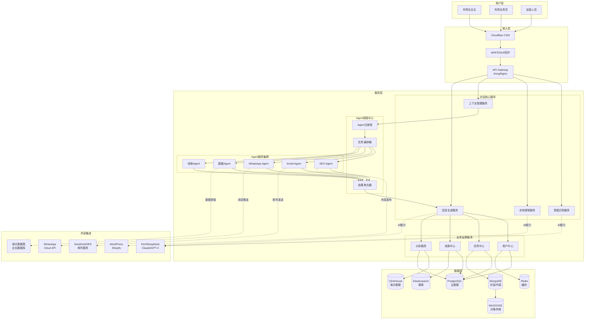

---

## 2. 核心业务流程图

### 2.1 获客任务完整生命周期

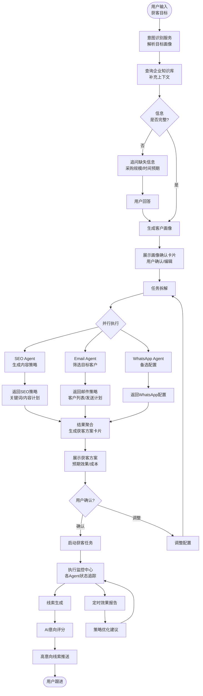

### 2.2 主管Agent协调逻辑

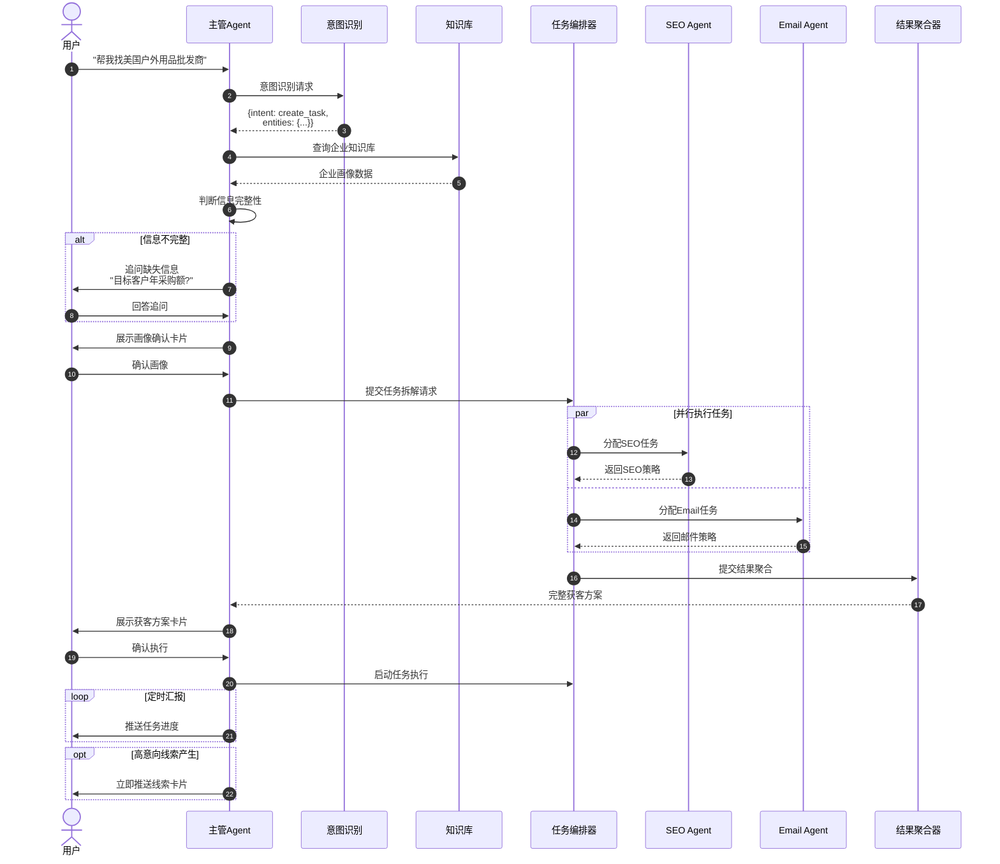

---

## 3. 数据流程图

### 3.1 线索数据全生命周期

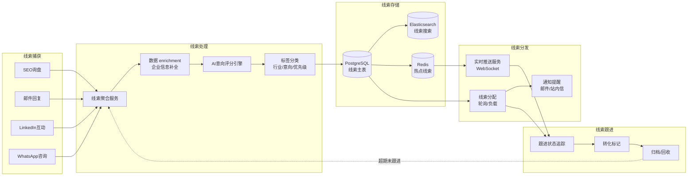

### 3.2 内容发布数据流（SEO Agent）

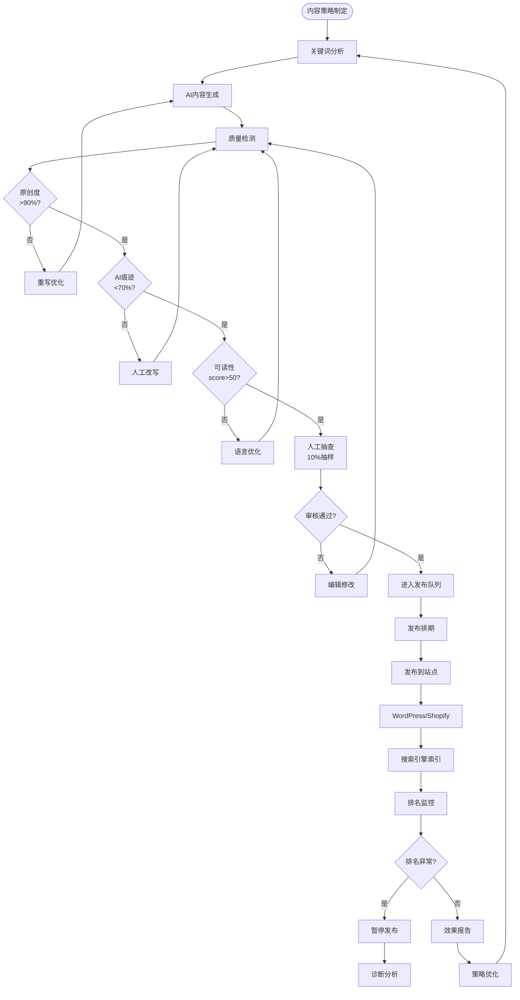

### 3.3 邮件发送数据流（Email Agent）

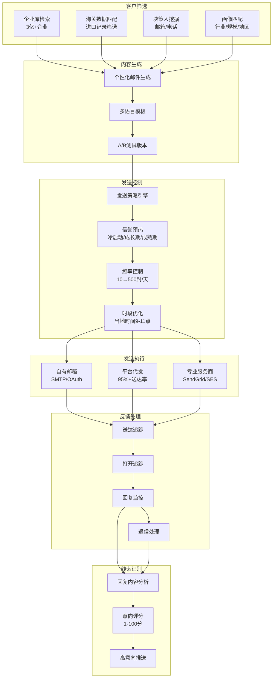

---

## 4. 状态机图

### 4.1 获客任务状态机

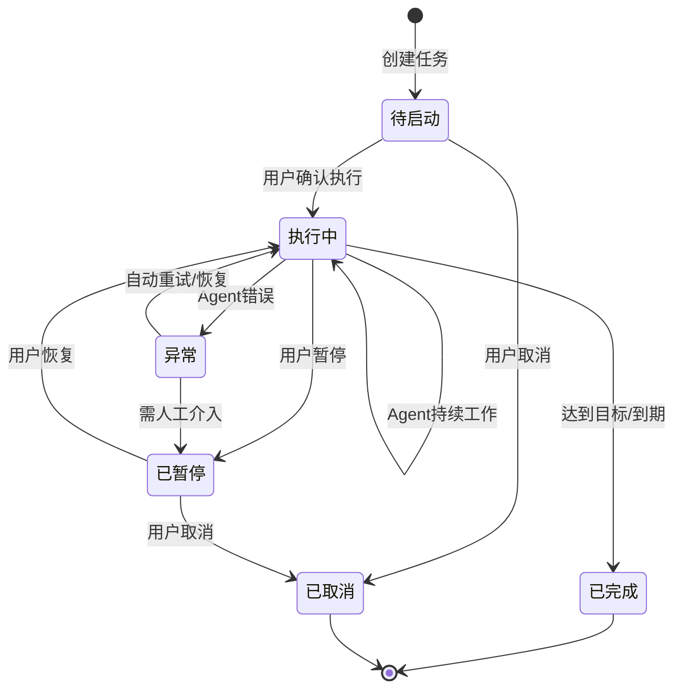

### 4.2 线索状态机

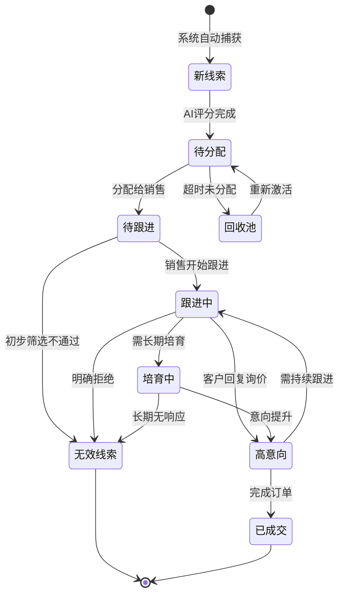

---

## 5. 时序图

### 5.1 用户创建获客任务时序

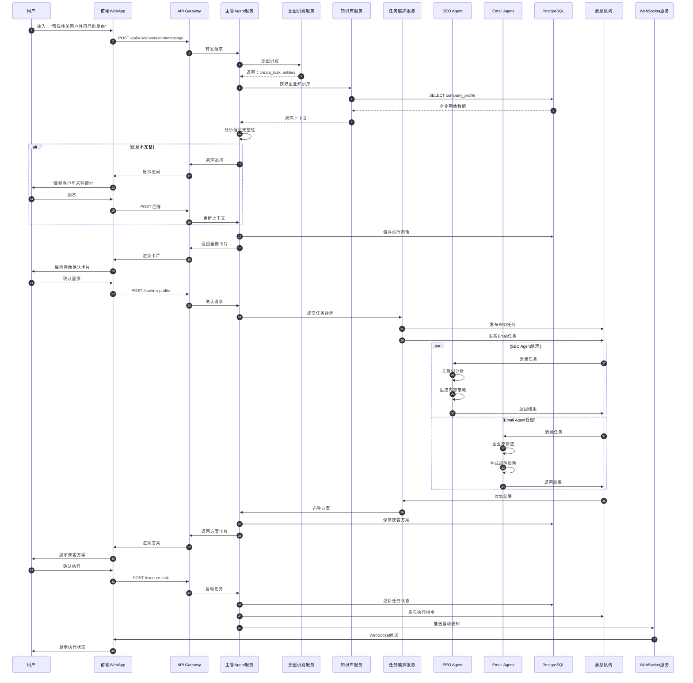

### 5.2 线索实时推送时序

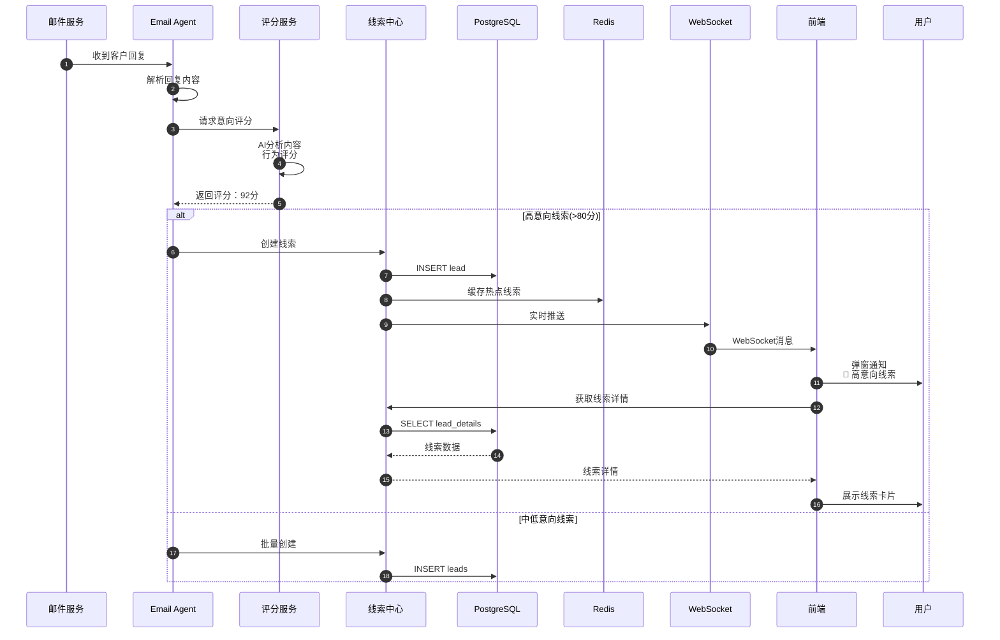

### 5.3 内容发布流程时序

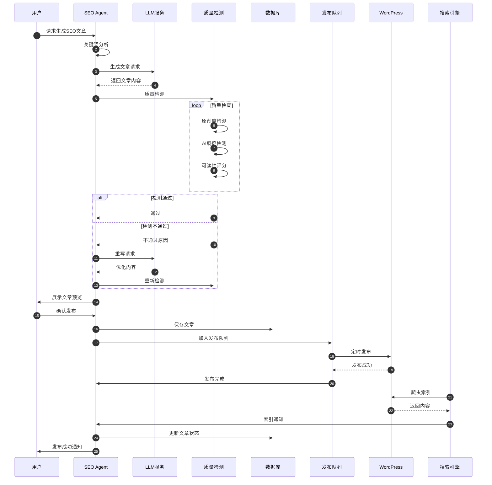

---

## 6. 领域模型图

### 6.1 核心业务实体关系

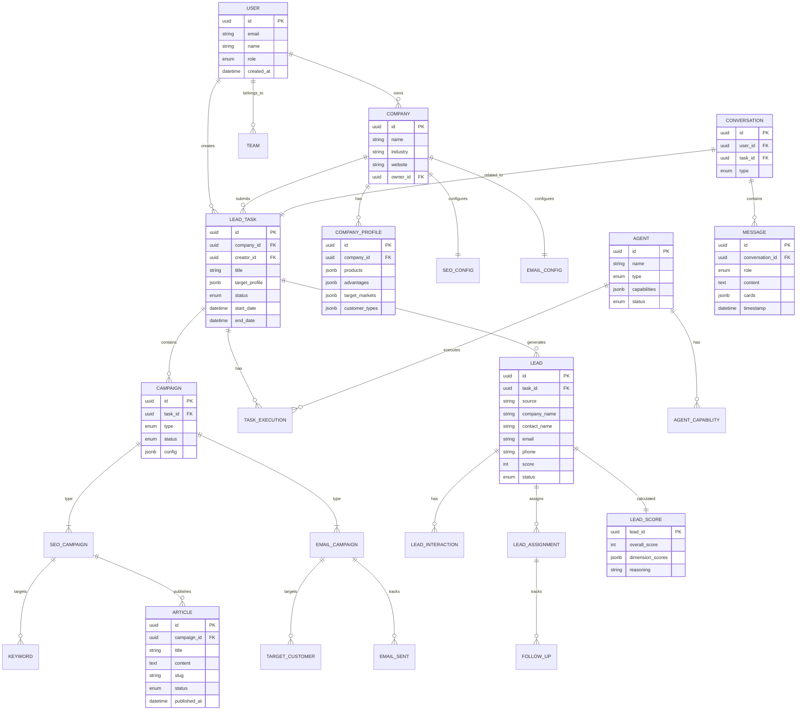

---

## 7. 部署架构图

### 7.1 Kubernetes部署拓扑

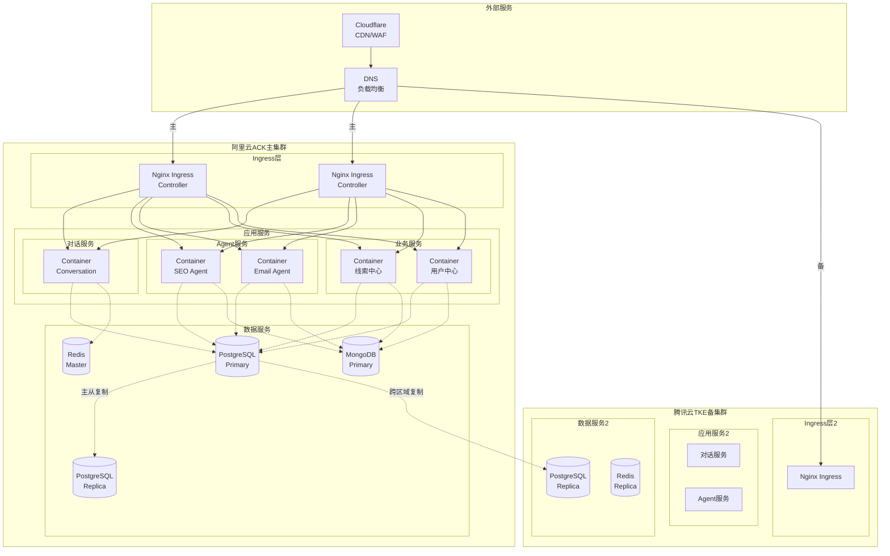

---

## 8. 监控告警架构

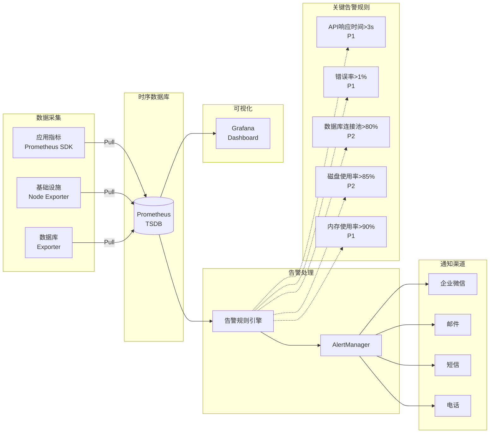

---

*文档说明：本文档使用Mermaid语法绘制，可在支持Mermaid的Markdown编辑器或GitHub/GitLab中直接渲染为图表*
