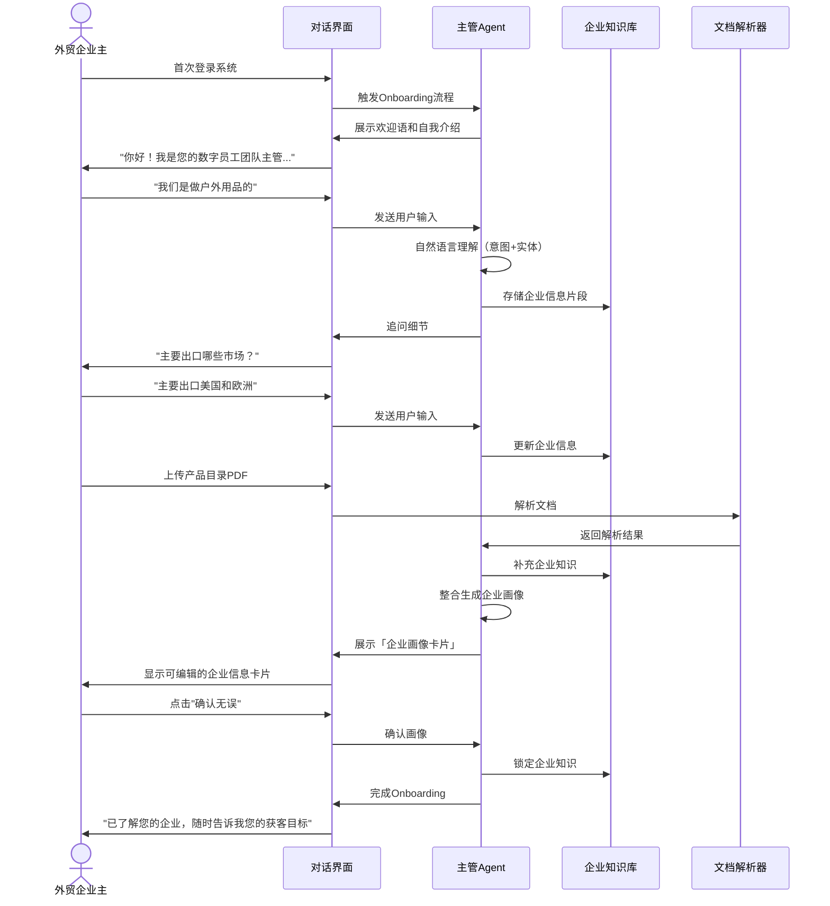
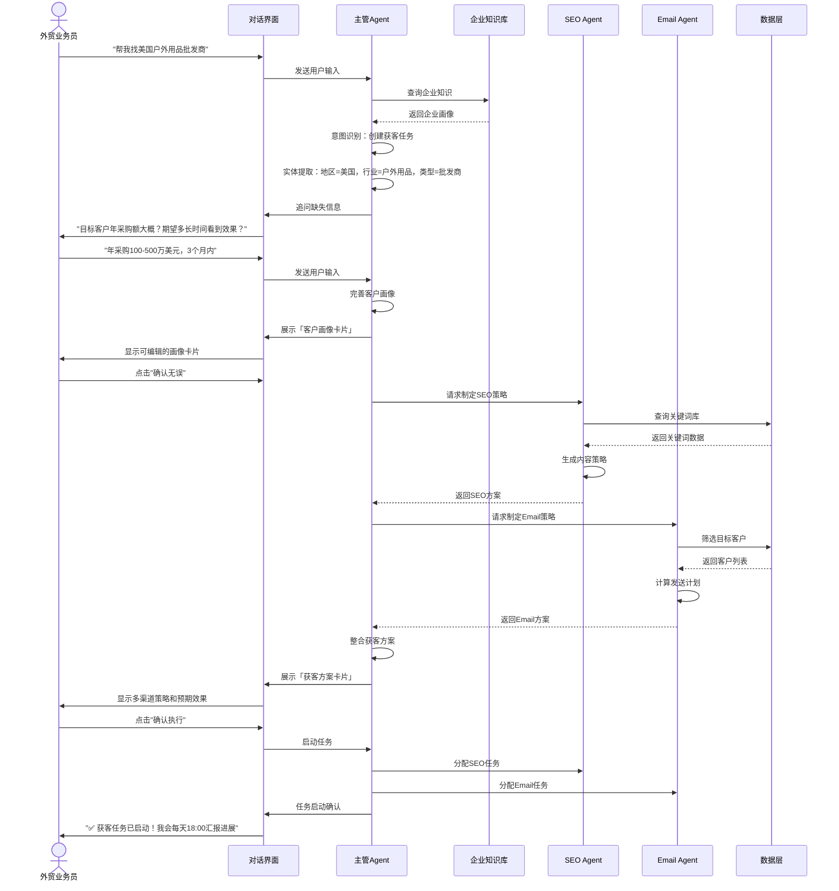
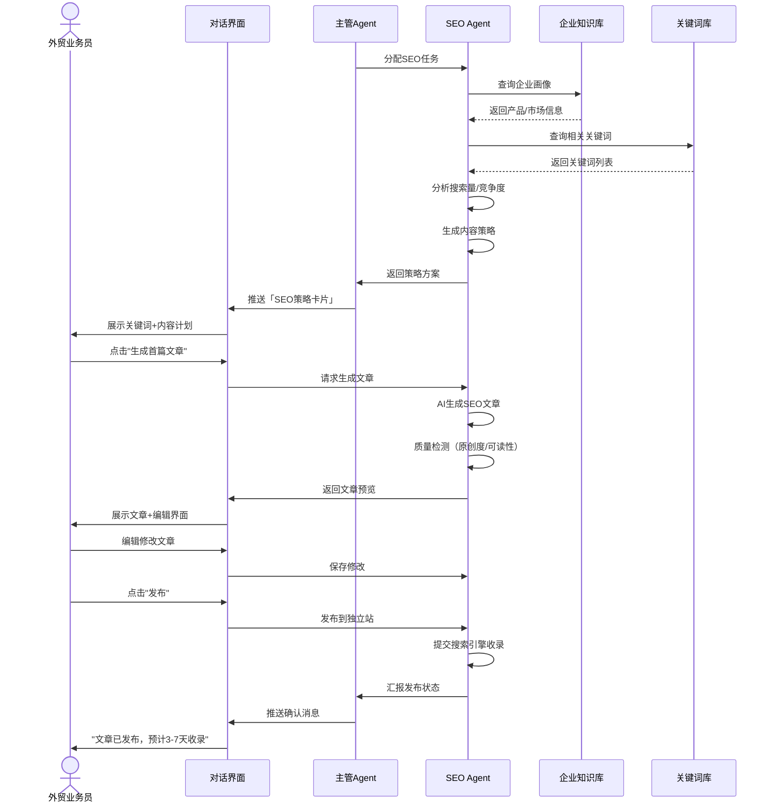
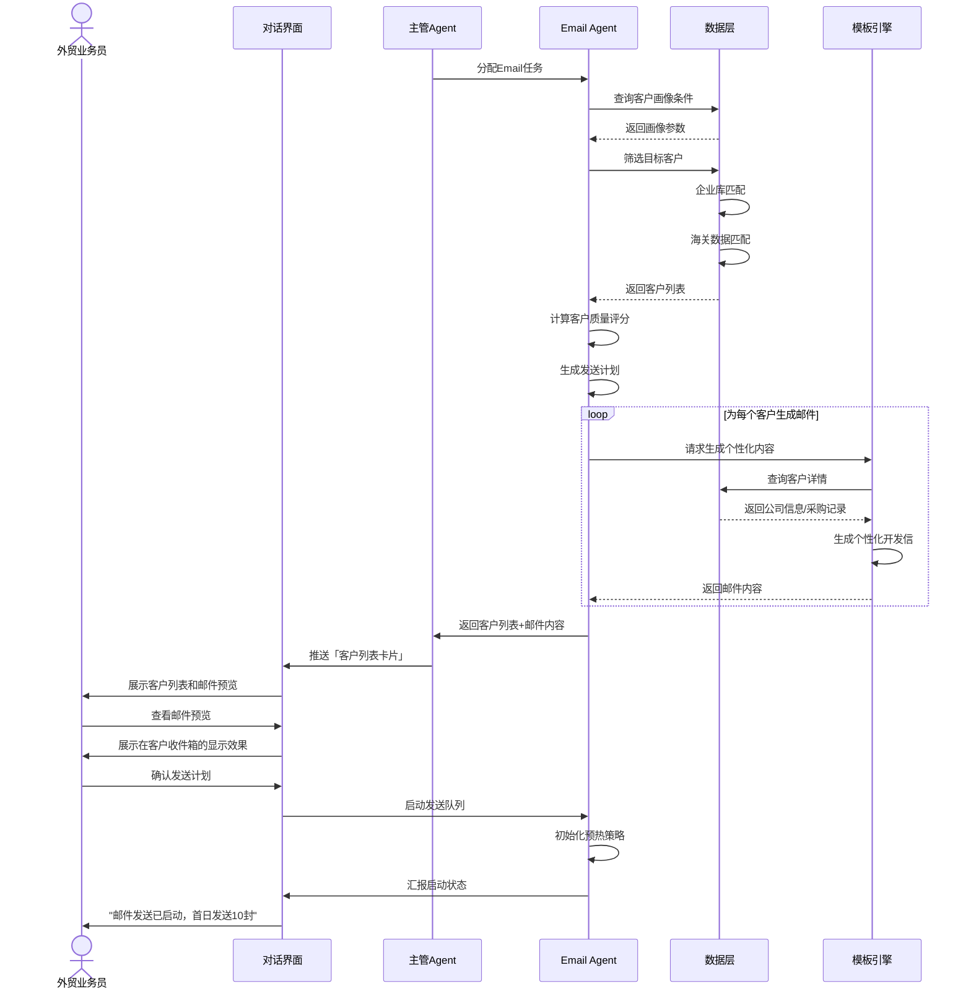
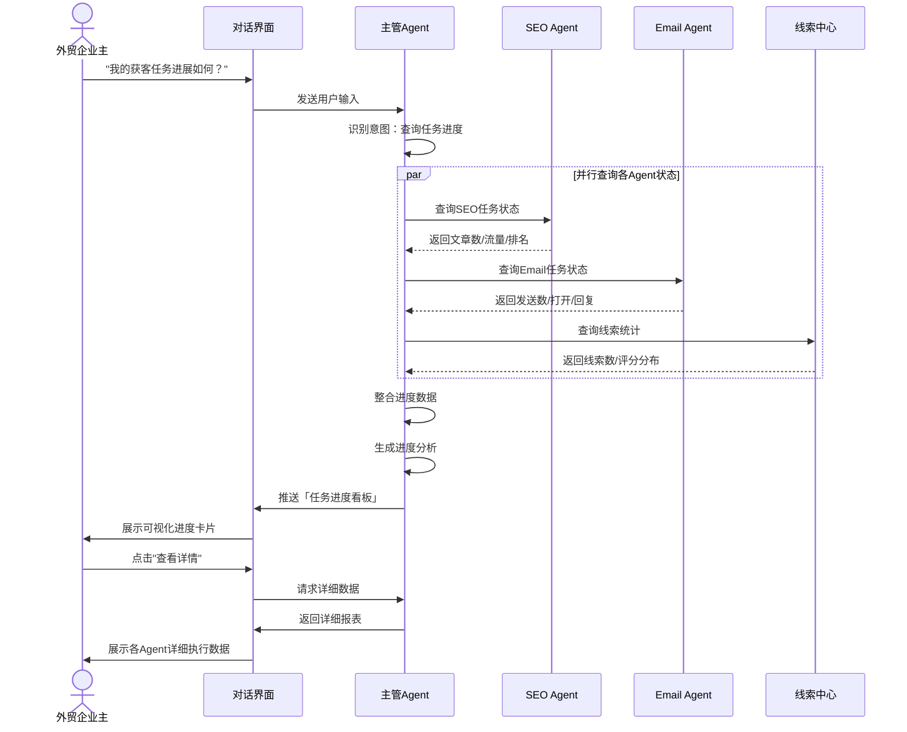
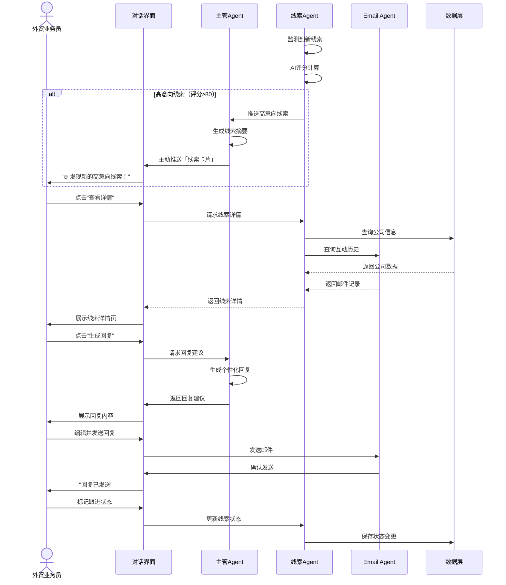
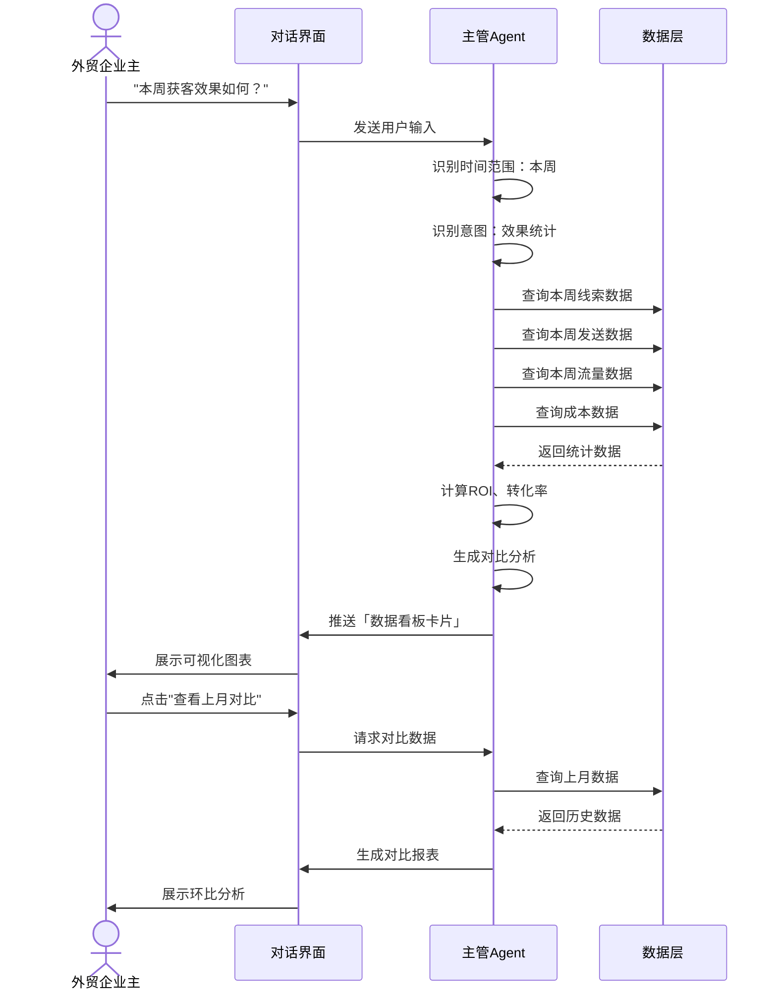

# DealClaw 数字员工团队 - 产品需求文档 V4.0

> 文档版本: V4.0（用户故事旅程详细版）  
> 最后更新: 2026-03-27  
> 核心理念: **对话式AI数字团队**，外贸B2B的AI员工而非工具  
> 产品形态: 主管Agent统一入口，多Agent协作执行，全程自然语言交互  

---

## 0. 竞品分析与差异化价值

### 0.1 市场格局与竞品分析

#### 0.1.1 目标市场定义

**市场范围**：外贸B2B企业获客工具市场  
**目标客户**：中国出口型外贸企业（年出口额100万-1亿美元）  
**核心痛点**：获客成本高、效率低、依赖人工、缺乏长期资产积累

#### 0.1.2 竞品全景图

| 竞品类型 | 代表产品 | 核心模式 | 定价 | 主要优势 | 主要短板 |
|---------|---------|---------|------|---------|---------|
| **通用AI Agent** | Kimi Claw、MaxClaw | 对话式AI助手 | ¥39-199/月 | 交互体验好、成本低 | 无外贸数据、无行业know-how |
| **外贸数据工具** | 品推智能体、小蓝本 | 数据驱动外联 | 年费制 | 3亿+企业数据、海关数据 | 无对话能力、纯工具属性 |
| **海外AI SDR** | Apollo.io、ZoomInfo | 欧美数据+邮件外联 | $199-599/月 | 数据质量高、生态完善 | 欧美数据为主、本土化不足 |
| **AI销售Agent** | Workus AI、光年触达iSales | Agent自动获客 | 按效果付费 | 自动化程度高、结果导向 | 配置界面、无长期资产 |

#### 0.1.3 核心竞品深度分析

**【直接竞品】Workus AI**

| 维度 | 详情 |
|-----|------|
| **定位** | AI Agent驱动的B2B商业网络 |
| **核心能力** | 100+数据源、多渠道触达（邮件/LinkedIn/WhatsApp）、按效果付费 |
| **产品形态** | 配置界面为主，非对话式 |
| **商业模式** | RaaS（按有效商机付费），单价¥300-500/条 |
| **优势** | 数据覆盖广、自动化程度高、结果承诺 |
| **短板** | ① 配置界面操作复杂，学习成本高<br>② 无SEO内容能力，获客成本无法递减<br>③ 无资产积累，客户流失即无价值沉淀 |

**【直接竞品】光年触达 iSales**

| 维度 | 详情 |
|-----|------|
| **定位** | AI驱动的出海营销解决方案 |
| **核心能力** | 60+数据库、马尔可夫状态机+强化学习、销售Agent |
| **产品形态** | 配置界面+部分自动化 |
| **商业模式** | 按效果付费（线索数/消息数） |
| **成绩** | 上线半年营收平衡，月营收200万，获客效率提升10倍 |
| **优势** | 算法能力强、效果数据好、自我造血能力 |
| **短板** | ① 仍需人工配置，非完全自主<br>② 无对话式交互<br>③ 缺乏SEO内容能力，长期获客成本无法降低 |

**【间接竞品】品推智能体**

| 维度 | 详情 |
|-----|------|
| **定位** | 数据驱动获客工具 |
| **核心能力** | 3亿企业+106亿海关数据 |
| **产品形态** | 传统SaaS工具界面 |
| **商业模式** | 年费制 |
| **优势** | 数据资产深厚、海关数据优势 |
| **短板** | ① 无AI Agent能力<br>② 无对话交互<br>③ 无内容营销能力 |

**【间接竞品】Apollo.io**

| 维度 | 详情 |
|-----|------|
| **定位** | 海外B2B数据+外联平台 |
| **核心能力** | 2.7亿企业数据、邮件外联、CRM集成 |
| **产品形态** | 欧美主流SaaS工具 |
| **商业模式** | $199/月起 |
| **优势** | 数据质量高、生态完善、品牌知名度 |
| **短板** | ① 欧美数据为主，中国供应商数据弱<br>② 无本土化服务<br>③ 无SEO内容能力 |

---

### 0.2 差异化价值分析

#### 0.2.1 核心差异化定位

> **DealClaw 是首个为外贸B2B打造的「对话式AI数字员工团队」**
> 
> 不是工具，是团队。不是功能堆砌，是数字员工协作。
> 
> 用户只需通过自然语言定义目标，主管Agent自动理解需求、协调子Agent团队、整合多渠道能力，全程无需人工干预，交付可成交的商机。

#### 0.2.2 与核心竞品的差异化对比

| 对比维度 | Workus AI | 光年触达iSales | **DealClaw** |
|---------|-----------|---------------|-------------|
| **产品形态** | 自动化工具 | 自动化工具 | **AI数字员工团队** |
| **交互方式** | 配置界面 | 配置界面 | **自然语言对话（唯一入口）** |
| **用户角色** | 配置管理员 | 配置管理员 | **团队管理者** |
| **获客模式** | 纯主动外联 | 纯主动外联 | **主动外联+被动SEO（双引擎）** |
| **资产积累** | 无 | 无 | **独立站+内容库（客户带走）** |
| **长期成本** | 恒定（每次付费） | 恒定（每次付费） | **递减（SEO边际成本→0）** |
| **扩展性** | 功能模块 | 功能模块 | **数字员工角色扩展** |

#### 0.2.3 三大核心差异化价值

**【差异化价值1】对话式数字员工交互**

| 对比项 | 竞品 | DealClaw |
|-------|------|---------|
| **获客任务创建** | 填写复杂表单（10+字段） | 自然语言一句话："帮我找美国户外用品批发商" |
| **画像确认** | 在配置页面逐项调整 | 富媒体卡片可视化，一键确认或编辑 |
| **进度查询** | 进入仪表盘查看 | 对话中直接问："我的任务进展如何？" |
| **效果查看** | 导出报表分析 | 对话中推送数据看板卡片 |
| **Agent协作** | 用户手动协调各功能模块 | 主管Agent自动协调，用户无感知 |

**价值主张**：将"操作软件"变为"与数字员工对话」，降低90%学习成本，提升300%使用频率

---

**【差异化价值2】双引擎获客（主动+被动）**

```
竞品获客模式（单引擎）：
数据外联 → 触达客户 → 获得线索 → 循环（成本恒定）
   ↑___________________________________________|

DealClaw获客模式（双引擎）：
数据外联引擎（即时见效）          SEO内容引擎（长期积累）
       ↓                                    ↓
主动触达潜在客户                    被动吸引搜索流量
       ↓                                    ↓
快速获取首批线索和反馈              积累内容资产和品牌权重
       ↓                                    ↓
验证市场和优化话术                  降低长期获客成本
       ↓                                    ↓
└───────────┬────────────────────────────┘
            ↓
     形成获客飞轮效应
     短期见效 + 长期降本
```

**成本对比**（以12个月为周期）：

| 月份 | 竞品纯外联成本 | DealClaw外联成本 | DealClaw SEO成本 | DealClaw综合成本 |
|-----|--------------|-----------------|-----------------|-----------------|
| 1-3 | ¥150/线索 | ¥150/线索 | ¥50/线索（投入期） | ¥200/线索 |
| 4-6 | ¥150/线索 | ¥150/线索 | ¥30/线索（见效期） | ¥180/线索 |
| 7-12 | ¥150/线索 | ¥150/线索 | ¥10/线索（收获期） | ¥160/线索 |
| **平均** | **¥150/线索** | **¥150/线索** | **递减至¥10/线索** | **¥100/线索** |

**价值主张**：不只是"更好的获客工具"，而是"唯一能同时解决短期现金流+长期资产积累的AI营销系统"

---

**【差异化价值3】可扩展的数字员工生态**

| 阶段 | 数字员工构成 | 覆盖场景 |
|-----|-------------|---------|
| **MVP（现在）** | 主管Agent + SEO Agent + Email Agent | 获客阶段 |
| **Phase 2（+3月）** | + WhatsApp Agent + 社媒Agent | 获客+触达 |
| **Phase 3（+6月）** | + 竞对监控Agent + 选品报价Agent | 获客+决策支持 |
| **Phase 4（+12月）** | + 物流Agent + 客服Agent + 跟单Agent | 全链路外贸支持 |

**价值主张**：客户不是在买软件，而是在雇佣一个**7×24小时工作的外贸AI团队**，且这个团队可以不断"招聘新成员"

---

#### 0.2.4 差异化壁垒分析

| 壁垒类型 | 壁垒深度 | 构建路径 | 竞品复制难度 |
|---------|---------|---------|------------|
| **对话式交互** | 🟢 高 | 技术+体验双重积累 | 高（需重构产品架构） |
| **双引擎协同** | 🟢 高 | SEO+外联技术栈整合 | 高（需跨领域能力） |
| **企业知识库** | 🟡 中→高 | 用户投入→知识积累→效果提升→粘性增强 | 中（需时间积累） |
| **多Agent架构** | 🟢 高 | 架构设计+协调算法 | 高（技术门槛） |
| **数据资产** | 🟡 中 | 3亿企业+海关数据采购 | 中（资金门槛） |

**核心结论**：
- 短期壁垒：对话式交互体验、双引擎协同能力
- 中期壁垒：企业知识库积累、多Agent协调算法
- 长期壁垒：完整数字员工生态、数据飞轮效应

---

#### 0.2.5 目标客户价值主张

**对于外贸企业主**：
> "用DealClaw，相当于雇佣了一支7×24小时的AI获客团队，每月成本仅相当于半个业务员，却能产出3-5倍的线索，而且获客成本会随时间越来越低。"

**对于外贸业务员**：
> "不用再手动找客户、写邮件、盯数据，只需要告诉主管Agent你的目标，AI自动完成所有繁琐工作，你只需要跟进高意向客户。"

**对于初创外贸公司**：
> "零门槛启动，不需要懂技术、不需要买数据、不需要建站，5分钟配置，当天开始获客。"

---

## 1. 产品定位

### 1.1 一句话描述

**DealClaw** 是首个为外贸B2B打造的**对话式AI数字员工团队**。用户通过自然语言与「数字员工团队主管Agent」对话，主管Agent理解需求、协调专业Agent团队（SEO/Email/社媒等）、整合多渠道能力，全程无需人工干预，交付可成交的商机。

未来，数字员工团队将持续扩展，覆盖外贸全场景：**物流Agent、竞对监控Agent、选品报价Agent、报关Agent、客服Agent**等，构建完整的外贸AI数字员工生态。

### 1.2 核心差异：数字员工 vs 传统工具

| 维度 | 传统SaaS工具 | Workus/iSales（自动化工具） | **DealClaw（数字员工团队）** |
|-----|------------|---------------------------|---------------------------|
| **产品形态** | 功能模块堆砌 | 自动化执行系统 | **AI数字员工协作** |
| **交互方式** | 点击、表单填写 | 配置界面 | **自然语言对话** |
| **执行主体** | 用户操作工具 | 系统按规则执行 | **多Agent自主协作** |
| **用户角色** | 操作员 | 配置管理员 | **团队管理者** |
| **知识学习** | 用户手动录入 | 上传文档解析 | **AI主动学习企业知识** |
| **方案生成** | 预设模板选择 | 预设流程执行 | **Agent团队动态制定** |
| **人工干预** | 全程人工操作 | 关键节点需人工 | **全程自主，结果确认** |
| **扩展性** | 购买更多模块 | 功能扩展 | **雇佣更多数字员工** |

### 1.3 产品形态

**三栏式对话界面**，类似 Kimi Claw：
- **左侧**：任务/项目导航 + Agent团队管理
- **中间**：对话区域（唯一人机交互入口）
- **右侧**：动态上下文面板（实时数据/线索/状态）

---

## 2. 版本历史

| 版本 | 日期 | 变更说明 |
|-----|------|---------|
| V2.2 | 2026-03-26 | 竞争差异化版，双引擎获客 |
| V3.0 | 2026-03-27 | 架构重构版，对话式AI数字团队，完整架构图含未来Agent，补充所有实现细节 |
| **V4.0** | **2026-03-27** | **用户故事旅程详细版，新增第5章「用户故事旅程及详细功能设计」，每条用户故事包含概念、泳道图、界面交互图、功能流程（正常/分支/异常）** |

---

## 3. 核心概念

### 3.1 数字员工团队架构（完整版）

```
                         用户（外贸企业主/业务员）
                          │
                          ▼ 唯一对话入口
            ┌─────────────────────────────────────────┐
            │      数字员工团队主管Agent               │
            │  ┌─────────────────────────────────┐    │
            │  │ 核心职责：管理协调（不直接执行）  │    │
            │  │ • 自然语言理解（意图+实体）       │    │
            │  │ • 企业知识管理（画像+上下文）     │    │
            │  │ • 任务拆解与Agent分配            │    │
            │  │ • 进度监控与结果汇总             │    │
            │  │ • 异常处理与升级决策             │    │
            │  └─────────────────────────────────┘    │
            └───────────────────┬─────────────────────┘
                                │
        ┌───────────────────────┼───────────────────────┐
        │                       │                       │
        ▼                       ▼                       ▼
┌─────────────────┐   ┌─────────────────┐   ┌─────────────────┐
│   SEO Agent     │   │   Email Agent   │   │  WhatsApp Agent │
│  （P0已上线）    │   │  （P0已上线）    │   │  （P1开发中）    │
├─────────────────┤   ├─────────────────┤   ├─────────────────┤
│• 三种模式配置   │   │• 多源客户筛选   │   │• Cloud API接入  │
│• 关键词策略     │   │• 个性化邮件     │   │• 自动回复工作流 │
│• 内容生成发布   │   │• 发送策略执行   │   │• 统一收件箱     │
│• 站点优化诊断   │   │• 信誉预热维护   │   │• 线索捕获转化   │
│• SEO风控监控    │   │• 反垃圾机制     │   │• 人工接管协作   │
└─────────────────┘   └─────────────────┘   └─────────────────┘
        │                       │                       │
        ▼                       ▼                       ▼
┌─────────────────┐   ┌─────────────────┐   ┌─────────────────┐
│   社媒Agent     │   │   数据Agent     │   │   线索Agent     │
│  （P1开发中）    │   │   （能力层）     │   │   （聚合层）     │
├─────────────────┤   ├─────────────────┤   ├─────────────────┤
│• LinkedIn运营   │   │• 3亿企业库检索   │   │• 多渠道线索聚合  │
│• WhatsApp接入   │   │• 海关数据匹配    │   │• AI意向评分      │
│• 社媒线索捕获   │   │• 社媒数据抓取    │   │• 线索分配跟进    │
│• 内容自动发布   │   │• 联系人挖掘      │   │• 转化漏斗分析    │
│• 互动管理       │   │• 数据质量验证    │   │• 跟进提醒        │
└─────────────────┘   └─────────────────┘   └─────────────────┘
        │
        │     ═══════════════════════════════════════════════════
        │     ║           未来数字员工扩展（虚线框）               ║
        │     ╠═══════════════════════════════════════════════════╣
        │     ║                                                   ║
        │     ║  ┌───────────┐ ┌───────────┐ ┌───────────┐      ║
        │     ║  │ 物流Agent │ │竞对监控Agent│ │选品报价Agent│     ║
        │     ║  │（P3规划）  │ │（P2规划）  │ │（P2规划）  │      ║
        │     ║  ├───────────┤ ├───────────┤ ├───────────┤      ║
        │     ║  │•物流方案  │ │•价格监控  │ │•成本分析   │      ║
        │     ║  │•报关文件  │ │•产品对比  │ │•智能报价   │      ║
        │     ║  │•运费比价  │ │•市场趋势  │ │•利润测算   │      ║
        │     ║  │•状态跟踪  │ │•策略建议  │ │•MOQ建议    │      ║
        │     ║  └───────────┘ └───────────┘ └───────────┘      ║
        │     ║                                                   ║
        │     ║  ┌───────────┐ ┌───────────┐ ┌───────────┐      ║
        │     ║  │ 报关Agent │ │ 监控Agent │ │ 选品Agent │      ║
        │     ║  │（P3规划）  │ │（P2规划）  │ │（P2规划）  │      ║
        │     ║  ├───────────┤ ├───────────┤ ├───────────┤      ║
        │     ║  │•单证生成  │ │•竞品追踪  │ │•市场分析   │      ║
        │     ║  │•HS编码   │ │•动态预警  │ │•趋势预测   │      ║
        │     ║  │•合规审核  │ │•数据报告  │ │•产品推荐   │      ║
        │     ║  │•税率计算  │ │•策略建议  │ │•定价辅助   │      ║
        │     ║  └───────────┘ └───────────┘ └───────────┘      ║
        │     ║                                                   ║
        │     ║  ┌───────────┐ ┌───────────┐ ┌───────────┐      ║
        │     ║  │ 客服Agent │ │ 跟单Agent │ │ 风控Agent │      ║
        │     ║  │（P3规划）  │ │（P3规划）  │ │（P3规划）  │      ║
        │     ║  ├───────────┤ ├───────────┤ ├───────────┤      ║
        │     ║  │•售后解答  │ │•订单跟踪  │ │•合规检查   │      ║
        │     ║  │•投诉处理  │ │•交付提醒  │ │•欺诈识别   │      ║
        │     ║  │•FAQ回复   │ │•异常预警  │ │•信用评估   │      ║
        │     ║  │•满意度   │ │•客户回访  │ │•风险提示   │      ║
        │     ║  └───────────┘ └───────────┘ └───────────┘      ║
        │     ║                                                   ║
        │     ╚═══════════════════════════════════════════════════╝
        │
        └─────────────────────────────────────────────────────┐
                                                            │
                              ┌─────────────────────────────┘
                              ▼
                    ┌─────────────────────┐
                    │      数据层          │
                    ├─────────────────────┤
                    │ • 3亿+企业数据库     │
                    │ • 100亿+海关数据     │
                    │ • 5000万+决策人数据  │
                    │ • 1亿+社媒档案       │
                    │ • 100万+外贸关键词   │
                    └─────────────────────┘
```

**架构设计原则**：
1. **单一对话入口**：用户只和「主管Agent」对话，无需切换界面
2. **职责分离**：主管Agent只做「管理协调」，子Agent做「专业执行」
3. **可扩展**：虚线框展示未来Agent，体现数字员工团队的完整愿景
4. **数据共享**：所有Agent共享企业知识库和核心数据层

### 3.2 企业知识库（核心上下文）

**为什么关键**：所有获客任务的上下文基础

| 知识类型 | 内容 | 来源 |
|---------|------|------|
| **企业画像** | 产品类别、核心优势、差异化卖点 | Onboarding对话/资料上传 |
| **业务背景** | 主营市场、目标客户类型、成交案例 | Onboarding对话/资料上传 |
| **获客历史** | 过往任务、效果数据、优化记录 | 任务执行自动积累 |
| **用户偏好** | 沟通风格、保守程度、决策习惯 | 对话中自动学习 |

**知识应用场景**：
- **创建任务时**：自动引用产品信息、优势卖点
- **内容生成时**：融入企业差异化优势
- **客户筛选时**：匹配目标市场偏好
- **邮件撰写时**：突出相关案例和认证

### 3.3 对话即界面（CUI - Conversational UI）

用户通过自然语言完成所有操作：

| 用户意图 | 对话示例 | 系统响应 |
|---------|---------|---------|
| **企业知识录入** | "我们是做户外用品的，主要出口美国" | 主管Agent追问细节 → 生成企业画像卡片 |
| **创建获客任务** | "帮我找美国户外用品批发商" | 主管Agent调用画像 → 追问细节 → 协调Agent制定方案 |
| **查看进度** | "我的获客任务进展如何？" | 主管Agent汇报各Agent工作状态 |
| **获取线索** | "今天有什么新线索？" | 主管Agent推送高意向线索卡片 |
| **优化内容** | "@Email Agent 帮我优化这封邮件" | Email Agent生成优化建议 |
| **查看数据** | "本周获客效果如何？" | 主管Agent展示数据看板卡片 |

### 3.4 富媒体卡片

对话中嵌入可交互的富媒体卡片：

- **企业画像卡片**：展示AI理解的企业信息，可编辑确认
- **获客方案卡片**：展示各Agent策略组合，可一键确认/调整
- **内容预览卡片**：展示生成的文章/邮件，可编辑、预览、发布
- **线索摘要卡片**：展示关键线索信息，可查看详情、一键跟进
- **数据看板卡片**：展示核心指标，可下钻查看详情

---

## 4. 用户故事

### 4.1 数字员工团队主管Agent

| ID | 用户故事 | 优先级 |
|:---:|---------|:------:|
| MA-001 | 作为外贸企业主，我希望首次登录时主管Agent主动自我介绍并引导我完成企业知识录入，以便建立协作关系 | P0 |
| MA-001a | 作为外贸企业主，我希望通过对话方式向主管Agent介绍我的企业（产品、优势、主营市场、目标客户），以便AI理解我的业务 | P0 |
| MA-001b | 作为外贸企业主，我希望上传企业资料（官网链接/产品目录PDF/公司介绍PPT）让AI自动解析学习，以便快速建立知识库 | P0 |
| MA-001c | 作为外贸业务员，我希望看到AI生成的「企业画像卡片」展示AI理解的内容，并能编辑修正，以便确保AI准确理解我的企业 | P0 |
| MA-001d | 作为外贸企业主，我希望主管Agent基于已学习的企业知识，主动询问我的获客需求（目标地区/客户类型/预算/时间），以便制定初步策略 | P0 |
| MA-001e | 作为外贸企业主，我希望主管Agent生成「获客策略建议」（基于企业特点推荐最佳渠道组合），以便确认方向 | P1 |
| MA-001f | 作为外贸业务员，我希望后续创建任务时主管Agent能引用企业知识自动填充相关内容，以便减少重复输入 | P1 |
| MA-002 | 作为外贸业务员，我希望能用自然语言告诉主管Agent我的获客目标，以便快速启动获客任务 | P0 |
| MA-003 | 作为外贸业务员，我希望主管Agent在理解目标后主动追问关键细节，以便生成精准的客户画像 | P0 |
| MA-004 | 作为外贸业务员，我希望看到「画像确认卡片」并能直接编辑确认，以便确保画像准确 | P0 |
| MA-005 | 作为外贸业务员，我希望主管Agent根据画像自动协调SEO和Email Agent制定获客方案，以便获得多渠道策略 | P0 |
| MA-006 | 作为外贸业务员，我希望看到「获客方案卡片」展示各Agent任务分配和预期效果，以便确认或调整 | P0 |
| MA-007 | 作为外贸企业主，我希望随时询问主管Agent"任务进展如何"，以便了解各Agent工作状态 | P0 |
| MA-008 | 作为外贸业务员，我希望主管Agent主动推送高意向线索，并能一键查看详情/生成回复，以便及时跟进 | P0 |
| MA-009 | 作为外贸企业主，我希望询问"本周获客效果"时主管Agent展示数据看板，以便评估ROI | P0 |
| MA-010 | 作为外贸业务员，我希望主管Agent基于数据给出优化建议，以便持续提升效果 | P1 |
| MA-011 | 作为外贸业务员，我希望在对话中@指定Agent进行专业对话，以便深入某个领域 | P1 |
| MA-012 | 作为外贸企业主，我希望主管Agent记住我的偏好，以便后续任务自动应用 | P1 |
| MA-013 | 作为外贸业务员，我希望主管Agent支持语音输入，以便在移动端快速下达指令 | P2 |

### 4.2 SEO Agent

| ID | 用户故事 | 优先级 |
|:---:|---------|:------:|
| SEO-001 | 作为外贸业务员，我希望SEO Agent根据我的产品和目标客户自动生成「内容策略方案」，以便明确SEO方向 | P0 |
| SEO-002 | 作为外贸业务员，我希望SEO Agent基于外贸长尾关键词库推荐目标关键词，以便精准定位 | P0 |
| SEO-003 | 作为外贸业务员，我希望SEO Agent生成SEO优化文章并展示预览，以便审核发布 | P0 |
| SEO-004 | 作为外贸业务员，我希望在文章中直接编辑修改AI生成的内容，以便符合品牌调性 | P0 |
| SEO-005 | 作为外贸业务员，我希望一键将文章发布到我的独立站（WordPress/Shopify），以便快速上线 | P0 |
| SEO-006 | 作为外贸企业主，我希望SEO Agent自动优化我现有独立站的页面，以便提升整站SEO评分 | P1 |
| SEO-007 | 作为外贸业务员，我希望看到每篇文章的SEO效果数据，以便评估内容价值 | P1 |
| SEO-008 | 作为外贸企业主，我希望SEO Agent分析竞品独立站的SEO策略，以便制定差异化方案 | P1 |
| SEO-009 | 作为无独立站的外贸企业主，我希望SEO Agent一键生成专业外贸独立站并绑定域名，以便快速建立线上阵地 | P2 |
| SEO-010 | 作为外贸业务员，我希望SEO Agent根据文章表现自动调整内容策略，以便持续优化 | P2 |
| SEO-011 | 作为外贸企业主，我希望SEO Agent展示三种SEO获客模式（自引流/AI建站/平台引流）的对比，以便选择适合的模式 | P0 |
| SEO-012 | 作为外贸业务员，我希望SEO Agent自动检测内容质量（AI痕迹/原创度/可读性），以避免搜索引擎惩罚 | P1 |
| SEO-013 | 作为外贸企业主，我希望SEO Agent监控站点SEO健康状态（收录/排名/流量），异常时主动预警，以便及时应对 | P1 |

### 4.3 Email Agent

| ID | 用户故事 | 优先级 |
|:---:|---------|:------:|
| EM-001 | 作为外贸业务员，我希望Email Agent从3亿企业库+海关数据中筛选匹配画像的目标客户，以便获得精准列表 | P0 |
| EM-002 | 作为外贸业务员，我希望Email Agent为每个目标客户生成个性化开发信，以便提升回复率 | P0 |
| EM-003 | 作为外贸业务员，我希望预览邮件在客户收件箱的显示效果，以便确保专业呈现 | P0 |
| EM-004 | 作为外贸业务员，我希望设置邮件发送策略（频率/时间/批次），以便控制发送节奏 | P0 |
| EM-005 | 作为外贸企业主，我希望Email Agent自动进行邮箱预热和信誉维护，以确保送达率 | P0 |
| EM-006 | 作为外贸业务员，我希望查看邮件发送数据（送达率/打开率/回复率），以便评估效果 | P0 |
| EM-007 | 作为外贸业务员，我希望对回复邮件的客户进行AI意向评分，以便优先跟进高意向线索 | P0 |
| EM-008 | 作为外贸业务员，我希望Email Agent自动生成跟进邮件，以便持续培育 | P1 |
| EM-009 | 作为外贸业务员，我希望对同一批客户进行A/B测试，以便找到最佳方案 | P1 |
| EM-010 | 作为外贸企业主，我希望Email Agent自动处理退信和投诉，以便维护发件域名信誉 | P1 |
| EM-011 | 作为外贸业务员，我希望配置邮件发送渠道（自有邮箱/平台代发/专业服务商），以便选择适合的发送方式 | P0 |
| EM-012 | 作为外贸企业主，我希望Email Agent协助配置SPF/DKIM/DMARC记录，以便通过邮件身份验证 | P1 |
| EM-013 | 作为外贸业务员，我希望Email Agent控制发送频率（冷启动期10封/天→成熟期500封/天），以便建立域名信誉 | P1 |
| EM-014 | 作为外贸企业主，我希望Email Agent检测邮件内容质量（避免垃圾关键词/图片比例<30%），以降低被拦截风险 | P1 |

### 4.4 WhatsApp Agent

| ID | 用户故事 | 优先级 |
|:---:|---------|:------:|
| WA-001 | 作为外贸业务员，我希望配置WhatsApp Business账号（Cloud API或App），以便接入WhatsApp获客渠道 | P1 |
| WA-002 | 作为外贸业务员，我希望配置WhatsApp自动化工作流（欢迎语/意图识别/自动回复），以便即时响应客户 | P1 |
| WA-003 | 作为外贸业务员，我希望在独立站嵌入WhatsApp联系按钮，以便访客一键发起对话 | P1 |
| WA-004 | 作为外贸业务员，我希望在邮件中添加WhatsApp联系链接，以便引导客户到即时通讯 | P1 |
| WA-005 | 作为外贸业务员，我希望通过WhatsApp统一收件箱管理所有对话，以便高效处理客户咨询 | P1 |
| WA-006 | 作为外贸业务员，我希望使用AI辅助功能（实时翻译/回复建议/情绪分析），以便提升沟通质量 | P1 |
| WA-007 | 作为外贸业务员，我希望WhatsApp对话自动捕获为线索并评分，以便统一跟进 | P1 |
| WA-008 | 作为外贸企业主，我希望WhatsApp Agent遵守防封号策略（新号限制/群发控制/内容审核），以确保账号安全 | P1 |
| WA-009 | 作为外贸业务员，我希望在必要时人工接管AI对话，以便处理复杂场景 | P1 |

### 4.5 数据与线索中心

| ID | 用户故事 | 优先级 |
|:---:|---------|:------:|
| LD-001 | 作为外贸业务员，我希望在「线索收件箱」查看所有渠道捕获的线索（SEO/邮件/社媒/WhatsApp），以便统一管理 | P0 |
| LD-002 | 作为外贸业务员，我希望看到每个线索的AI评分（1-100分）和评分依据，以便判断跟进优先级 | P0 |
| LD-003 | 作为外贸业务员，我希望查看线索的详细画像和互动历史，以便制定跟进策略 | P0 |
| LD-004 | 作为外贸业务员，我希望一键将线索分配给团队成员，以便协作跟进 | P1 |
| LD-005 | 作为外贸业务员，我希望为线索添加标签和跟进备注，以便管理客户状态 | P1 |
| LD-006 | 作为外贸企业主，我希望查看「转化漏斗」数据（曝光→线索→商机→成交），以便了解转化效率 | P1 |
| LD-007 | 作为外贸业务员，我希望对高意向线索一键生成AI回复建议，以便快速响应 | P0 |

### 4.6 设置与集成

| ID | 用户故事 | 优先级 |
|:---:|---------|:------:|
| ST-001 | 作为外贸业务员，我希望在设置中连接我的企业邮箱，以便发送开发信 | P0 |
| ST-002 | 作为外贸业务员，我希望在设置中连接我的独立站，以便SEO Agent发布内容 | P0 |
| ST-003 | 作为外贸企业主，我希望上传公司资料，以便主管Agent学习企业知识 | P0 |
| ST-004 | 作为外贸业务员，我希望配置我的获客偏好，以便个性化执行 | P1 |
| ST-005 | 作为外贸企业主，我希望邀请团队成员加入并设置权限，以便团队协作 | P1 |
| ST-006 | 作为外贸业务员，我希望与我的CRM系统（如孚盟/小满）同步线索数据，以便现有流程衔接 | P2 |

---

## 5. 系统架构

### 5.1 三层架构

```
┌─────────────────────────────────────────────────────────────────┐
│                         用户层（User Layer）                      │
│  ┌─────────────┐  ┌─────────────┐  ┌─────────────┐              │
│  │  外贸企业主  │  │  外贸业务员  │  │   运营人员   │              │
│  └──────┬──────┘  └──────┬──────┘  └──────┬──────┘              │
└─────────┼────────────────┼────────────────┼─────────────────────┘
          │                │                │
          └────────────────┴────────────────┘
                           │
                           ▼
┌─────────────────────────────────────────────────────────────────┐
│                        对话层（Conversation Layer）               │
│                                                                  │
│   ┌─────────────────────────────────────────────────────────┐   │
│   │              数字员工团队主管Agent（统一入口）              │   │
│   │  • 自然语言理解  • 企业知识管理  • 任务拆解与分配          │   │
│   │  • 进度监控与汇总  • 结果汇报与交付                        │   │
│   └──────────────────────────┬──────────────────────────────┘   │
│                              │                                   │
│   ┌──────────────────────────┼──────────────────────────────┐   │
│   │                    Agent调度中心                           │   │
│   │           • Agent注册  • 任务编排  • 结果聚合              │   │
│   └──────────────────────────┼──────────────────────────────┘   │
│                              │                                   │
│   ┌──────────────────────────┼──────────────────────────────┐   │
│   │                          │                               │   │
│   ▼                          ▼                               ▼   │
┌───────────┐            ┌───────────┐            ┌───────────┐   │
│ SEO Agent │            │Email Agent│            │WhatsApp   │   │
│  （P0）    │            │   （P0）   │            │  Agent    │   │
│           │            │           │            │  （P1）    │   │
└───────────┘            └───────────┘            └───────────┘   │
│                                                                  │
│  ┌─────────────────────────────────────────────────────────┐    │
│  ║     未来数字员工扩展（P2/P3规划，与现有Agent平级）         ║    │
│  ╠═════════════════════════════════════════════════════════╣    │
│  ║                                                         ║    │
│  ║  ┌─────────┐ ┌─────────┐ ┌─────────┐ ┌─────────┐      ║    │
│  ║  │物流Agent│ │竞对Agent│ │报价Agent│ │客服Agent│      ║    │
│  ║  │（P3）   │ │（P2）   │ │（P2）   │ │（P3）   │      ║    │
│  ║  └─────────┘ └─────────┘ └─────────┘ └─────────┘      ║    │
│  ║                                                         ║    │
│  ║  ┌─────────┐ ┌─────────┐ ┌─────────┐ ┌─────────┐      ║    │
│  ║  │报关Agent│ │监控Agent│ │选品Agent│ │跟单Agent│      ║    │
│  ║  │（P3）   │ │（P2）   │ │（P2）   │ │（P3）   │      ║    │
│  ║  └─────────┘ └─────────┘ └─────────┘ └─────────┘      ║    │
│  ║                                                         ║    │
│  ╚═════════════════════════════════════════════════════════╝    │
│                                                                  │
└─────────────────────────────────────────────────────────────────┘
                           │
                           ▼
┌─────────────────────────────────────────────────────────────────┐
│                        能力层（Capability Layer）                 │
│                                                                  │
│   ┌───────────────┐  ┌───────────────┐  ┌───────────────┐      │
│   │   数据能力     │  │   内容能力     │  │   触达能力     │      │
│   │ • 3亿企业库   │  │ • AI内容生成  │  │ • 邮件发送    │      │
│   │ • 海关数据    │  │ • SEO优化     │  │ • WhatsApp    │      │
│   │ • 社媒数据    │  │ • 多语言翻译  │  │ • 站点发布    │      │
│   │ • 决策人库    │  │ • 竞品分析    │  │ • API集成     │      │
│   └───────────────┘  └───────────────┘  └───────────────┘      │
│                                                                  │
│   ┌───────────────┐  ┌───────────────┐  ┌───────────────┐      │
│   │   风控能力     │  │   分析能力     │  │   安全合规     │      │
│   │ • SEO防封号   │  │ • 线索评分    │  │ • GDPR合规    │      │
│   │ • 邮件反垃圾  │  │ • 效果追踪    │  │ • 数据加密    │      │
│   │ • WhatsApp防封│  │ • 转化漏斗    │  │ • 访问控制    │      │
│   │ • 内容质量检测│  │ • A/B测试     │  │ • 审计日志    │      │
│   └───────────────┘  └───────────────┘  └───────────────┘      │
│                                                                  │
└─────────────────────────────────────────────────────────────────┘
```

### 5.2 核心数据流

```
用户输入："帮我找美国户外用品批发商"
       │
       ▼
┌─────────────────────────────────────────┐
│ 主管Agent：意图识别 + 企业知识库查询    │
│ • 意图：创建获客任务                     │
│ • 实体：地区=美国，行业=户外用品         │
│ • 知识库：企业画像（产品/优势/市场）     │
└──────────────────┬──────────────────────┘
                   │
       ┌───────────┴───────────┐
       ▼                       ▼
┌─────────────┐         ┌─────────────┐
│ 追问缺失信息 │         │ 生成画像卡片 │
│ • 采购规模？ │         │ • 可编辑确认 │
│ • 时间预期？ │         └──────┬──────┘
└─────────────┘                │
                               ▼
              ┌─────────────────────────────┐
              │ 主管Agent：任务拆解          │
              │ • 分配SEO Agent：内容策略    │
              │ • 分配Email Agent：外联策略  │
              │ • 分配WhatsApp Agent：备选   │
              └──────────────┬──────────────┘
                             │
              ┌──────────────┴──────────────┐
              ▼                             ▼
       ┌─────────────┐               ┌─────────────┐
       │ SEO Agent   │               │ Email Agent │
       │ 执行内容策略 │               │ 执行外联策略 │
       └──────┬──────┘               └──────┬──────┘
              │                             │
              └──────────────┬──────────────┘
                             ▼
                    ┌─────────────────┐
                    │ 获客方案卡片     │
                    │ • SEO策略+预期  │
                    │ • 邮件策略+预期 │
                    │ • WhatsApp备选  │
                    └────────┬────────┘
                             ▼
                    ┌─────────────────┐
                    │  执行监控中心    │
                    │ • 各Agent状态   │
                    │ • 实时进度追踪  │
                    │ • 异常预警      │
                    └────────┬────────┘
                             ▼
                    ┌─────────────────┐
                    │   线索交付       │
                    │ • 多渠道聚合     │
                    │ • AI意向评分    │
                    │ • 主动推送      │
                    └─────────────────┘
```

### 5.3 关键状态机

```
┌──────────┐     启动      ┌──────────┐
│  待启动   │──────────────►│ 执行中   │
│ (Created)│◄──────────────│(Running) │
└────┬─────┘   暂停/完成   └────┬─────┘
     │                          │
     │    ┌──────────────┐      │
     └───►│   已暂停     │◄─────┘
          │  (Paused)    │
          └──────────────┘
```

---

## 6. 用户故事旅程及详细功能设计

本章详细描述核心用户故事的完整旅程，每条用户故事包含：用户故事概念、泳道图（用户与系统交互）、界面交互图、功能流程（正常流程/分支流程/异常流程）。

### 6.1 主管Agent用户故事

#### 5.1.1 US-001: 首次使用Onboarding

**1. 用户故事概念**

| 要素 | 描述 |
|-----|------|
| **作为** | 外贸企业主 |
| **我希望** | 首次登录时主管Agent主动自我介绍并引导我完成企业知识录入 |
| **以便** | 建立协作关系，让AI理解我的业务 |
| **优先级** | P0 |
| **涉及Agent** | 主管Agent |

**故事详述**：
用户首次登录DealClaw，主管Agent以数字员工团队主管的身份主动问候，通过自然语言对话了解用户的企业信息（产品类别、核心优势、主营市场、目标客户），并支持上传企业资料（官网链接/产品目录PDF/公司介绍PPT）进行自动解析。最终生成「企业画像卡片」供用户确认或编辑，完成企业知识库的初始构建。

**2. 泳道图（用户与系统交互）**



**3. 界面交互图**

```
┌─────────────────────────────────────────────────────────────────────────────┐
│  Onboarding流程 - 对话界面                                                    │
├─────────────────────────────────────────────────────────────────────────────┤
│                                                                             │
│  🤖 主管Agent                                                                 │
│  ─────────────────────────────────────────────────────────────────────     │
│  你好！我是您的数字员工团队主管，将为您协调SEO、邮件等专业Agent为您获客。       │
│                                                                             │
│  首先让我了解您的企业，您是做哪个行业的？                                       │
│                                                                             │
│  ─────────────────────────────────────────────────────────────────────     │
│                                                                             │
│  👤 外贸企业主                                                                │
│  ─────────────────────────────────────────────────────────────────────     │
│  我们是做户外用品的，主要做帐篷和睡袋                                          │
│                                                                             │
│  ─────────────────────────────────────────────────────────────────────     │
│                                                                             │
│  🤖 主管Agent                                                                 │
│  ─────────────────────────────────────────────────────────────────────     │
│  了解了！您主要出口哪些市场？                                                   │
│                                                                             │
│  ─────────────────────────────────────────────────────────────────────     │
│                                                                             │
│  👤 外贸企业主                                                                │
│  ─────────────────────────────────────────────────────────────────────     │
│  主要出口美国和欧洲                                                           │
│                                                                             │
│  ─────────────────────────────────────────────────────────────────────     │
│                                                                             │
│  🤖 主管Agent                                                                 │
│  ─────────────────────────────────────────────────────────────────────     │
│  好的！您也可以上传产品目录或公司介绍，让我更全面地了解您。                     │
│                                                                             │
│  [📎 上传文件]                                                                │
│  ─────────────────────────────────────────────────────────────────────     │
│                                                                             │
│  👤 外贸企业主                                                                │
│  ─────────────────────────────────────────────────────────────────────     │
│  [上传了 product-catalog.pdf]                                                  │
│                                                                             │
│  ─────────────────────────────────────────────────────────────────────     │
│                                                                             │
│  🤖 主管Agent                                                                 │
│  ─────────────────────────────────────────────────────────────────────     │
│  已阅读您的产品目录！以下是我对贵公司的理解：                                    │
│                                                                             │
│  ┌─────────────────────────────────────────────────────────────────────┐   │
│  │ 🏢 企业画像 - AI理解确认                                             │   │
│  │ ─────────────────────────────────────────────────────────────────  │   │
│  │                                                                     │   │
│  │ 🏭 产品类别：户外用品（帐篷/睡袋/登山装备）                           │   │
│  │ 🌟 核心优势：自有工厂、OEM定制、通过ISO认证                          │   │
│  │ 🌍 主营市场：北美、欧洲                                              │   │
│  │ 🎯 目标客户：批发商、品牌商                                          │   │
│  │ 💰 价格定位：中高端                                                  │   │
│  │                                                                     │   │
│  │              [编辑修改]              [✓ 确认无误]                   │   │
│  │                                                                     │   │
│  └─────────────────────────────────────────────────────────────────────┘   │
│                                                                             │
│  ─────────────────────────────────────────────────────────────────────     │
│                                                                             │
│  [输入框：有什么可以帮你的？]         [语音] [发送]                          │
│                                                                             │
└─────────────────────────────────────────────────────────────────────────────┘
```

**4. 功能流程**

**正常流程**

| 步骤 | 动作 | 系统响应 | 输出 |
|-----|------|---------|------|
| 1 | 用户首次登录 | 系统检测为新用户，触发Onboarding | 主管Agent发送欢迎语 |
| 2 | 用户文字描述企业 | Agent解析自然语言，提取实体 | 存储企业信息片段 |
| 3 | Agent追问细节 | 根据已有信息，询问缺失字段 | 对话继续 |
| 4 | 用户回答追问 | 更新企业知识库 | 补充信息 |
| 5 | 用户上传文档（可选） | 文档解析器提取信息 | 补充企业知识 |
| 6 | Agent生成画像卡片 | 整合所有信息，生成可视化卡片 | 展示企业画像卡片 |
| 7 | 用户确认画像 | 锁定企业知识库 | Onboarding完成 |
| 8 | Agent引导至主界面 | 提示可随时开始获客任务 | 进入主对话界面 |

**分支流程**

| 分支点 | 条件 | 流程 |
|-------|------|------|
| B1 | 用户跳过文档上传 | Agent基于对话信息生成画像，追问"是否确定不上传资料？" |
| B2 | 用户编辑画像卡片 | 进入编辑模式，用户修改后重新确认 |
| B3 | 用户回答"不确定"市场 | Agent提供选项卡片供选择（北美/欧洲/东南亚等） |
| B4 | 文档解析失败 | 提示"文档解析遇到问题，请尝试其他格式或直接输入" |

**异常流程**

| 异常 | 触发条件 | 系统处理 | 用户反馈 |
|-----|---------|---------|---------|
| E1 | 网络中断 | 保存已收集信息，恢复后继续 | "网络已恢复，我们继续" |
| E2 | 用户长时间无响应（>5分钟） | Agent主动提醒"还在吗？" | 等待用户响应或提供跳过选项 |
| E3 | 用户输入无法识别 | 请求澄清"抱歉，我没理解，您能换个说法吗？" | 重新输入 |
| E4 | 文档格式不支持 | 提示支持的格式（PDF/DOC/PNG） | 请用户重新上传 |
| E5 | 企业信息矛盾 | 指出矛盾点"您提到做服装，但上传的是电子产品目录" | 请用户确认 |

---

#### 5.1.2 US-002: 创建获客任务

**1. 用户故事概念**

| 要素 | 描述 |
|-----|------|
| **作为** | 外贸业务员 |
| **我希望** | 用自然语言告诉主管Agent我的获客目标 |
| **以便** | 快速启动获客任务 |
| **优先级** | P0 |
| **涉及Agent** | 主管Agent、SEO Agent、Email Agent |

**故事详述**：
用户通过自然语言向主管Agent描述获客需求（如"帮我找美国户外用品批发商"），主管Agent基于企业知识库理解上下文，追问关键细节（采购规模、时间预期等），生成「客户画像卡片」供用户确认。确认后，主管Agent协调SEO Agent和Email Agent制定获客方案，最终生成「获客方案卡片」展示策略和预期效果，用户确认后任务启动。

**2. 泳道图（用户与系统交互）**



**3. 界面交互图**

```
┌─────────────────────────────────────────────────────────────────────────────┐
│  创建获客任务 - 对话流程                                                      │
├─────────────────────────────────────────────────────────────────────────────┤
│                                                                             │
│  👤 外贸业务员                                                                │
│  ─────────────────────────────────────────────────────────────────────     │
│  帮我找美国户外用品批发商                                                     │
│  ─────────────────────────────────────────────────────────────────────     │
│                                                                             │
│  🤖 主管Agent                                                                 │
│  ─────────────────────────────────────────────────────────────────────     │
│  收到！我来为您创建获客任务。                                                  │
│  基于您的企业画像（户外用品出口商）：                                          │
│  • 目标地区：美国                                                             │
│  • 行业：户外用品                                                             │
│  • 客户类型：批发商                                                           │
│                                                                             │
│  让我确认几个细节：                                                            │
│  1. 目标客户年采购额大概？                                                     │
│  2. 期望多长时间看到效果？                                                     │
│  ─────────────────────────────────────────────────────────────────────     │
│                                                                             │
│  👤 外贸业务员                                                                │
│  ─────────────────────────────────────────────────────────────────────     │
│  年采购100-500万美元，希望3个月内有效果                                        │
│  ─────────────────────────────────────────────────────────────────────     │
│                                                                             │
│  🤖 主管Agent                                                                 │
│  ─────────────────────────────────────────────────────────────────────     │
│  了解了！这是您的目标客户画像：                                                │
│                                                                             │
│  ┌─────────────────────────────────────────────────────────────────────┐   │
│  │ 🎯 目标客户画像                                                      │   │
│  │ ─────────────────────────────────────────────────────────────────  │   │
│  │                                                                     │   │
│  │ 🌍 地区：美国                                                       │   │
│  │ 🏭 行业：户外用品批发                                                │   │
│  │ 👥 规模：中型（50-200人）                                           │   │
│  │ 💰 年采购：100万-500万美元                                          │   │
│  │ 👤 决策人：采购经理/采购总监                                         │   │
│  │ ⏰ 时间预期：3个月内                                                 │   │
│  │                                                                     │   │
│  │              [编辑]              [✓ 确认无误]                       │   │
│  │                                                                     │   │
│  └─────────────────────────────────────────────────────────────────────┘   │
│                                                                             │
│  [用户确认后]                                                                │
│                                                                             │
│  🤖 主管Agent                                                                 │
│  ─────────────────────────────────────────────────────────────────────     │
│  正在协调SEO Agent和Email Agent制定方案...                                    │
│  [████████░░] 生成中...                                                      │
│                                                                             │
│  ─────────────────────────────────────────────────────────────────────     │
│                                                                             │
│  🤖 主管Agent                                                                 │
│  ─────────────────────────────────────────────────────────────────────     │
│  方案已生成！这是为您定制的获客方案：                                          │
│                                                                             │
│  ┌─────────────────────────────────────────────────────────────────────┐   │
│  │ 📋 获客方案 - 多渠道整合                                             │   │
│  │ ─────────────────────────────────────────────────────────────────  │   │
│  │                                                                     │   │
│  │ 🔍 SEO Agent 策略                                                   │   │
│  │ ├─ 模式：AI建站（推荐）                                              │   │
│  │ ├─ 目标关键词：wholesale camping gear                              │   │
│  │ ├─ 内容计划：每周2篇行业文章                                         │   │
│  │ └─ 预期线索：8条/月                                                 │   │
│  │                                                                     │   │
│  │ ✉️ Email Agent 策略                                                 │   │
│  │ ├─ 发送渠道：平台代发（高送达率）                                     │   │
│  │ ├─ 目标客户：800家精准企业                                           │   │
│  │ ├─ 发送计划：每日30封，持续4周                                       │   │
│  │ └─ 预期线索：15条/月                                                │   │
│  │                                                                     │   │
│  │ ─────────────────────────────────────────────────────────────────  │   │
│  │ 📊 整体预期                                                          │   │
│  │ • 获客周期：4-6周                                                   │   │
│  │ • 总线索数：23-32条                                                 │   │
│  │ • 预估成本：¥85-110/条                                              │   │
│  │ • 高意向占比：预计40-50%                                            │   │
│  │                                                                     │   │
│  │         [调整配置]              [🚀 确认执行]                       │   │
│  │                                                                     │   │
│  └─────────────────────────────────────────────────────────────────────┘   │
│                                                                             │
│  [用户点击"确认执行"]                                                         │
│                                                                             │
│  🤖 主管Agent                                                                 │
│  ─────────────────────────────────────────────────────────────────────     │
│  ✅ 获客任务已启动！                                                           │
│  • SEO Agent：正在生成首篇SEO文章...                                          │
│  • Email Agent：正在筛选目标客户...                                           │
│  我会每天18:00向您汇报进展。                                                   │
│  ─────────────────────────────────────────────────────────────────────     │
│                                                                             │
└─────────────────────────────────────────────────────────────────────────────┘
```

**4. 功能流程**

**正常流程**

| 步骤 | 动作 | 系统响应 | 输出 |
|-----|------|---------|------|
| 1 | 用户输入获客目标 | Agent识别意图，查询企业知识库 | 理解任务上下文 |
| 2 | Agent追问细节 | 询问采购规模、时间预期等关键参数 | 对话继续 |
| 3 | 用户回答追问 | Agent完善客户画像 | 画像完整度提升 |
| 4 | Agent生成画像卡片 | 可视化展示画像，支持编辑 | 客户画像卡片 |
| 5 | 用户确认画像 | Agent启动子Agent协调 | 进入方案制定 |
| 6 | SEO Agent制定策略 | 查询关键词库，生成内容计划 | SEO方案 |
| 7 | Email Agent制定策略 | 筛选目标客户，计算发送计划 | Email方案 |
| 8 | Agent整合方案 | 生成获客方案卡片 | 多渠道方案展示 |
| 9 | 用户确认执行 | 分配任务给各Agent | 任务启动，开始执行 |
| 10 | Agent汇报启动状态 | 展示各Agent执行状态 | 执行确认消息 |

**分支流程**

| 分支点 | 条件 | 流程 |
|-------|------|------|
| B1 | 用户编辑画像 | 进入编辑模式，修改字段后重新生成方案 |
| B2 | 用户选择"调整配置" | 展开方案配置界面，可调整渠道/预算/频率 |
| B3 | 用户只选择单渠道 | 只启动选中的Agent，另一Agent标记为"稍后启用" |
| B4 | 用户询问预期依据 | Agent展示数据来源和计算逻辑 |
| B5 | 目标客户数量不足 | 提示"建议放宽筛选条件"，提供调整选项 |

**异常流程**

| 异常 | 触发条件 | 系统处理 | 用户反馈 |
|-----|---------|---------|---------|
| E1 | 意图识别失败 | 请求澄清"您是想创建获客任务吗？" | 用户确认或重新描述 |
| E2 | 企业知识库为空 | 提示"请先完成企业信息录入" | 引导至Onboarding |
| E3 | 关键词库无匹配 | SEO Agent反馈"建议调整目标市场" | 提供替代关键词建议 |
| E4 | 目标客户池为空 | Email Agent反馈"未找到匹配客户，建议调整画像" | 提供画像调整建议 |
| E5 | 子Agent响应超时 | 主管Agent提示"方案生成中，请稍候" | 超时后提供"简化方案"选项 |
| E6 | 用户取消任务 | 保存画像草稿，提示"已保存，可随时继续" | 返回主界面 |

---

## 7. 界面设计

### 7.1 整体布局

```
┌─────────────────────────────────────────────────────────────────────────────┐
│  DealClaw 数字员工团队                                                        │
├──────────────┬──────────────────────────────────────────────┬───────────────┤
│              │                                              │               │
│  左侧导航     │              对话区域                        │   右侧面板    │
│  (200px)     │             (弹性宽度)                       │   (300px)     │
│              │                                              │               │
│ ┌──────────┐ │  ┌────────────────────────────────────────┐ │  ┌──────────┐ │
│ │ 💬 对话  │ │  │ 🤖 主管Agent头像                       │ │  │ 📊 实时   │ │
│ │          │ │  │                                        │ │  │   数据    │ │
│ │ 📋 任务  │ │  │ 你好！我是您的数字员工团队主管。我已   │ │  │ ─────────  │ │
│ │          │ │  │ 经学习了您的企业信息，随时可以告诉我   │ │  │ 任务进度   │ │
│ │ 🎯 线索  │ │  │ 您的获客目标。                         │ │  │ 今日线索   │ │
│ │          │ │  │                                        │ │  │ 渠道效果   │ │
│ │ 📊 数据  │ │  │ ────────────────────────────────────── │ │  │ ─────────  │ │
│ │          │ │  │                                        │ │  │ 🎯 高意向 │ │
│ │ 🤖 Agent │ │  │ 👤 用户头像                            │ │  │ 线索推荐   │ │
│ │   团队   │ │  │                                        │ │  │ ─────────  │ │
│ │          │ │  │ 帮我找美国户外用品批发商              │ │  │ Sarah Lee │ │
│ │ ⚙️ 设置  │ │  │                                        │ │  │ +12 其他  │ │
│ └──────────┘ │  │ ────────────────────────────────────── │ │  └──────────┘ │
│              │  │                                        │ │               │
│              │  │ 🤖 主管Agent头像                       │ │               │
│              │  │ [富媒体卡片：画像/方案/线索/数据]     │ │               │
│              │  │                                        │ │               │
│              │  │ ────────────────────────────────────── │ │               │
│              │  │                                        │ │               │
│              │  │ [输入框：有什么可以帮你的？]            │ │               │
│              │  │ [语音] [发送]                           │ │               │
│              │  └────────────────────────────────────────┘ │               │
│              │                                              │               │
└──────────────┴──────────────────────────────────────────────┴───────────────┘
```

### 7.2 左侧导航

```
📂 DealClaw 数字员工团队
│
├── 💬 当前对话（默认选中）
│   └── 主管Agent
│
├── 📋 获客任务
│   ├── 美国户外用品批发商（进行中）
│   ├── 欧洲电子产品零售商（进行中）
│   └── 日本美妆品牌方（已完成）
│
├── 🎯 线索收件箱
│   └── 23条新线索 🔴
│
├── 📊 数据看板
│   └── 实时效果监控
│
├── 🤖 Agent团队
│   ├── 🤖 主管Agent
│   ├── 🔍 SEO Agent（已上线）
│   ├── ✉️ Email Agent（已上线）
│   └── 💬 WhatsApp Agent（即将上线）
│   ════════════════════════════════
│   ║ 即将加入的数字员工：            ║
│   ║ • 🚢 物流Agent（报关/运输）    ║
│   ║ • 📈 竞对监控Agent              ║
│   ║ • 💰 选品报价Agent              ║
│   ╚════════════════════════════════╝
│
└── ⚙️ 设置
    ├── 企业知识库
    ├── 渠道配置
    └── 团队管理
```

### 7.3 富媒体卡片规范

#### 企业画像卡片（Onboarding）
```
┌────────────────────────────────────┐
│ 🏢 企业画像 - AI理解确认            │
│ ─────────────────────────────────  │
│                                    │
│ 🏭 产品类别：户外用品（帐篷/睡袋/   │
│             登山装备）              │
│ 🌟 核心优势：自有工厂、OEM定制、    │
│             通过ISO认证            │
│ 🌍 主营市场：北美、欧洲             │
│ 🎯 目标客户：批发商、品牌商         │
│ 💰 价格定位：中高端                 │
│                                    │
│ [编辑修改]          [确认无误✓]    │
└────────────────────────────────────┘
```

#### 客户画像卡片（获客任务）
```
┌────────────────────────────────────┐
│ 🎯 目标客户画像                     │
│ ─────────────────────────────────  │
│                                    │
│ 🌍 地区：美国                       │
│ 🏭 行业：户外用品批发               │
│ 👥 规模：中型（50-200人）          │
│ 💰 年采购：100万-500万美元         │
│ 👤 决策人：采购经理/采购总监        │
│ ⏰ 时间预期：3个月内                │
│                                    │
│ [编辑]              [确认无误✓]    │
└────────────────────────────────────┘
```

#### 获客方案卡片
```
┌────────────────────────────────────┐
│ 📋 获客方案 - 多渠道整合            │
│ ─────────────────────────────────  │
│                                    │
│ 🔍 SEO Agent 策略                  │
│ ├─ 模式：AI建站（推荐）             │
│ ├─ 目标关键词：wholesale camping   │
│ ├─ 内容计划：每周2篇行业文章        │
│ └─ 预期线索：8条/月                │
│                                    │
│ ✉️ Email Agent 策略                │
│ ├─ 发送渠道：平台代发（高送达率）   │
│ ├─ 目标客户：800家精准企业          │
│ ├─ 发送计划：每日30封，持续4周      │
│ └─ 预期线索：15条/月               │
│                                    │
│ 💬 WhatsApp Agent（备选）          │
│ └─ 状态：待配置（可提升转化30%）    │
│                                    │
│ ─────────────────────────────────  │
│ 📊 整体预期                        │
│ • 获客周期：4-6周                   │
│ • 总线索数：23-32条                 │
│ • 预估成本：¥85-110/条              │
│ • 高意向占比：预计40-50%            │
│                                    │
│ [调整配置]          [确认执行✓]    │
└────────────────────────────────────┘
```

---

### 6.2 SEO Agent用户故事

#### 5.2.1 US-003: 自动生成SEO内容策略

**1. 用户故事概念**

| 要素 | 描述 |
|-----|------|
| **作为** | 外贸业务员 |
| **我希望** | SEO Agent根据我的产品和目标客户自动生成「内容策略方案」 |
| **以便** | 明确SEO方向，提升搜索排名 |
| **优先级** | P0 |
| **涉及Agent** | SEO Agent |

**故事详述**：
用户获客任务创建后，SEO Agent基于企业知识库（产品信息、目标市场）和外贸长尾关键词库，自动推荐目标关键词，制定内容策略（文章主题、发布频率、优化建议），并生成首篇SEO文章供用户审核。

**2. 泳道图（用户与系统交互）**



**3. 界面交互图**

```
┌─────────────────────────────────────────────────────────────────────────────┐
│  SEO内容策略 - 对话界面                                                       │
├─────────────────────────────────────────────────────────────────────────────┤
│                                                                             │
│  🤖 SEO Agent                                                                 │
│  ─────────────────────────────────────────────────────────────────────     │
│  已为您制定SEO内容策略：                                                       │
│                                                                             │
│  ┌─────────────────────────────────────────────────────────────────────┐   │
│  │ 🔍 SEO内容策略方案                                                   │   │
│  │ ─────────────────────────────────────────────────────────────────  │   │
│  │                                                                     │   │
│  │ 🎯 目标关键词（基于您的产品和市场）                                    │   │
│  │ ┌─────────────────────────────────────────────────────────────────┐│   │
│  │ │ 关键词                    │ 月搜索量 │ 竞争度 │ 优先级        ││   │
│  │ ├─────────────────────────────────────────────────────────────────┤│   │
│  │ │ wholesale camping tents   │ 1,300   │ 中     │ ⭐⭐⭐ 高      ││   │
│  │ │ bulk outdoor sleeping bags│ 890     │ 低     │ ⭐⭐⭐ 高      ││   │
│  │ │ camping gear distributor  │ 720     │ 中     │ ⭐⭐ 中       ││   │
│  │ │ outdoor equipment wholesale│ 2,100  │ 高     │ ⭐⭐ 中       ││   │
│  │ └─────────────────────────────────────────────────────────────────┘│   │
│  │                                                                     │   │
│  │ 📝 内容发布计划                                                     │   │
│  │ • 第1周：2024年露营装备市场趋势（已生成）                             │   │
│  │ • 第2周：如何选择可靠的户外用品供应商                                 │   │
│  │ • 第3周：批发露营帐篷的5个关键考量因素                                │   │
│  │ • 第4周：OEM定制睡袋的生产流程详解                                    │   │
│  │                                                                     │   │
│  │ 📊 预期效果                                                         │   │
│  │ • 3个月内目标关键词进入前20页                                        │   │
│  │ • 预估月均自然流量：500-800访客                                      │   │
│  │ • 预估月均转化线索：5-8条                                            │   │
│  │                                                                     │   │
│  │              [调整策略]              [📝 查看首篇文章]              │   │
│  │                                                                     │   │
│  └─────────────────────────────────────────────────────────────────────┘   │
│                                                                             │
│  [用户点击"查看首篇文章"]                                                     │
│                                                                             │
│  🤖 SEO Agent                                                                 │
│  ─────────────────────────────────────────────────────────────────────     │
│  已为您生成首篇SEO文章：                                                       │
│                                                                             │
│  ┌─────────────────────────────────────────────────────────────────────┐   │
│  │ 📝 文章预览                                                          │   │
│  │ ─────────────────────────────────────────────────────────────────  │   │
│  │                                                                     │   │
│  │ 标题：2024年露营装备市场趋势：批发商如何把握机遇                        │   │
│  │                                                                     │   │
│  │ [文章内容预览...]                                                    │   │
│  │ 2024年全球露营装备市场预计增长15%，其中北美和欧洲是主要增长区域。       │   │
│  │ 对于批发商而言，了解当前市场趋势至关重要...                             │   │
│  │                                                                     │   │
│  │ ✅ 质量检测通过                                                      │   │
│  │ • 原创度：96%  │ 可读性：良好  │ AI痕迹：低                          │   │
│  │                                                                     │   │
│  │              [✏️ 编辑]  [👁️ 预览]  [🚀 发布]                        │   │
│  │                                                                     │   │
│  └─────────────────────────────────────────────────────────────────────┘   │
│                                                                             │
└─────────────────────────────────────────────────────────────────────────────┘
```

**4. 功能流程**

**正常流程**

| 步骤 | 动作 | 系统响应 | 输出 |
|-----|------|---------|------|
| 1 | 主管Agent分配任务 | SEO Agent接收任务参数 | 获取企业画像+客户画像 |
| 2 | 查询关键词库 | 匹配相关长尾关键词 | 关键词列表 |
| 3 | 分析关键词数据 | 评估搜索量、竞争度、相关性 | 优先级排序 |
| 4 | 生成内容策略 | 制定文章主题和发布计划 | SEO策略方案 |
| 5 | 推送策略卡片 | 主管Agent展示给用户 | 可视化策略卡片 |
| 6 | 用户请求生成文章 | SEO Agent生成首篇文章 | AI生成内容 |
| 7 | 质量检测 | 检测原创度、可读性、AI痕迹 | 质量报告 |
| 8 | 展示文章预览 | 支持编辑和发布 | 文章编辑界面 |
| 9 | 用户编辑（可选） | 保存修改内容 | 更新文章 |
| 10 | 用户发布 | 发布到独立站+提交收录 | 发布确认 |

**分支流程**

| 分支点 | 条件 | 流程 |
|-------|------|------|
| B1 | 用户调整策略 | 可修改关键词、调整发布频率、更换文章主题 |
| B2 | 质量检测未通过 | 自动重写或提示用户修改 |
| B3 | 用户选择"预览" | 打开文章在独立站的预览效果 |
| B4 | 用户选择定时发布 | 设置发布时间，加入发布队列 |
| B5 | 关键词库无匹配 | 推荐相近关键词或扩大市场范围 |

**异常流程**

| 异常 | 触发条件 | 系统处理 | 用户反馈 |
|-----|---------|---------|---------|
| E1 | 关键词库查询失败 | 使用备份关键词库 | 提示"使用推荐关键词" |
| E2 | 文章生成超时 | 提供"简化版"文章或重试 | 等待或选择简化版 |
| E3 | 独立站发布失败 | 保存草稿，提示检查站点连接 | 请检查WordPress/Shopify配置 |
| E4 | 质量检测AI痕迹过高 | 自动降重改写 | 提示"已优化原创度" |
| E5 | 站点未配置 | 提示"请先连接独立站" | 引导至设置页面 |

---

### 6.3 Email Agent用户故事

#### 5.3.1 US-004: 筛选目标客户并生成开发信

**1. 用户故事概念**

| 要素 | 描述 |
|-----|------|
| **作为** | 外贸业务员 |
| **我希望** | Email Agent从3亿企业库+海关数据中筛选匹配画像的目标客户 |
| **以便** | 获得精准客户列表，提升开发信回复率 |
| **优先级** | P0 |
| **涉及Agent** | Email Agent、数据Agent |

**故事详述**：
基于获客任务的客户画像，Email Agent查询3亿企业库和海关数据，筛选符合条件的目标客户，为每个客户生成个性化开发信（融入客户公司信息、采购历史、企业优势），并制定发送策略（频率、时间、批次）。

**2. 泳道图（用户与系统交互）**



**3. 界面交互图**

```
┌─────────────────────────────────────────────────────────────────────────────┐
│  Email客户筛选与开发信 - 对话界面                                             │
├─────────────────────────────────────────────────────────────────────────────┤
│                                                                             │
│  🤖 Email Agent                                                               │
│  ─────────────────────────────────────────────────────────────────────     │
│  已为您筛选目标客户并生成开发信：                                              │
│                                                                             │
│  ┌─────────────────────────────────────────────────────────────────────┐   │
│  │ ✉️ 目标客户列表（共匹配 856 家企业）                                  │   │
│  │ ─────────────────────────────────────────────────────────────────  │   │
│  │                                                                     │   │
│  │ 📊 筛选条件                                                         │   │
│  │ • 地区：美国         • 行业：户外用品批发                             │   │
│  │ • 规模：50-200人     • 年采购：100万-500万美元                        │   │
│  │                                                                     │   │
│  │ 🎯 高意向客户推荐（AI评分 85+）                                      │   │
│  │ ┌─────────────────────────────────────────────────────────────────┐│   │
│  │ │ 公司名              │ 地区    │ 规模   │ 评分 │ 操作         ││   │
│  │ ├─────────────────────────────────────────────────────────────────┤│   │
│  │ │ Outdoor Gear Co.    │ 加州    │ 120人  │ 92   │ [查看邮件]   ││   │
│  │ │ Summit Camping      │ 德州    │ 85人   │ 88   │ [查看邮件]   ││   │
│  │ │ Wild Trail Supply   │ 佛州    │ 200人  │ 85   │ [查看邮件]   ││   │
│  │ │ Adventure Depot     │ 纽约    │ 150人  │ 83   │ [查看邮件]   ││   │
│  │ └─────────────────────────────────────────────────────────────────┘│   │
│  │                                                                     │   │
│  │ 📈 发送策略建议                                                      │   │
│  │ • 目标客户：800家（已按评分排序）                                     │   │
│  │ • 发送计划：每日30封，持续27天                                        │   │
│  │ • 发送时间：美国时间周二-周四 9:00-11:00                              │   │
│  │ • 发送渠道：平台代发（送达率95%+）                                    │   │
│  │                                                                     │   │
│  │              [调整筛选]  [预览邮件]  [🚀 启动发送]                  │   │
│  │                                                                     │   │
│  └─────────────────────────────────────────────────────────────────────┘   │
│                                                                             │
│  [用户点击"预览邮件"]                                                         │
│                                                                             │
│  🤖 Email Agent                                                               │
│  ─────────────────────────────────────────────────────────────────────     │
│  这是给 Outdoor Gear Co. 的个性化开发信：                                      │
│                                                                             │
│  ┌─────────────────────────────────────────────────────────────────────┐   │
│  │ 📧 邮件预览 - 收件箱视图                                              │   │
│  │ ─────────────────────────────────────────────────────────────────  │   │
│  │                                                                     │   │
│  │ ┌───────────────────────────────────────────────────────────────┐  │   │
│  │ │ 📨 收件箱                                                      │  │   │
│  │ │                                                                │  │   │
│  │ │ From: Sarah Chen <sarah@yourcompany.com>              9:30 AM │  │   │
│  │ │ Subject: Re: Quality Camping Gear Supply - OEM Available      │  │   │
│  │ │                                                                │  │   │
│  │ │ Hi Mike,                                                      │  │   │
│  │ │                                                                │  │   │
│  │ │ I noticed Outdoor Gear Co. has been expanding       [已读 ✓] │  │   │
│  │ │ your camping product line. Congratulations on                 │  │   │
│  │ │ the new store opening in San Diego!                           │  │   │
│  │ │                                                                │  │   │
│  │ │ We're a specialized camping gear manufacturer...              │  │   │
│  │ └───────────────────────────────────────────────────────────────┘  │   │
│  │                                                                     │   │
│  │ 📋 邮件内容                                                          │   │
│  │ Subject: Quality Camping Gear Supply - OEM Available               │   │
│  │                                                                     │   │
│  │ Hi Mike,                                                           │   │
│  │                                                                     │   │
│  │ I noticed Outdoor Gear Co. has been expanding your camping         │   │
│  │ product line. Congratulations on the new store opening in          │   │
│  │ San Diego!                                                         │   │
│  │                                                                     │   │
│  │ We're a specialized camping gear manufacturer with 15 years...     │   │
│  │                                                                     │   │
│  │ 💡 个性化亮点                                                        │   │
│  │ ✓ 提及客户公司最新动态（新店开业）                                     │   │
│  │ ✓ 引用客户主营产品类别                                               │   │
│  │ ✓ 匹配客户所在地区（加州）                                           │   │
│  │                                                                     │   │
│  │              [✏️ 编辑]  [🔄 换一版]  [👍 确认]                       │   │
│  │                                                                     │   │
│  └─────────────────────────────────────────────────────────────────────┘   │
│                                                                             │
└─────────────────────────────────────────────────────────────────────────────┘
```

**4. 功能流程**

**正常流程**

| 步骤 | 动作 | 系统响应 | 输出 |
|-----|------|---------|------|
| 1 | 主管Agent分配任务 | Email Agent接收客户画像 | 获取筛选条件 |
| 2 | 查询企业库 | 匹配地区/行业/规模 | 企业列表 |
| 3 | 海关数据匹配 | 验证采购历史和规模 | 增强客户信息 |
| 4 | 计算质量评分 | AI评估客户意向度 | 评分排序 |
| 5 | 生成发送计划 | 计算批次、频率、时间 | 发送策略 |
| 6 | 批量生成邮件 | 为每个客户生成个性化内容 | 邮件列表 |
| 7 | 推送客户卡片 | 展示客户列表和邮件预览 | 可视化界面 |
| 8 | 用户预览邮件 | 展示收件箱视图效果 | 邮件预览 |
| 9 | 用户确认计划 | 启动发送队列 | 任务开始 |
| 10 | 初始化发送 | 首日冷启动（10-20封） | 发送确认 |

**分支流程**

| 分支点 | 条件 | 流程 |
|-------|------|------|
| B1 | 用户调整筛选 | 可修改地区、规模、行业条件 |
| B2 | 用户编辑邮件 | 进入编辑器，修改后保存 |
| B3 | 用户"换一版" | 重新生成该客户的邮件内容 |
| B4 | 用户移除客户 | 从列表中删除不合适的客户 |
| B5 | 客户数量过多 | 提供"分批发送"或"精选Top500"选项 |
| B6 | 用户选择自有邮箱 | 切换至客户邮箱发送配置 |

**异常流程**

| 异常 | 触发条件 | 系统处理 | 用户反馈 |
|-----|---------|---------|---------|
| E1 | 企业库查询超时 | 使用缓存数据或缩小筛选范围 | 提示"使用部分数据" |
| E2 | 匹配客户不足（<50家） | 建议放宽条件 | 提供条件调整建议 |
| E3 | 邮件生成失败 | 使用通用模板 | 提示"已使用标准模板" |
| E4 | 邮箱域名信誉低 | 降低首日发送量 | 提示"建议进行邮箱预热" |
| E5 | 发送渠道配置错误 | 暂停发送，提示检查配置 | 请检查SMTP/API配置 |
| E6 | 退信率过高（>5%） | 自动暂停，诊断问题 | "检测到发送异常，已暂停" |

---

## 8. 核心交互流程

### 8.1 首次使用（Onboarding）流程

```
用户首次登录
    │
    ▼
主管Agent自我介绍
"你好！我是您的数字员工团队主管。
我将为您协调SEO、邮件等专业Agent为您获客。
首先让我了解您的企业..."
    │
    ▼
┌─────────────────────────────────────────┐
│ 1️⃣ 企业知识学习                          │
├─────────────────────────────────────────┤
│ • 对话问答：产品？优势？市场？客户？     │
│ • 资料上传：官网/PDF（可选）              │
└──────────────────┬──────────────────────┘
                   │
                   ▼
┌─────────────────────────────────────────┐
│ 2️⃣ 生成企业画像卡片                      │
│ AI整理理解的企业信息，用户可编辑确认      │
└──────────────────┬──────────────────────┘
                   │
                   ▼
┌─────────────────────────────────────────┐
│ 3️⃣ 需求探询                              │
│ 基于企业特点，询问获客目标               │
└──────────────────┬──────────────────────┘
                   │
                   ▼
┌─────────────────────────────────────────┐
│ 4️⃣ 渠道配置（引导设置基础能力）          │
│ • 连接企业邮箱（Email Agent）            │
│ • 选择SEO模式并配置（SEO Agent）         │
│ • 配置WhatsApp（可选，WhatsApp Agent）   │
└──────────────────┬──────────────────────┘
                   │
                   ▼
完成Onboarding，进入主界面
"已了解您的企业，随时告诉我您的获客目标"
```

### 8.2 创建获客任务流程

```
用户：帮我找美国户外用品批发商
    │
    ▼
主管Agent：
"收到！我来为您创建获客任务。
基于您的企业画像（户外用品出口商）：
• 目标地区：美国
• 行业：户外用品
• 客户类型：批发商

让我确认几个细节：
1. 目标客户年采购额大概？
2. 期望多长时间看到效果？"
    │
    ▼
用户回答追问
    │
    ▼
主管Agent生成「客户画像卡片」
    │
    ▼
用户确认画像
    │
    ▼
主管Agent协调子Agent：
"正在协调SEO Agent和Email Agent制定方案..."
（显示任务拆解和Agent分配进度）
    │
    ▼
主管Agent生成「获客方案卡片」
展示：SEO策略 + 邮件策略 + 整体预期
    │
    ▼
用户确认执行
    │
    ▼
主管Agent：
"✅ 获客任务已启动！
• SEO Agent：正在生成首篇SEO文章...
• Email Agent：正在筛选目标客户...
我会每天18:00向您汇报进展。"
```

---

### 6.4 任务管理与线索跟进用户故事

#### 5.4.1 US-005: 查看获客任务进展

**1. 用户故事概念**

| 要素 | 描述 |
|-----|------|
| **作为** | 外贸企业主 |
| **我希望** | 随时询问主管Agent"任务进展如何" |
| **以便** | 了解各Agent工作状态和执行进度 |
| **优先级** | P0 |
| **涉及Agent** | 主管Agent、SEO Agent、Email Agent |

**故事详述**：
用户通过自然语言询问任务进度，主管Agent查询各子Agent的执行状态，汇总生成「任务进度看板」，展示SEO和Email任务的实时数据（文章发布数、邮件发送数、线索获取数等），并提供可视化图表。

**2. 泳道图（用户与系统交互）**



**3. 界面交互图**

```
┌─────────────────────────────────────────────────────────────────────────────┐
│  任务进度查询 - 对话界面                                                      │
├─────────────────────────────────────────────────────────────────────────────┤
│                                                                             │
│  👤 外贸企业主                                                                │
│  ─────────────────────────────────────────────────────────────────────     │
│  我的获客任务进展如何？                                                        │
│  ─────────────────────────────────────────────────────────────────────     │
│                                                                             │
│  🤖 主管Agent                                                                 │
│  ─────────────────────────────────────────────────────────────────────     │
│  以下是您的获客任务进展（美国户外用品批发商）：                                 │
│                                                                             │
│  ┌─────────────────────────────────────────────────────────────────────┐   │
│  │ 📊 获客任务进度看板                                                  │   │
│  │ ─────────────────────────────────────────────────────────────────  │   │
│  │                                                                     │   │
│  │ 任务状态：🟢 执行中（已运行15天）                                     │   │
│  │                                                                     │   │
│  │ ┌─────────────────────────────────────────────────────────────────┐│   │
│  │ │ 🔍 SEO Agent                                          [查看详情]││   │
│  │ ├─────────────────────────────────────────────────────────────────┤│   │
│  │ │ 📄 已发布文章：6篇       🎯 关键词排名：3个进前50                  ││   │
│  │ │ 👥 自然流量：320访客     📈 环比增长：+25%                        ││   │
│  │ │ ━━━━━━━━━━━━━━━━━━━━━━▓▓▓░░░░░░░░  45%                         ││   │
│  │ └─────────────────────────────────────────────────────────────────┘│   │
│  │                                                                     │   │
│  │ ┌─────────────────────────────────────────────────────────────────┐│   │
│  │ │ ✉️ Email Agent                                        [查看详情]││   │
│  │ ├─────────────────────────────────────────────────────────────────┤│   │
│  │ │ 📤 已发送：450封         📬 送达率：96%                          ││   │
│  │ │ 👁️ 打开率：28%           💬 回复率：4.2%                         ││   │
│  │ │ ━━━━━━━━━━━━━━━━━━━━━━▓▓▓▓▓▓░░░░  60%                         ││   │
│  │ └─────────────────────────────────────────────────────────────────┘│   │
│  │                                                                     │   │
│  │ ┌─────────────────────────────────────────────────────────────────┐│   │
│  │ │ 🎯 线索收获                                           [查看全部]││   │
│  │ ├─────────────────────────────────────────────────────────────────┤│   │
│  │ │ ✨ 总线索：23条（本月目标：30条）  🔥 高意向：8条（35%）           ││   │
│  │ │ 📍 来源分布：SEO 30% │ Email 65% │ 其他 5%                       ││   │
│  │ │ ━━━━━━━━━━━━━━━━━━━━━━▓▓▓▓▓▓▓▓░░░  77%                         ││   │
│  │ └─────────────────────────────────────────────────────────────────┘│   │
│  │                                                                     │   │
│  │ 💡 智能建议：Email打开率良好，建议优化主题行以提升回复率              │   │
│  │                                                                     │   │
│  └─────────────────────────────────────────────────────────────────────┘   │
│                                                                             │
└─────────────────────────────────────────────────────────────────────────────┘
```

**4. 功能流程**

**正常流程**

| 步骤 | 动作 | 系统响应 | 输出 |
|-----|------|---------|------|
| 1 | 用户询问进度 | 主管Agent识别意图 | 确认为进度查询 |
| 2 | 并行查询各Agent | SEO/Email/线索中心返回数据 | 原始数据 |
| 3 | 数据整合 | 计算完成度、增长率 | 汇总数据 |
| 4 | 生成分析 | 分析趋势，给出建议 | 智能建议 |
| 5 | 推送看板卡片 | 可视化展示进度 | 进度看板 |
| 6 | 用户查看详情 | 展示详细数据报表 | 详细视图 |

**分支流程**

| 分支点 | 条件 | 流程 |
|-------|------|------|
| B1 | 多个获客任务 | 提供任务选择器，展示指定任务进度 |
| B2 | 用户询问特定Agent | 只展示该Agent的详细数据 |
| B3 | 用户询问线索详情 | 跳转至线索收件箱 |
| B4 | 数据异常（如骤降） | 自动标注并提示可能原因 |

**异常流程**

| 异常 | 触发条件 | 系统处理 | 用户反馈 |
|-----|---------|---------|---------|
| E1 | Agent数据获取失败 | 使用缓存数据，标注"数据更新中" | 展示上次同步数据 |
| E2 | 无正在执行的任务 | 提示"当前没有进行中的任务" | 建议创建新任务 |
| E3 | 查询超时 | 提供简化版进度（仅总数） | "数据加载中，先为您展示概要" |

---

#### 5.4.2 US-006: 获取并跟进高意向线索

**1. 用户故事概念**

| 要素 | 描述 |
|-----|------|
| **作为** | 外贸业务员 |
| **我希望** | 主管Agent主动推送高意向线索，并能一键查看详情/生成回复 |
| **以便** | 及时跟进高意向客户，提升转化率 |
| **优先级** | P0 |
| **涉及Agent** | 主管Agent、线索Agent、Email Agent |

**故事详述**：
当系统识别到高意向线索（AI评分80+，或有积极互动）时，主管Agent主动推送「线索卡片」给用户。用户可查看线索详情（公司信息、互动历史、AI评分依据），一键生成回复建议，或标记跟进状态。

**2. 泳道图（用户与系统交互）**



**3. 界面交互图**

```
┌─────────────────────────────────────────────────────────────────────────────┐
│  高意向线索推送与跟进 - 对话界面                                              │
├─────────────────────────────────────────────────────────────────────────────┤
│                                                                             │
│  🤖 主管Agent                                                                 │
│  ─────────────────────────────────────────────────────────────────────     │
│  🔥 发现新的高意向线索！                                                       │
│                                                                             │
│  ┌─────────────────────────────────────────────────────────────────────┐   │
│  │ 🎯 高意向线索推荐（评分：92/100）                                    │   │
│  │ ─────────────────────────────────────────────────────────────────  │   │
│  │                                                                     │   │
│  │ ┌─────────────────────────────────────────────────────────────────┐│   │
│  │ │ 🏢 Summit Camping Supply                                       ││   │
│  │ │ 📍 Austin, Texas, USA    🏭 户外用品零售    👥 85人            ││   │
│  │ │                                                                 ││   │
│  │ │ 💡 AI评分依据：                                                ││   │
│  │ │ ✓ 打开了3封邮件（最后打开：2小时前）                              ││   │
│  │ │ ✓ 点击了网站链接                                               ││   │
│  │ │ ✓ 回复邮件询问价格（高意向信号）                                 ││   │
│  │ │ ✓ 公司规模匹配目标画像（50-200人）                               ││   │
│  │ │                                                                 ││   │
│  │ │ 💬 最新互动：                                                   ││   │
│  │ │ "Hi, thanks for reaching out. Can you send me your             ││   │
│  │ │  wholesale price list for camping tents?"                      ││   │
│  │ │                                                                 ││   │
│  │ │              [查看详情]  [💬 生成回复]  [⏰ 稍后提醒]          ││   │
│  │ └─────────────────────────────────────────────────────────────────┘│   │
│  │                                                                     │   │
│  └─────────────────────────────────────────────────────────────────────┘   │
│                                                                             │
│  [用户点击"生成回复"]                                                         │
│                                                                             │
│  🤖 主管Agent                                                                 │
│  ─────────────────────────────────────────────────────────────────────     │
│  已为您生成回复建议：                                                          │
│                                                                             │
│  ┌─────────────────────────────────────────────────────────────────────┐   │
│  │ 💬 回复建议（基于上下文生成）                                        │   │
│  │ ─────────────────────────────────────────────────────────────────  │   │
│  │                                                                     │   │
│  │ Hi [Name],                                                         │   │
│  │                                                                     │   │
│  │ Thank you for your interest! I'd be happy to share our wholesale   │   │
│  │ price list with you.                                              │   │
│  │                                                                     │   │
│  │ Attached is our catalog with MOQ and pricing for our popular     │   │
│  │ camping tent models. We offer:                                    │   │
│  │ • OEM/ODM customization                                           │   │
│  │ • Competitive wholesale pricing (20% below market average)        │   │
│  │ • Flexible MOQ starting from 100 units                            │   │
│  │                                                                     │   │
│  │ Would you like to schedule a quick call to discuss your specific │   │
│  │ requirements?                                                     │   │
│  │                                                                     │   │
│  │ Best regards,                                                     │   │
│  │ [Your Name]                                                       │   │
│  │                                                                     │   │
│  │ 📎 附件：wholesale-catalog.pdf                                     │   │
│  │                                                                     │   │
│  │ 💡 回复亮点：                                                      │   │
│  │ ✓ 直接回应价格询问                                                │   │
│  │ ✓ 突出竞争优势（低于市场价20%）                                    │   │
│  │ ✓ 明确MOQ降低决策门槛                                             │   │
│  │ ✓ 邀请下一步行动（电话会议）                                       │   │
│  │                                                                     │   │
│  │              [✏️ 编辑]  [🔄 换一版]  [📎 添加附件]  [🚀 发送]      │   │
│  │                                                                     │   │
│  └─────────────────────────────────────────────────────────────────────┘   │
│                                                                             │
└─────────────────────────────────────────────────────────────────────────────┘
```

**4. 功能流程**

**正常流程**

| 步骤 | 动作 | 系统响应 | 输出 |
|-----|------|---------|------|
| 1 | 新线索进入 | 线索Agent评分 | AI评分 |
| 2 | 高意向判定 | 触发主动推送 | 推送通知 |
| 3 | 生成线索摘要 | 整合公司信息+互动历史 | 线索卡片 |
| 4 | 用户查看详情 | 查询详细数据 | 详情页 |
| 5 | 用户请求回复 | 基于上下文生成回复 | 回复建议 |
| 6 | 用户编辑（可选） | 保存修改 | 更新内容 |
| 7 | 用户发送 | 调用Email Agent发送 | 发送确认 |
| 8 | 标记状态 | 更新线索跟进状态 | 状态同步 |

**分支流程**

| 分支点 | 条件 | 流程 |
|-------|------|------|
| B1 | 用户选择"稍后提醒" | 设置提醒时间，加入待办 |
| B2 | 用户标记"无效线索" | 记录原因，优化筛选算法 |
| B3 | 用户分配给同事 | 转移线索所有权 |
| B4 | 多个高意向线索 | 按评分排序展示列表 |
| B5 | 用户选择电话跟进 | 生成电话沟通要点 |

**异常流程**

| 异常 | 触发条件 | 系统处理 | 用户反馈 |
|-----|---------|---------|---------|
| E1 | 公司信息查询失败 | 展示基础信息 | "部分信息暂时无法获取" |
| E2 | 回复生成失败 | 提供通用模板 | "已使用标准回复模板" |
| E3 | 邮件发送失败 | 保存草稿，提示重试 | "发送失败，已保存至草稿箱" |
| E4 | 线索已被跟进 | 提示"该线索已被同事跟进" | 避免重复跟进 |

---

#### 5.4.3 US-007: 查看获客效果数据

**1. 用户故事概念**

| 要素 | 描述 |
|-----|------|
| **作为** | 外贸企业主 |
| **我希望** | 询问"本周获客效果"时主管Agent展示数据看板 |
| **以便** | 评估ROI，了解各渠道效果 |
| **优先级** | P0 |
| **涉及Agent** | 主管Agent、数据看板 |

**故事详述**：
用户通过自然语言询问获客效果，主管Agent生成「数据看板卡片」，展示本周/本月核心指标（线索数、成本、转化率、渠道分布），支持时间维度切换和下钻分析。

**2. 泳道图（用户与系统交互）**



**3. 界面交互图**

```
┌─────────────────────────────────────────────────────────────────────────────┐
│  获客效果数据看板 - 对话界面                                                  │
├─────────────────────────────────────────────────────────────────────────────┤
│                                                                             │
│  👤 外贸企业主                                                                │
│  ─────────────────────────────────────────────────────────────────────     │
│  本周获客效果如何？                                                            │
│  ─────────────────────────────────────────────────────────────────────     │
│                                                                             │
│  🤖 主管Agent                                                                 │
│  ─────────────────────────────────────────────────────────────────────     │
│  以下是本周获客效果数据（3月20日-3月27日）：                                   │
│                                                                             │
│  ┌─────────────────────────────────────────────────────────────────────┐   │
│  │ 📊 获客效果数据看板                                                  │   │
│  │ ─────────────────────────────────────────────────────────────────  │   │
│  │                                                                     │   │
│  │ 📈 核心指标（对比上周）                                              │   │
│  │ ┌────────────────┬──────────┬──────────┬──────────┐                │   │
│  │ │ 指标           │ 本周     │ 上周     │ 环比     │                │   │
│  │ ├────────────────┼──────────┼──────────┼──────────┤                │   │
│  │ │ 总线索数       │ 28条     │ 22条     │ +27% ↑   │                │   │
│  │ │ 高意向线索     │ 10条     │ 7条      │ +43% ↑   │                │   │
│  │ │ 平均获客成本   │ ¥98/条   │ ¥105/条  │ -7% ↓    │                │   │
│  │ │ 邮件回复率     │ 4.5%     │ 3.8%     │ +18% ↑   │                │   │
│  │ │ 自然流量       │ 520访客  │ 410访客  │ +27% ↑   │                │   │
│  │ └────────────────┴──────────┴──────────┴──────────┘                │   │
│  │                                                                     │   │
│  │ 📊 线索来源分布                                                     │   │
│  │ ┌──────────────────────────────────────────────────────────────┐   │   │
│  │ │ ████████████████░░░░░░░░░░░░░░  Email  68% (19条)            │   │   │
│  │ │ ████████░░░░░░░░░░░░░░░░░░░░░░  SEO     25% (7条)            │   │   │
│  │ │ ██░░░░░░░░░░░░░░░░░░░░░░░░░░░░  其他     7% (2条)            │   │   │
│  │ └──────────────────────────────────────────────────────────────┘   │   │
│  │                                                                     │   │
│  │ 💰 ROI分析                                                          │   │
│  │ • 本周投入：¥2,744（平台服务费+发送成本）                             │   │
│  │ • 预估回报：¥12,000（按平均订单¥3,000×转化率15%）                    │   │
│  │ • ROI：4.4x                                                        │   │
│  │                                                                     │   │
│  │ 🏆 本周亮点                                                          │   │
│  │ • 邮件回复率创新高（4.5%），主题行优化效果显著                        │   │
│  │ • SEO文章开始带来稳定自然流量                                         │   │
│  │                                                                     │   │
│  │ 💡 优化建议                                                          │   │
│  │ • 建议增加1篇SEO文章/周，可进一步提升自然流量                         │   │
│  │ • 高意向线索集中在Email渠道，建议加大该渠道投入                        │   │
│  │                                                                     │   │
│  │         [查看上月对比]  [导出报表]  [设置目标]                      │   │
│  │                                                                     │   │
│  └─────────────────────────────────────────────────────────────────────┘   │
│                                                                             │
└─────────────────────────────────────────────────────────────────────────────┘
```

**4. 功能流程**

**正常流程**

| 步骤 | 动作 | 系统响应 | 输出 |
|-----|------|---------|------|
| 1 | 用户询问效果 | 识别时间范围 | 确认为本周/本月 |
| 2 | 查询多维度数据 | 线索/流量/成本/发送 | 原始数据 |
| 3 | 计算核心指标 | ROI、转化率、环比 | 统计指标 |
| 4 | 生成分析洞察 | 亮点提取、优化建议 | 智能分析 |
| 5 | 推送看板卡片 | 可视化展示 | 数据看板 |
| 6 | 用户下钻查看 | 展示详细对比数据 | 详细报表 |

**分支流程**

| 分支点 | 条件 | 流程 |
|-------|------|------|
| B1 | 用户指定时间范围 | 查询指定时间段数据 |
| B2 | 用户询问特定渠道 | 展示该渠道详细分析 |
| B3 | 用户导出报表 | 生成Excel/PDF下载 |
| B4 | 用户设置目标 | 进入目标设置流程 |

**异常流程**

| 异常 | 触发条件 | 系统处理 | 用户反馈 |
|-----|---------|---------|---------|
| E1 | 数据不足（新任务） | 提示"数据积累中，建议1周后查看" | 展示已有数据 |
| E2 | 历史数据缺失 | 仅展示当前数据，标注"无对比数据" | 正常展示 |

---

## 9. 关键实现细节

### 9.1 SEO三种模式详细配置

```
┌─────────────────────────────────────────────────────────────┐
│              SEO三种模式 - 选择与配置流程                     │
├─────────────────────────────────────────────────────────────┤
│                                                              │
│ 【模式一】商家独立站自引流（Bring Your Own Site）             │
│ ─────────────────────────────────────────────────────       │
│ 适用：已有WordPress/Shopify/自建站                          │
│                                                              │
│ 配置流程：                                                   │
│ 1. 站点接入                                                  │
│    • WordPress：Application Password授权                   │
│    • Shopify：Store API + Access Token                      │
│    • 自建站：自定义API或Webhook                              │
│                                                              │
│ 2. 站点诊断（自动执行）                                      │
│    • SEO评分扫描（标题/Meta/内链/速度/移动适配）            │
│    • 内容审计（历史文章排名/流量/转化）                     │
│    • 生成诊断报告和优化建议                                  │
│                                                              │
│ 3. 内容策略制定                                              │
│    • 基于诊断结果，制定新增文章计划（8-12篇/月）             │
│    • 自动优化现有页面（标题/Meta/内链/图片ALT/Schema）       │
│                                                              │
│ 4. 持续运营                                                  │
│    • 每周2-5篇新文章（根据站点年龄调整）                     │
│    • 监控排名和流量变化                                      │
│    • 异常时自动预警和调整                                    │
│                                                              │
├─────────────────────────────────────────────────────────────┤
│ 【模式二】AI搭建独立站 + 引流（All-in-One）⭐ 推荐            │
│ ─────────────────────────────────────────────────────       │
│ 适用：无独立站，想快速启动SEO获客                           │
│                                                              │
│ 配置流程：                                                   │
│ 1. 站点创建                                                  │
│    • 自动生成子域名：company.dealclaw.com                    │
│    • 或绑定自有域名（CNAME配置）                             │
│                                                              │
│ 2. 模板选择                                                  │
│    • 外贸行业专属模板（B2B展示型）                           │
│    • 响应式设计、移动优先                                    │
│                                                              │
│ 3. 基础内容生成                                              │
│    • AI生成：公司介绍、产品页、About Us、联系我们           │
│    • 基于企业知识库自动填充                                  │
│                                                              │
│ 4. SEO架构配置                                               │
│    • 自动生成XML站点地图                                     │
│    • 配置Robots.txt                                          │
│    • 添加Schema结构化数据标记                                │
│                                                              │
│ 5. 持续运营                                                  │
│    • 每周2-3篇SEO文章                                        │
│    • 持续优化站内链接结构                                    │
│    • 3-6个月积累搜索权重                                     │
│                                                              │
│ 站点所有权：                                                 │
│ • 基础版：托管在DealClaw，使用子域名                         │
│ • 高级版：可绑定自有域名，内容可导出迁移                     │
│                                                              │
├─────────────────────────────────────────────────────────────┤
│ 【模式三】垂直行业平台引流（Marketplace Traffic）             │
│ ─────────────────────────────────────────────────────       │
│ 适用：希望借助平台流量快速获取曝光                          │
│                                                              │
│ 平台形态：                                                   │
│ • 站点定位：垂直行业B2B采购平台（outdoor-dealclaw.com）      │
│ • 目标买家：海外批发商、零售商、品牌商                       │
│ • 内容策略：行业报告、采购指南、供应商推荐、产品对比         │
│ • 流量来源：SEO + 付费广告 + 社交媒体                       │
│                                                              │
│ 商家入驻权益：                                               │
│ • 基础入驻：公司主页 + 产品展示 + 接收平台询盘               │
│ • 内容露出：平台文章中插入商家产品/案例                      │
│ • 首页推荐：行业首页Banner + 优质供应商专区                  │
│ • 专属流量：定制Landing Page，独占流量                       │
│                                                              │
│ 流量分配机制：                                               │
│ • 搜索词匹配：买家搜索"户外用品批发商"→展示相关商家         │
│ • 地域分配：根据商家目标市场分配对应地区流量                 │
│ • 质量评分：根据商家响应速度、成交率分配权重                 │
│                                                              │
│ 计费方式：                                                   │
│ • 入驻年费（基础展示）                                       │
│ • 点击付费CPC（买家点击商家页面）                            │
│ • 成交佣金3-5%（通过平台成交）                               │
│                                                              │
└─────────────────────────────────────────────────────────────┘
```

### 9.2 邮件系统完整配置

```
┌─────────────────────────────────────────────────────────────┐
│              邮件系统 - 发送渠道与风控机制                    │
├─────────────────────────────────────────────────────────────┤
│                                                              │
│ 【发送渠道选择】                                             │
│ ─────────────────────                                       │
│                                                              │
│ 渠道A：客户自有邮箱                                          │
│ • 适用：已有企业邮箱（Gmail/Outlook/企业邮箱）               │
│ • 配置：OAuth授权或SMTP配置                                  │
│ • 成本：免费（使用现有邮箱）                                 │
│ • 送达率：取决于邮箱信誉（通常70-85%）                       │
│ • 限制：受邮箱服务商发送限额限制                             │
│                                                              │
│ 渠道B：平台代发服务                                          │
│ • 适用：无企业邮箱，或希望更高送达率                         │
│ • 配置：选择子域名（outreach@company.dealclaw.com）          │
│ • 成本：按发送量计费（约¥0.05/封）                           │
│ • 送达率：95%+                                               │
│ • 优势：专业发信IP、自动信誉维护                             │
│                                                              │
│ 渠道C：专业邮件服务商（SendGrid/Amazon SES等）               │
│ • 适用：大规模外联（>1000封/天）                             │
│ • 配置：API密钥配置                                          │
│ • 成本：按发送量计费（约¥0.02-0.05/封）                      │
│ • 送达率：98%+                                               │
│ • 优势：企业级送达率、详细数据分析                           │
│                                                              │
│ 【反垃圾邮件机制】                                           │
│ ─────────────────────                                       │
│                                                              │
│ 身份验证：                                                   │
│ • SPF记录：声明哪些IP可以代表域名发送邮件                    │
│ • DKIM签名：邮件数字签名，验证邮件未被篡改                   │
│ • DMARC策略：指定如何处理验证失败的邮件                      │
│ • 实施：协助客户配置DNS记录                                  │
│                                                              │
│ 发送频率控制：                                               │
│ ┌──────────┬───────────┬─────────────┬──────────────┐       │
│ │ 阶段     │ 发送量    │ 间隔时间    │ 目标         │       │
│ ├──────────┼───────────┼─────────────┼──────────────┤       │
│ │ 冷启动期 │ 10-20封/天│ 5-10分钟   │ 建立域名信誉 │       │
│ │ 成长期   │ 50-100封/天│ 2-5分钟   │ 逐步提升量   │       │
│ │ 成熟期   │ 200-500封/天│ 1-2分钟  │ 稳定大量发送 │       │
│ └──────────┴───────────┴─────────────┴──────────────┘       │
│                                                              │
│ 内容质量检测：                                               │
│ • AI检测垃圾关键词（避免"免费""立即购买"等）                │
│ • 图片比例控制（不超过邮件内容30%）                          │
│ • 主题行规范（避免全大写、过多感叹号）                       │
│ • 必须包含真实发件人信息和物理地址                           │
│ • 必须提供清晰的退订链接                                     │
│                                                              │
│ 退信处理：                                                   │
│ • 硬退信（邮箱不存在）：立即从列表移除                       │
│ • 软退信（邮箱已满/暂时不可用）：重试3次后移除               │
│ • 投诉监控：超过0.1%暂停发送并诊断                           │
│                                                              │
│ 信誉监控：                                                   │
│ • 实时监控域名/IP信誉评分                                    │
│ • 黑名单检测（Spamhaus等）                                   │
│ • 送达率趋势分析                                             │
│ • 异常时自动降低发送频率                                     │
│                                                              │
└─────────────────────────────────────────────────────────────┘
```

### 9.3 SEO风控与防封号机制

```
┌─────────────────────────────────────────────────────────────┐
│              SEO风控与防封号机制                             │
├─────────────────────────────────────────────────────────────┤
│                                                              │
│ 【搜索引擎惩罚风险识别】                                     │
│ ─────────────────────                                       │
│                                                              │
│ 风险类型：                                                   │
│ • 内容农场：大量低质量、重复、AI痕迹明显的内容               │
│   → 后果：整站降权、收录下降                                 │
│                                                              │
│ • 关键词堆砌：标题/正文过度优化、不自然的关键词密度          │
│   → 后果：页面降权、排名消失                                 │
│                                                              │
│ • 隐藏文本：用户看不见但搜索引擎能看见的内容                 │
│   → 后果：手动惩罚、移除索引                                 │
│                                                              │
│ • 外链spam：购买低质量外链、链接农场                         │
│   → 后果：外链失效、站点降权                                 │
│                                                              │
│ • 技术作弊：站群、doorway pages、cloaking                    │
│   → 后果：严重惩罚、域名拉黑                                 │
│                                                              │
│ 【内容质量保障体系】                                         │
│ ─────────────────────                                       │
│                                                              │
│ AI内容检测与优化：                                           │
│ • AI痕迹检测：使用GPTZero等工具检测AI生成概率                │
│   → 标准：超过70%时进行人工改写                              │
│                                                              │
│ • 原创度检测：Copyscape查重                                  │
│   → 标准：确保原创度>90%                                     │
│                                                              │
│ • 可读性评分：Flesch Reading Ease                            │
│   → 标准：分数>50（易读范围）                                │
│                                                              │
│ • E-E-A-T评估：专业性、权威性、可信度                        │
│   → 措施：添加作者署名、引用来源、展示资质                   │
│                                                              │
│ 内容发布节奏控制：                                           │
│                                                              │
│ AI生成文章 → 质量检测                                        │
│       │                                                      │
│       ├── 检测通过 → 人工抽查（10%抽样）                     │
│       │              ├── 合格 → 进入发布队列                 │
│       │              └── 不合格 → 返回修改                   │
│       │                                                      │
│       └── 检测未通过 → 返回修改                              │
│                                                              │
│ 发布频率控制：                                               │
│ • 新站：每周2篇（避免过度活跃）                              │
│ • 老站：每周5篇（基于历史信誉）                              │
│ • 监控排名变化，异常时暂停分析                               │
│                                                              │
│ 【技术SEO安全规范】                                          │
│ ─────────────────────                                       │
│                                                              │
│ 站点结构：                                                   │
│ ✓ 清晰的URL层级，合理内链                                    │
│ ✗ 避免：大量重复页面、死链                                   │
│                                                              │
│ 页面速度：                                                   │
│ ✓ 优化图片、使用CDN、延迟加载                                │
│ ✗ 避免：过度使用JS、大体积资源                               │
│                                                              │
│ 移动适配：                                                   │
│ ✓ 响应式设计、移动优先                                       │
│ ✗ 避免：隐藏内容、跳转劫持                                   │
│                                                              │
│ Schema标记：                                                 │
│ ✓ 合理使用结构化数据                                         │
│ ✗ 避免：虚假标记、误导搜索引擎                               │
│                                                              │
│ 【多站点风险隔离】                                           │
│ ─────────────────────                                       │
│                                                              │
│ 站群防护策略：                                               │
│ • IP分散：不同站点使用不同服务器IP                           │
│ • 域名隔离：避免使用相同域名注册信息                         │
│ • 内容差异化：同主题站点内容去重率>80%                       │
│ • 外链独立：站群间不互相链接                                 │
│ • 流量隔离：不同分析账号、不共享代码                         │
│                                                              │
│ 监控预警系统：                                               │
│ ┌──────────┬──────────────────┬────────────────────────┐    │
│ │ 监控指标 │ 预警阈值         │ 响应动作               │    │
│ ├──────────┼──────────────────┼────────────────────────┤    │
│ │ 收录量   │ 单日下降>30%     │ 立即停止发布，诊断原因 │    │
│ │ 排名     │ 核心词下降>10位  │ 检查页面是否被惩罚     │    │
│ │ 流量     │ 自然流量下降>50% │ 全站检查，必要时暂停   │    │
│ │ 索引状态 │ 被移除索引页面   │ 立即修复并重新提交     │    │
│ └──────────┴──────────────────┴────────────────────────┘    │
│                                                              │
│ 【应急响应机制】                                             │
│ ─────────────────────                                       │
│                                                              │
│ 惩罚恢复流程：                                               │
│ 发现排名异常 → 诊断问题类型（内容/技术/外链）                │
│       │                                                      │
│       ├── 内容问题 → 删除低质量内容 → 提交重新审核           │
│       ├── 技术问题 → 修复技术错误 → 提交重新审核             │
│       └── 外链问题 → 拒绝垃圾外链 → 提交重新审核             │
│                                                              │
└─────────────────────────────────────────────────────────────┘
```

### 9.4 WhatsApp Business完整配置

```
┌─────────────────────────────────────────────────────────────┐
│              WhatsApp Business - 完整配置与风控              │
├─────────────────────────────────────────────────────────────┤
│                                                              │
│ 【账号接入方式】                                             │
│ ─────────────────────                                       │
│                                                              │
│ 方式A：WhatsApp Cloud API ⭐ 推荐                            │
│ • 优势：官方云托管，稳定可靠，支持自动化                     │
│ • 配置流程：                                                 │
│   1. 提交WhatsApp Business账号申请                           │
│   2. 完成Meta官方认证（Business Verification）               │
│   3. 配置Webhook接收消息回调                                 │
│   4. 验证手机号并获取API密钥                                 │
│ • 功能支持：                                                 │
│   - 自动回复、群发通知                                       │
│   - 消息模板（需Meta预审核）                                 │
│   - 多媒体消息（图片/视频/文档）                             │
│   - 消息状态追踪（送达/已读）                                │
│                                                              │
│ 方式B：WhatsApp Business App                                 │
│ • 优势：免费，配置简单                                       │
│ • 配置流程：扫码绑定您的手机WhatsApp                         │
│ • 限制：                                                     │
│   - 需手机在线                                               │
│   - 限制自动化能力                                           │
│   - 不支持大规模群发                                         │
│ • 适用：小微企业，人工为主                                   │
│                                                              │
│ 【自动化工作流】                                             │
│ ─────────────────────                                       │
│                                                              │
│ 场景1：网站访客点击WhatsApp按钮                              │
│ 触发：访客点击站点WhatsApp图标                               │
│ 动作：                                                       │
│ 1. 自动发送欢迎语：                                          │
│    "您好！感谢联系XX户外用品。我是您的专属顾问，             │
│     请问有什么可以帮您？"                                    │
│ 2. 发送产品目录PDF（可选）                                   │
│ 3. AI意图识别，自动回复或转人工                              │
│                                                              │
│ 场景2：访客无回复                                            │
│ 触发：访客24小时无回复                                       │
│ 动作：自动跟进                                               │
│ "您好！看到您可能忙。这是我们热销产品的快速链接，           │
│  有空时可以看看：[链接]"                                     │
│                                                              │
│ 场景3：AI意图识别后的分支                                    │
│ 访客回复 → AI意图识别                                        │
│       │                                                      │
│       ├── 产品咨询 → 发送产品目录 → 需要人工? → 是/否        │
│       ├── 价格咨询 → 转接人工销售                            │
│       └── 售后问题 → 创建工单 → 售后团队处理                 │
│                                                              │
│ 场景4：高意向客户邮件回复后引导                              │
│ 触发：客户回复邮件表示兴趣                                   │
│ 动作：自动发送WhatsApp联系邀请                               │
│ "感谢您的回复！如需即时沟通，请加我WhatsApp：[链接]"         │
│                                                              │
│ 场景5：表单提交后自动回复                                    │
│ 触发：线索表单填写手机号                                     │
│ 动作：自动发送感谢消息+资料包                                │
│                                                              │
│ 【后台聊天功能】                                             │
│ ─────────────────────                                       │
│                                                              │
│ 统一收件箱（Shared Inbox）：                                 │
│ • 消息分配：自动分配给在线客服，支持转接                     │
│ • 标签管理：标记客户意向（高/中/低）、行业、阶段             │
│ • 快捷回复：预设常见问题回复模板                             │
│ • AI辅助：                                                   │
│   - 实时翻译（支持100+语言）                                 │
│   - 回复建议（基于上下文）                                   │
│   - 情绪分析（积极/中性/消极）                               │
│ • 聊天记录：永久保存，支持搜索和导出                         │
│                                                              │
│ 【防封号策略】                                               │
│ ─────────────────────                                       │
│                                                              │
│ 新号营销限制：                                               │
│ • 新注册账号前30天限制发送量                                 │
│ • 模拟正常用户行为（间隔发送、避免批量操作）                 │
│ • 逐步增加发送频率                                           │
│                                                              │
│ 群发限制：                                                   │
│ • 遵守WhatsApp官方限制                                       │
│ • 每日最多1000条模板消息                                     │
│ • 非模板消息需客户先发起对话                                 │
│                                                              │
│ 举报风险防控：                                               │
│ • 提供退订选项                                               │
│ • 及时响应客户屏蔽请求                                       │
│ • 投诉率监控，异常时自动调整                                 │
│                                                              │
│ 内容审核：                                                   │
│ • AI预审消息内容                                             │
│ • 避免敏感词和垃圾信息特征                                   │
│ • 避免过度营销话术                                           │
│                                                              │
│ 【线索评分增强】                                             │
│ ─────────────────────                                       │
│                                                              │
│ WhatsApp互动加分：                                           │
│ • 主动发起WhatsApp对话的线索：+20分                          │
│ • 对话超过5轮的线索：+15分                                   │
│ • 要求报价的线索：+30分                                      │
│ • 发送产品询盘的线索：+25分                                  │
│                                                              │
│ 结合其他渠道的复合评分：                                     │
│ • 邮件打开 + WhatsApp咨询：高意向                            │
│ • 网站访问 + WhatsApp对话：高意向                            │
│                                                              │
└─────────────────────────────────────────────────────────────┘
```

---

## 10. 运营与支持体系

### 10.1 定价策略与SLA

#### 定价模式

| 版本 | 月费 | 包含内容 | 适合用户 |
|-----|------|---------|---------|
| **体验版** | ¥0 | 1个获客任务、50条线索额度、基础对话 | 个人体验 |
| **专业版** | ¥299 | 5个获客任务、500条线索/月、全渠道支持 | 小型外贸企业 |
| **团队版** | ¥999 | 无限任务、2000条线索/月、API接入、团队协作 | 中型外贸企业 |
| **企业版** | 定制 | 专属数据定制、私有部署、SLA保障 | 大型外贸企业 |

#### 按效果付费模式

| 计费项 | 价格 | 说明 |
|-------|------|------|
| **基础服务费** | ¥199/月 | 平台使用费 |
| **线索计费** | ¥10-50/条 | 根据线索质量评分定价 |
| **成交分成** | 3-5% | 通过平台成交收取佣金 |

**效果承诺**：首月不满意可申请退款或免费延长服务

#### SLA承诺

| 服务项 | 承诺标准 | 补偿机制 |
|-------|---------|---------|
| **系统可用性** | 99.9% | 低于99.9%按比例返还服务费 |
| **对话响应时间** | < 3秒 | 超时即赠送积分 |
| **内容生成时间** | < 30秒 | 超时自动升级处理优先级 |
| **线索推送延迟** | < 5分钟 | 延迟推送赠送额外线索额度 |
| **客服响应** | 工作时间<2小时 | 超时赠送服务时长 |

### 10.2 客户支持体系

**支持渠道**：

| 渠道 | 响应时间 | 服务时段 | 适用场景 |
|-----|---------|---------|---------|
| **应用内对话** | < 5分钟 | 7×24 AI支持 | 日常使用问题 |
| **在线客服** | < 2小时 | 工作日9-18点 | 复杂技术问题 |
| **电话支持** | < 30分钟 | 工作日9-18点 | 企业版客户紧急问题 |
| **邮件支持** | < 24小时 | 全天候 | 非紧急咨询、功能建议 |

### 10.3 数据备份与业务连续性

**数据备份策略**：

| 数据类型 | 备份频率 | 保留周期 | 存储位置 |
|---------|---------|---------|---------|
| **用户数据** | 实时同步 | 永久 | 主库+异地容灾 |
| **对话记录** | 实时写入 | 永久 | 主库+归档存储 |
| **内容数据** | 发布时备份 | 永久 | 对象存储+CDN |
| **线索数据** | 实时同步 | 永久 | 主库+异地容灾 |

**灾难恢复**：

| 灾难场景 | RTO | RPO | 恢复策略 |
|---------|-----|-----|---------|
| **单点故障** | < 5分钟 | 0 | 自动故障转移 |
| **数据中心故障** | < 30分钟 | < 5分钟 | 异地容灾切换 |
| **数据库损坏** | < 1小时 | < 15分钟 | 主从切换+备份恢复 |

---

## 11. 合规与安全

### 11.1 GDPR合规与数据隐私

**数据合规措施**：

| 合规要求 | 实施措施 |
|---------|---------|
| **数据最小化** | 仅收集获客必需的数据 |
| **目的限制** | 数据仅用于约定的获客服务 |
| **存储限制** | 超期数据自动归档或删除 |
| **数据准确性** | 提供数据更正机制 |
| **数据可携带** | 支持数据导出 |
| **被遗忘权** | 支持账号注销和数据删除 |

### 11.2 安全架构

**数据安全**：

| 层级 | 措施 |
|-----|------|
| **传输安全** | 全站HTTPS、TLS 1.3 |
| **存储安全** | 数据库加密、敏感字段加密 |
| **访问控制** | RBAC权限模型、操作审计日志 |
| **API安全** | 限流、鉴权、签名验证 |

---

## 12. 迭代路线

### Phase 1：MVP核心（6周）

| 周次 | 交付内容 | 覆盖Agent |
|:---:|---------|----------|
| 1-2 | Onboarding流程 + 企业知识库 | 主管Agent |
| 3-4 | 主管Agent对话 + 任务协调 | 主管Agent |
| 5 | SEO Agent MVP（三种模式） | SEO Agent |
| 6 | Email Agent MVP + 线索中心 | Email Agent |

### Phase 2：效果优化（+3周）

- SEO风控与防封号机制完善
- 邮件反垃圾与信誉维护
- 数据看板与优化建议
- A/B测试功能

### Phase 3：WhatsApp与协作（+3周）

- WhatsApp Agent（Cloud API/App）
- 统一收件箱
- 团队权限管理
- CRM集成

### Phase 4：未来数字员工（P2/P3规划）

- 🚢 物流Agent（报关/运输/跟踪）
- 📈 竞对监控Agent（价格/产品/策略监控）
- 💰 选品报价Agent（成本分析/智能定价）
- 🎧 客服Agent（售后支持/投诉处理）
- 📦 跟单Agent（订单管理/交付提醒）

---

## 13. 附录

### 13.1 术语表

| 术语 | 定义 |
|-----|------|
| **主管Agent** | 数字员工团队主管，唯一人机对话入口，负责任务协调 |
| **子Agent** | 专业领域Agent（SEO/Email/WhatsApp等），负责任务执行 |
| **企业知识库** | AI学习的企业信息集合，是任务执行的上下文基础 |
| **获客任务** | 用户定义的获客目标，由主管Agent协调执行 |
| **富媒体卡片** | 对话中嵌入的可交互组件（画像/方案/线索/数据） |
| **线索评分** | AI基于多维度评估的线索意向分数（1-100） |
| **三种SEO模式** | 自引流（已有站点）/ AI建站（无站点）/ 平台引流 |
| **RaaS** | Result as a Service，按效果付费模式 |

---

*文档版本: V4.0（用户故事旅程详细版）*  
*核心理念: 对话式AI数字团队，外贸B2B的AI员工而非工具*  
*产品形态: 主管Agent统一入口，多Agent协作执行，全程自然语言交互*  
*扩展愿景: 物流/竞对/选品/客服等Agent构建完整外贸数字员工生态*  
*最后更新: 2026-03-27*
