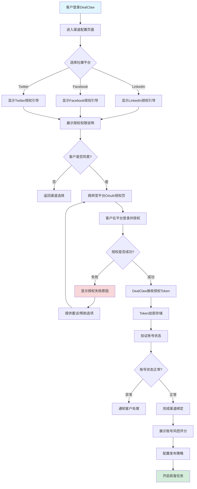
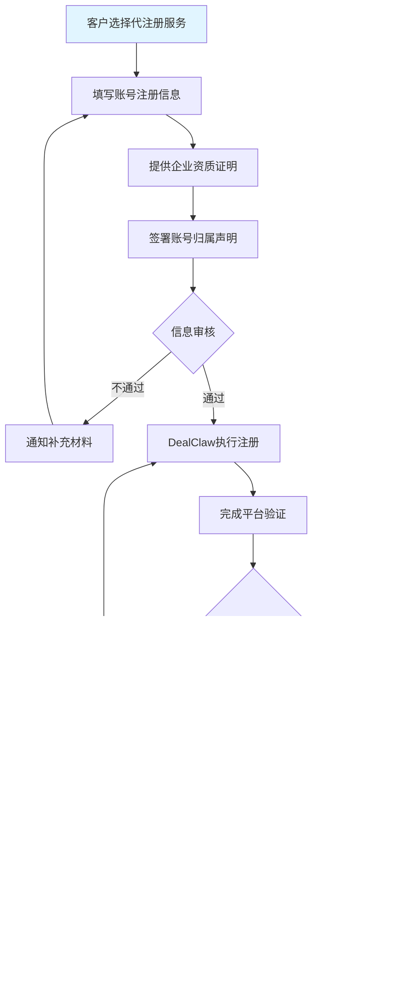
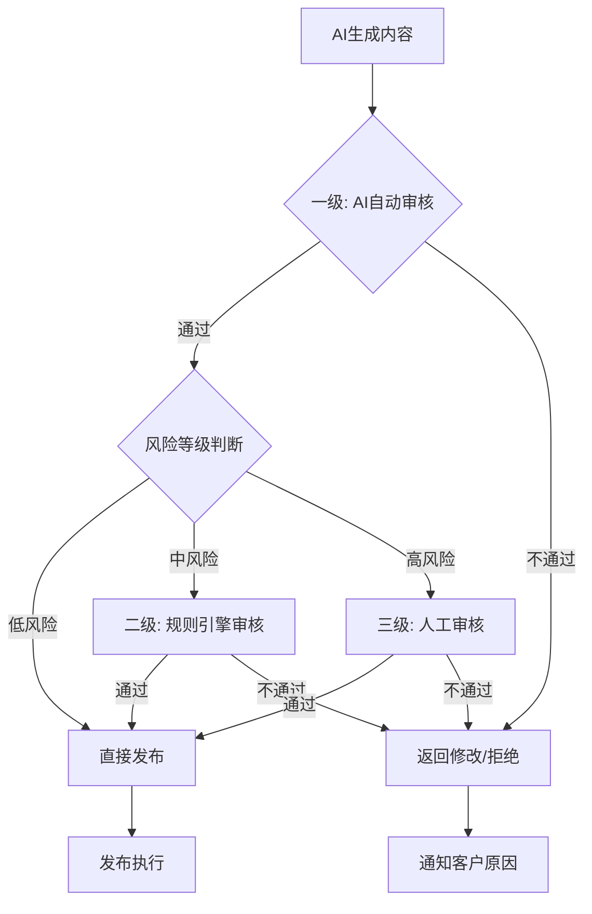
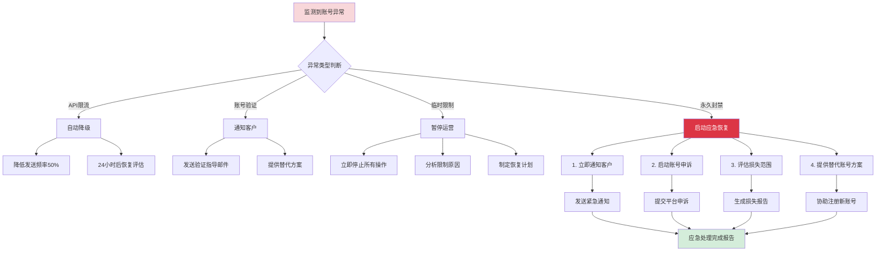

# DealClaw 获客师 - 社媒账号归属与风控完整方案

> 文档版本: V1.0  
> 编写日期: 2026-03-26  
> 适用范围: LinkedIn、Facebook、Twitter/X 等社媒渠道获客

---

## 1. 方案概述

### 1.1 设计目标
- **账号安全**: 最大限度降低社媒账号被封风险
- **归属清晰**: 明确账号所有权与运营权的边界
- **责任分明**: 界定DealClaw与客户的责任范围
- **合规可控**: 符合各平台服务条款与地区法规

### 1.2 核心原则
```
┌─────────────────────────────────────────────────────────────┐
│                    社媒账号管理核心原则                        │
├─────────────────────────────────────────────────────────────┤
│  🔐 账号所有权归客户 → 客户拥有完全控制权                      │
│  ⚙️  运营权可委托 → DealClaw提供技术支持                       │
│  🛡️ 风险共担机制 → 明确责任边界与损失承担                     │
│  📊 全程透明可控 → 客户可实时监控所有操作                     │
└─────────────────────────────────────────────────────────────┘
```

---

## 2. 账号归属策略

### 2.1 三种模式对比分析

| 维度 | 模式A: DealClaw统一账号 | 模式B: 客户自有账号 | 模式C: 混合模式 ⭐推荐 |
|-----|----------------------|-------------------|---------------------|
| **账号归属** | DealClaw平台所有 | 客户完全所有 | 客户所有，DealClaw代运营 |
| **启动速度** | ⚡ 即时开通 | 🐢 需客户自行注册/授权 | ⚡ 授权后即可使用 |
| **品牌展示** | ❌ 弱（DealClaw品牌） | ✅ 强（客户自有品牌） | ✅ 强（客户自有品牌） |
| **客户信任度** | ❌ 低（非客户官方身份） | ✅ 高（官方身份） | ✅ 高（官方身份） |
| **封号风险** | 🔴 极高（多客户共用） | 🟢 低（独立账号） | 🟢 低（独立账号） |
| **风控难度** | 🔴 难（牵连所有客户） | 🟢 易（单账号隔离） | 🟢 易（单账号隔离） |
| **运营成本** | 💰 低（集约化） | 💰 高（多账号维护） | 💰 中（技术平台化） |
| **长期价值** | ❌ 无积累（客户流失即无） | ✅ 资产沉淀（客户带走） | ✅ 资产沉淀（客户带走） |
| **合规性** | 🔴 违规（平台条款限制） | 🟢 合规 | 🟢 合规 |

### 2.2 模式详细分析

#### 模式A: DealClaw统一账号（不推荐）

**运作方式**
```
DealClaw 运营一个/多个主账号
        ↓
为不同客户创建分组/标签
        ↓
通过同一账号发布不同客户内容
        ↓
客户间数据隔离（逻辑层面）
```

**主要风险**
| 风险类型 | 风险等级 | 说明 |
|---------|---------|------|
| 平台封号 | 🔴 极高 | LinkedIn/Facebook明确禁止账号共享/代理运营 |
| 连带责任 | 🔴 极高 | 一个客户违规操作导致所有客户账号被封 |
| 品牌混淆 | 🟡 中等 | 客户难以建立独立品牌形象 |
| 数据安全 | 🟡 中等 | 多客户数据共用同一账号，泄露风险高 |
| 法律合规 | 🔴 高 | 违反平台服务条款，存在法律风险 |

**结论**: ❌ 不采用此模式

---

#### 模式B: 客户自有账号（基础模式）

**运作方式**
```
客户自行注册社媒账号
        ↓
授权 DealClaw 访问权限（OAuth/API）
        ↓
DealClaw 通过授权执行获客操作
        ↓
客户保留账号完全控制权
```

**优点**
- ✅ 符合平台服务条款，合规安全
- ✅ 客户拥有品牌资产，长期价值归属明确
- ✅ 风险隔离，单账号问题不影响其他客户
- ✅ 客户可随时撤销授权，自主可控

**缺点**
- ⚠️ 客户需要自行完成账号注册和认证
- ⚠️ 需要客户配合完成授权流程
- ⚠️ 账号维护责任主要在客户

**适用场景**
- 已有社媒账号的成熟企业
- 对品牌控制要求高的客户
- 合规要求严格的行业

---

#### 模式C: 混合模式 ⭐ 推荐方案

**运作方式**
```
┌─────────────────────────────────────────────────────────────┐
│                      混合模式架构                            │
├─────────────────────────────────────────────────────────────┤
│                                                             │
│  客户账号层（所有权层）                                       │
│  ┌─────────────┐  ┌─────────────┐  ┌─────────────┐         │
│  │ 客户A账号    │  │ 客户B账号    │  │ 客户C账号    │         │
│  │ (LinkedIn)  │  │ (LinkedIn)  │  │ (Facebook)  │         │
│  └──────┬──────┘  └──────┬──────┘  └──────┬──────┘         │
│         │                │                │                 │
│         └────────────────┼────────────────┘                 │
│                          ▼                                  │
│  授权接入层（OAuth/API）                                      │
│  ┌─────────────────────────────────────────────────────┐   │
│  │        DealClaw 安全授权网关                          │   │
│  │   • OAuth 2.0 标准授权                               │   │
│  │   • Token 加密存储                                   │   │
│  │   • 权限最小化原则                                   │   │
│  │   • 授权可撤销                                       │   │
│  └─────────────────────────┬───────────────────────────┘   │
│                            ▼                                │
│  运营执行层（操作层）                                         │
│  ┌─────────────────────────────────────────────────────┐   │
│  │        DealClaw 获客师执行引擎                        │   │
│  │   • AI内容生成                                       │   │
│  │   • 智能发布调度                                     │   │
│  │   • 风控合规检查                                     │   │
│  │   • 数据回传分析                                     │   │
│  └─────────────────────────────────────────────────────┘   │
│                                                             │
└─────────────────────────────────────────────────────────────┘
```

**两种子模式**

| 子模式 | 说明 | 适用客户 |
|-------|------|---------|
| **C1: 客户已有账号** | 客户自行注册并授权DealClaw代运营 | 已有社媒基础的客户 |
| **C2: DealClaw代注册** | DealClaw协助注册，但账号归客户所有 | 无社媒基础的新客户 |

**推荐方案: 模式C（混合模式）**

选择理由:
1. **合规优先**: 每个账号归属清晰，符合平台服务条款
2. **风险隔离**: 单账号问题不波及其他客户
3. **品牌归属**: 客户积累的品牌资产完全归属客户
4. **灵活可控**: 客户可选择自主运营或委托运营
5. **技术赋能**: DealClaw提供技术平台降低多账号管理成本

---

## 3. 具体实施方案

### 3.1 客户自有账号授权流程（模式C1）

#### 流程图



#### UI交互设计

**步骤1: 渠道选择页面**
```
┌─────────────────────────────────────────────────────────────┐
│  配置获客渠道                                      [返回]  │
├─────────────────────────────────────────────────────────────┤
│                                                             │
│  选择您要启用的社媒渠道                                       │
│  ─────────────────────────────────────────────────────────  │
│                                                             │
│  ┌─────────────────┐  ┌─────────────────┐  ┌─────────────┐ │
│  │  💼 LinkedIn    │  │  👥 Facebook    │  │  🐦 Twitter │ │
│  │                 │  │                 │  │             │ │
│  │  B2B专业平台     │  │  社交网络        │  │  即时互动    │ │
│  │  适合高管决策人  │  │  适合大众消费   │  │  适合话题营销│ │
│  │                 │  │                 │  │             │ │
│  │  [ 点击授权 ]   │  │  [ 即将推出 ]   │  │ [ 即将推出 ]│ │
│  │                 │  │                 │  │             │ │
│  │  ✅ 推荐用于:    │  │  ✅ 推荐用于:    │  │ ✅ 推荐用于: │ │
│  │  北美、欧洲B2B   │  │  消费品、零售   │  │ 科技、互联网 │ │
│  └─────────────────┘  └─────────────────┘  └─────────────┘ │
│                                                             │
│  📌 提示: 授权后您可随时在设置中撤销授权                      │
│                                                             │
└─────────────────────────────────────────────────────────────┘
```

**步骤2: 授权确认页面**
```
┌─────────────────────────────────────────────────────────────┐
│  LinkedIn 账号授权                                 [取消]  │
├─────────────────────────────────────────────────────────────┤
│                                                             │
│  ┌─────────────────────────────────────────────────────┐   │
│  │                                                     │   │
│  │           🔐 授权权限说明                            │   │
│  │                                                     │   │
│  │  DealClaw 获客师需要以下权限来代您运营账号:          │   │
│  │                                                     │   │
│  │  ✅ 读取个人资料                                     │   │
│  │     用于展示您的专业身份                             │   │
│  │                                                     │   │
│  │  ✅ 发布内容和动态                                   │   │
│  │     用于自动发布获客内容                             │   │
│  │                                                     │   │
│  │  ✅ 读取消息通知（可选）                              │   │
│  │     用于捕获潜在客户咨询                             │   │
│  │                                                     │   │
│  │  ❌ 不会获取您的密码                                 │   │
│  │  ❌ 不会访问您的私信内容（除非您授权）                │   │
│  │  ❌ 不会修改账号安全设置                             │   │
│  │                                                     │   │
│  └─────────────────────────────────────────────────────┘   │
│                                                             │
│  📋 授权前请确认:                                            │
│  ☐ 此账号为我个人/公司拥有                                  │
│  ☐ 我同意DealClaw获客师代我运营此账号                        │
│  ☐ 我已阅读并同意服务条款                                    │
│                                                             │
│              [  前往 LinkedIn 授权  ]                       │
│                                                             │
│  🔒 您的数据安全受SSL加密保护                                │
│                                                             │
└─────────────────────────────────────────────────────────────┘
```

**步骤3: 授权成功与风控初始化**
```
┌─────────────────────────────────────────────────────────────┐
│  ✅ 授权成功                                                │
├─────────────────────────────────────────────────────────────┤
│                                                             │
│  您的 LinkedIn 账号已成功绑定！                              │
│                                                             │
│  ┌─────────────────────────────────────────────────────┐   │
│  │  账号信息                                            │   │
│  │  ─────────────────────────────────────────────────  │   │
│  │  账号名称: 张三                                       │   │
│  │  账号ID: linkedin.com/in/zhangsan                   │   │
│  │  账号状态: 🟢 正常                                    │   │
│  │  账号健康度: 85/100                                   │   │
│  │  风控等级: 🟡 中等风险（新账号）                       │   │
│  └─────────────────────────────────────────────────────┘   │
│                                                             │
│  📊 基于您的账号情况，我们推荐以下安全策略:                   │
│                                                             │
│  ┌─────────────────────────────────────────────────────┐   │
│  │  发布频率设置                                        │   │
│  │  ─────────────────────────────────────────────────  │   │
│  │  ○ 保守模式: 每周1-2篇（推荐新账号）                  │   │
│  │  ● 标准模式: 每周3-5篇（当前选择）                    │   │
│  │  ○ 积极模式: 每日1篇（仅限成熟账号）                  │   │
│  │  ○ 自定义                                            │   │
│  └─────────────────────────────────────────────────────┘   │
│                                                             │
│  ┌─────────────────────────────────────────────────────┐   │
│  │  内容审核设置                                        │   │
│  │  ─────────────────────────────────────────────────  │   │
│  │  ● AI生成后自动发布（低风险内容）                     │   │
│  │  ○ AI生成后人工确认再发布（推荐）                     │   │
│  │  ○ 所有内容需人工审核                                 │   │
│  └─────────────────────────────────────────────────────┘   │
│                                                             │
│              [  完成配置，开启获客任务  ]                    │
│                                                             │
└─────────────────────────────────────────────────────────────┘
```

### 3.2 DealClaw代注册流程（模式C2）

适用场景: 客户没有社媒账号，希望DealClaw协助注册

#### 流程图



**关键控制点**

| 控制点 | 措施 | 目的 |
|-------|------|------|
| 信息审核 | 验证企业真实性 | 防止虚假账号注册 |
| 归属声明 | 签署电子协议 | 明确账号所有权归客户 |
| 密码移交 | 客户首次登录后修改 | 确保客户掌握账号控制权 |
| 二次授权 | 客户主动授权DealClaw | 符合平台服务条款 |

#### 账号归属声明模板

```
┌─────────────────────────────────────────────────────────────┐
│              社媒账号归属与使用协议                          │
├─────────────────────────────────────────────────────────────┤
│                                                             │
│ 甲方（客户）: _________________                             │
│ 乙方（DealClaw）: DealClaw Technology Co., Ltd.             │
│                                                             │
│ 鉴于甲方委托乙方代为注册社媒账号，双方就账号归属事宜达成      │
│ 如下协议:                                                    │
│                                                             │
│ 第一条 账号信息                                              │
│ 平台名称: _________________                                 │
│ 账号ID: _________________                                   │
│ 注册邮箱: _________________（甲方所有）                      │
│                                                             │
│ 第二条 所有权归属                                            │
│ 1. 账号所有权完全归甲方所有                                  │
│ 2. 乙方仅为技术代注册方，不享有账号任何权益                  │
│ 3. 甲方可随时终止乙方运营权限，收回账号完全控制权            │
│                                                             │
│ 第三条 责任划分                                              │
│ 1. 因平台政策导致账号限制，双方协商解决                      │
│ 2. 因乙方操作违规导致封号，乙方承担恢复责任                  │
│ 3. 因甲方提供虚假信息导致问题，甲方承担责任                  │
│                                                             │
│ 甲方签字: _________________ 日期: _______                   │
│ 乙方签字: _________________ 日期: _______                   │
│                                                             │
└─────────────────────────────────────────────────────────────┘
```

### 3.3 多账号管理架构

#### 系统架构图

```
┌─────────────────────────────────────────────────────────────────────────────┐
│                         DealClaw 多账号管理平台                               │
├─────────────────────────────────────────────────────────────────────────────┤
│                                                                             │
│  ┌─────────────────────────────────────────────────────────────────────┐   │
│  │                        账号接入层 (Account Gateway)                  │   │
│  │  ┌─────────────┐  ┌─────────────┐  ┌─────────────┐  ┌─────────────┐ │   │
│  │  │ LinkedIn    │  │ Facebook    │  │ Twitter/X   │  │ Instagram   │ │   │
│  │  │ Adapter     │  │ Adapter     │  │ Adapter     │  │ Adapter     │ │   │
│  │  └──────┬──────┘  └──────┬──────┘  └──────┬──────┘  └──────┬──────┘ │   │
│  │         └─────────────────┴─────────────────┴─────────────────┘     │   │
│  │                              │                                      │   │
│  │                    ┌─────────┴─────────┐                            │   │
│  │                    │  OAuth Manager    │                            │   │
│  │                    │  • Token管理      │                            │   │
│  │                    │  • 权限控制       │                            │   │
│  │                    │  • 授权刷新       │                            │   │
│  │                    └─────────┬─────────┘                            │   │
│  └──────────────────────────────┼──────────────────────────────────────┘   │
│                                 │                                           │
│  ┌──────────────────────────────┼──────────────────────────────────────┐   │
│  │                        风控引擎层 (Risk Control)                      │   │
│  │                              │                                       │   │
│  │  ┌───────────────────────────┼───────────────────────────────┐      │   │
│  │  │                   Risk Engine                              │      │   │
│  │  │  ┌─────────────┐  ┌─────────────┐  ┌─────────────────────┐ │      │   │
│  │  │  │ 行为分析器   │  │ 内容审核器   │  │ 账号健康监控器       │ │      │   │
│  │  │  │             │  │             │  │                     │ │      │   │
│  │  │  │ • 发送频率   │  │ • 敏感词检测 │  │ • 平台限制追踪       │ │      │   │
│  │  │  │ • 操作时间   │  │ • 垃圾内容识别│  │ • 封禁预警          │ │      │   │
│  │  │  │ • 互动模式   │  │ • 合规性检查 │  │ • 风险评分          │ │      │   │
│  │  │  └─────────────┘  └─────────────┘  └─────────────────────┘ │      │   │
│  │  └────────────────────────────────────────────────────────────┘      │   │
│  │                                                                       │   │
│  │  ┌─────────────────────────────────────────────────────────────┐     │   │
│  │  │                  规则配置中心                                │     │   │
│  │  │  • 平台规则库  • 客户自定义规则  • 动态调整策略              │     │   │
│  │  └─────────────────────────────────────────────────────────────┘     │   │
│  └──────────────────────────────────────────────────────────────────────┘   │
│                                                                             │
│  ┌──────────────────────────────────────────────────────────────────────┐   │
│  │                        执行调度层 (Execution Layer)                   │   │
│  │                                                                       │   │
│  │  ┌─────────────┐  ┌─────────────┐  ┌─────────────┐  ┌─────────────┐  │   │
│  │  │ 内容生成器   │  │ 发布调度器   │  │ 互动管理器   │  │ 数据分析器   │  │   │
│  │  │             │  │             │  │             │  │             │  │   │
│  │  │ AI内容创作   │  │ 智能排期     │  │ 自动回复     │  │ 效果追踪     │  │   │
│  │  │ 多语言支持   │  │ 错峰发送     │  │ 线索捕获     │  │ 报表生成     │  │   │
│  │  └─────────────┘  └─────────────┘  └─────────────┘  └─────────────┘  │   │
│  │                                                                       │   │
│  └──────────────────────────────────────────────────────────────────────┘   │
│                                                                             │
│  ┌──────────────────────────────────────────────────────────────────────┐   │
│  │                        数据隔离层 (Data Isolation)                    │   │
│  │                                                                       │   │
│  │   客户A数据 ◄──────────┐  ┌──────────► 客户B数据                      │   │
│  │      ↓                  │  │                  ↓                       │   │
│  │   独立Schema            │  │            独立Schema                    │   │
│  │   加密存储              │  │            加密存储                      │   │
│  │   访问隔离              │  │            访问隔离                      │   │
│  │                         │  │                                          │   │
│  │   [严格的数据隔离机制，确保客户数据互不访问]                          │   │
│  │                                                                       │   │
│  └──────────────────────────────────────────────────────────────────────┘   │
│                                                                             │
└─────────────────────────────────────────────────────────────────────────────┘
```

#### 账号池管理设计

```
┌─────────────────────────────────────────────────────────────┐
│                    账号状态管理面板                          │
├─────────────────────────────────────────────────────────────┤
│  筛选: [全部 ▼]  [LinkedIn ▼]  [状态 ▼]        [+ 添加账号] │
├─────────────────────────────────────────────────────────────┤
│                                                             │
│  ┌─────────────────────────────────────────────────────┐   │
│  │ 🟢 正常运营                                          │   │
│  ├─────────────────────────────────────────────────────┤   │
│  │ 账号          平台        健康度    日发送    状态   │   │
│  │ ──────────────────────────────────────────────────  │   │
│  │ ABC Company   LinkedIn    92/100    3/5      🟢 正常 │   │
│  │ XYZ Trading   LinkedIn    88/100    4/5      🟢 正常 │   │
│  │ 123 Export    Facebook    85/100    2/3      🟢 正常 │   │
│  └─────────────────────────────────────────────────────┘   │
│                                                             │
│  ┌─────────────────────────────────────────────────────┐   │
│  │ 🟡 需要注意                                          │   │
│  ├─────────────────────────────────────────────────────┤   │
│  │ 账号          平台        健康度    风险项      操作  │   │
│  │ ──────────────────────────────────────────────────  │   │
│  │ New Tech Co   LinkedIn    65/100    发送频率高  [调整]│   │
│  │               ↳ 建议: 降低发送频率至每周3篇          │   │
│  └─────────────────────────────────────────────────────┘   │
│                                                             │
│  ┌─────────────────────────────────────────────────────┐   │
│  │ 🔴 异常/封禁                                         │   │
│  ├─────────────────────────────────────────────────────┤   │
│  │ 账号          平台        状态      原因        操作  │   │
│  │ ──────────────────────────────────────────────────  │   │
│  │ Test Account  LinkedIn    🔴 限制    可疑登录   [申诉]│   │
│  │               ↳ 时间: 2026-03-25 14:30              │   │
│  │               ↳ 已通知客户，等待确认邮件              │   │
│  └─────────────────────────────────────────────────────┘   │
│                                                             │
└─────────────────────────────────────────────────────────────┘
```

---

## 4. 风控体系设计

### 4.1 封号风险等级评估

#### 风险等级矩阵

| 风险等级 | 评分范围 | 状态标识 | 处理策略 |
|---------|---------|---------|---------|
| 🟢 低风险 | 80-100 | 正常运营 | 标准策略，定期监控 |
| 🟡 中风险 | 60-79 | 需要注意 | 降低频率，加强审核 |
| 🟠 高风险 | 40-59 | 警告状态 | 暂停新增，人工介入 |
| 🔴 极高风险 | <40 | 紧急处理 | 暂停运营，启动恢复 |

#### 风险评估维度

```
┌─────────────────────────────────────────────────────────────┐
│                    账号健康度评分模型                         │
├─────────────────────────────────────────────────────────────┤
│                                                             │
│  基础信息 (30分)                                             │
│  ├── 账号注册时间: >6个月(10分) / 3-6个月(7分) / <3个月(4分) │
│  ├── 资料完整度: 100%(10分) / 80%(7分) / <60%(3分)          │
│  └── 历史违规: 无违规(10分) / 1次警告(5分) / 曾封禁(0分)     │
│                                                             │
│  行为指标 (40分)                                             │
│  ├── 发送频率: 合规(15分) / 略高(10分) / 过高(0分)           │
│  ├── 互动质量: 高互动(15分) / 中等(10分) / 低互动(3分)       │
│  └── 操作规律: 符合人工(10分) / 略机械化(5分) / 明显机器(0分)│
│                                                             │
│  内容质量 (20分)                                             │
│  ├── 原创度: 高原创(10分) / 部分原创(6分) / 低原创(2分)      │
│  ├── 合规性: 完全合规(10分) / 轻微违规(5分) / 严重违规(0分)  │
│  └── 用户反馈: 无举报(加分) / 有举报(减分)                   │
│                                                             │
│  平台关系 (10分)                                             │
│  ├── 会员等级: 付费会员(10分) / 普通用户(6分)                │
│  └── 平台活动: 有参与(加分) / 无(不加分)                     │
│                                                             │
│  动态调整                                                    │
│  ├── 近期平台风控加强: -10分                                 │
│  └── 同行业封号案例: -5分                                    │
│                                                             │
└─────────────────────────────────────────────────────────────┘
```

### 4.2 预防措施

#### 4.2.1 发送频率控制

**分层频率策略**

```javascript
// 发送频率配置
const frequencyRules = {
  // 新账号 (<1个月)
  newAccount: {
    linkedin: {
      postsPerDay: 1,
      postsPerWeek: 3,
      connectionRequestsPerDay: 5,
      messagesPerDay: 10
    },
    facebook: {
      postsPerDay: 1,
      postsPerWeek: 4,
      commentsPerDay: 10
    }
  },
  
  // 成长期账号 (1-6个月)
  growingAccount: {
    linkedin: {
      postsPerDay: 2,
      postsPerWeek: 8,
      connectionRequestsPerDay: 15,
      messagesPerDay: 30
    },
    facebook: {
      postsPerDay: 2,
      postsPerWeek: 10,
      commentsPerDay: 25
    }
  },
  
  // 成熟账号 (>6个月，健康度>80)
  matureAccount: {
    linkedin: {
      postsPerDay: 3,
      postsPerWeek: 15,
      connectionRequestsPerDay: 30,
      messagesPerDay: 50
    },
    facebook: {
      postsPerDay: 3,
      postsPerWeek: 15,
      commentsPerDay: 50
    }
  }
};

// 动态调整逻辑
function calculateSafeFrequency(account) {
  const baseRules = frequencyRules[account.stage];
  let multiplier = 1.0;
  
  // 根据健康度调整
  if (account.healthScore < 60) multiplier *= 0.5;
  else if (account.healthScore < 80) multiplier *= 0.8;
  
  // 根据平台风控等级调整
  if (platformRiskLevel === 'high') multiplier *= 0.7;
  
  return applyMultiplier(baseRules, multiplier);
}
```

**错峰发送机制**

```
┌─────────────────────────────────────────────────────────────┐
│                    智能错峰发送调度                           │
├─────────────────────────────────────────────────────────────┤
│                                                             │
│  时间窗口优化                                               │
│  ├── 北美客户: 当地时间 9:00-11:00, 14:00-16:00            │
│  ├── 欧洲客户: 当地时间 10:00-12:00, 15:00-17:00           │
│  └── 亚太客户: 当地时间 9:00-11:00, 13:00-15:00            │
│                                                             │
│  多账号分散                                                 │
│  ├── 同一平台账号发送间隔: >30分钟                         │
│  ├── 同一IP下账号数限制: ≤3个                              │
│  └── 随机化发送时间: ±15分钟抖动                           │
│                                                             │
│  发送队列管理                                               │
│  ┌─────────────────────────────────────────────────────┐   │
│  │  发送队列                                            │   │
│  │  ┌─────────┬─────────┬─────────┬─────────┐         │   │
│  │  │ 09:15   │ 09:47   │ 10:23   │ 11:05   │  ...    │   │
│  │  │ 账号A   │ 账号C   │ 账号B   │ 账号D   │         │   │
│  │  └─────────┴─────────┴─────────┴─────────┘         │   │
│  │                                                      │   │
│  │  调度算法: 优先队列 + 随机抖动 + 平台限制检查         │   │
│  └─────────────────────────────────────────────────────┘   │
│                                                             │
└─────────────────────────────────────────────────────────────┘
```

#### 4.2.2 内容审核机制

**三级内容审核流程**



**AI自动审核检查项**

| 检查类别 | 检查内容 | 处理方式 |
|---------|---------|---------|
| 敏感词检测 | 政治、色情、歧视、暴力等 | 立即拦截，人工复核 |
| 垃圾内容识别 | 过度营销、重复内容、诱导点击 | 降低权重，限制发布 |
| 版权问题 | 图片版权、商标侵权 | 提示替换素材 |
| 平台规则 | 各平台特定禁忌（如LinkedIn禁止过度自动化） | 按平台规则调整 |
| 行业合规 | 特定行业限制（如医疗、金融） | 增加免责声明或拒绝 |

#### 4.2.3 行为模拟技术

**人机行为模拟策略**

```
┌─────────────────────────────────────────────────────────────┐
│                    行为模拟技术实现                          │
├─────────────────────────────────────────────────────────────┤
│                                                             │
│  1. 操作时间模拟                                             │
│  ├── 避免整点发送: 09:00 ❌ → 09:23 ✅                     │
│  ├── 符合工作时间: 避免凌晨操作（除非目标市场在活跃）         │
│  └── 引入随机间隔: 操作间隔 30-120秒随机                     │
│                                                             │
│  2. 操作路径模拟                                             │
│  ├── 浏览 → 停留 → 互动 → 发布                              │
│  ├── 模拟真人浏览轨迹: 滚动、点击、返回                       │
│  └── 避免直接跳转到发布页面                                  │
│                                                             │
│  3. 内容多样性                                               │
│  ├── 混合内容类型: 图文/纯文/链接/视频                       │
│  ├── 变化发送频率: 避免每天固定数量                          │
│  └── 互动比例控制: 发布与互动比例约 1:3                      │
│                                                             │
│  4. 设备指纹模拟                                             │
│  ├── 浏览器指纹随机化                                        │
│  ├── IP地址池轮换（按地区匹配）                              │
│  └── User-Agent多样性                                       │
│                                                             │
└─────────────────────────────────────────────────────────────┘
```

### 4.3 监控预警系统

#### 实时监控指标

```
┌─────────────────────────────────────────────────────────────┐
│                    风控监控仪表板                            │
├─────────────────────────────────────────────────────────────┤
│                                                             │
│  实时风险指标                    告警状态                    │
│  ────────────────────────────────────────────────────────  │
│                                                             │
│  ┌─────────────────────────┐    ┌────────────────────────┐ │
│  │ 平台API响应异常          │    │ 🟡 LinkedIn API延迟升高 │ │
│  │ 当前: 正常 ✅            │    │ 已持续: 15分钟          │ │
│  │ 24h异常次数: 2           │    │ 影响账号: 12个          │ │
│  └─────────────────────────┘    └────────────────────────┘ │
│                                                             │
│  ┌─────────────────────────┐    ┌────────────────────────┐ │
│  │ 账号健康度分布           │    │ 🔴 异常账号需处理       │ │
│  │ 🟢 正常: 45个 (78%)     │    │ Account_123: 发送受限   │ │
│  │ 🟡 警告: 8个  (14%)     │    │ Account_456: 验证需求   │ │
│  │ 🔴 异常: 4个  (7%)      │    │                        │ │
│  │ ⚫ 离线: 1个  (1%)      │    │                        │ │
│  └─────────────────────────┘    └────────────────────────┘ │
│                                                             │
│  发送成功率趋势 (24h)                                        │
│  ────────────────────────────────────────────────────────  │
│                                                             │
│  100% ┤    ╭─╮                                               │
│   95% ┤╭──╯  ╰╮  ╭──╮                                        │
│   90% ┤╯      ╰──╯  ╰──  ╭───╮                              │
│   85% ┤                  ╯   ╰───  ← LinkedIn风控加强时段    │
│   80% ┤                                                      │
│       └────┬────┬────┬────┬────┬────┬────┬                 │
│           00   04   08   12   16   20   24                  │
│                                                             │
│  ┌─────────────────────────────────────────────────────┐   │
│  │ 📊 关键趋势                                         │   │
│  │ • LinkedIn今日发布成功率下降 8%，可能平台加强风控   │   │
│  │ • 3个账号收到平台警告，已自动降低发送频率           │   │
│  │ • 建议: 今日全平台降低发送量 20%                    │   │
│  └─────────────────────────────────────────────────────┘   │
│                                                             │
└─────────────────────────────────────────────────────────────┘
```

#### 预警等级与响应

| 预警等级 | 触发条件 | 响应时间 | 自动措施 | 人工介入 |
|---------|---------|---------|---------|---------|
| 🟡 提示 | 健康度下降10分 | - | 记录日志 | 每日汇总报告 |
| 🟠 警告 | API限频/健康度<60 | 15分钟 | 降低发送频率 | 邮件通知运营 |
| 🔴 紧急 | 发送失败率>20%/账号受限 | 5分钟 | 暂停该账号新任务 | 即时通知+群告警 |
| 🚨 严重 | 账号被封/大规模异常 | 即时 | 全平台暂停/启动恢复 | 电话通知+应急小组 |

### 4.4 封号应急响应流程

#### 应急响应流程图



#### 应急响应SOP

**Stage 1: 发现与评估 (0-15分钟)**

| 步骤 | 执行人 | 动作 | 输出 |
|-----|-------|------|------|
| 1 | 系统 | 自动检测账号状态异常 | 异常告警 |
| 2 | 系统 | 记录异常时间、类型、影响范围 | 事件记录 |
| 3 | 值班人员 | 确认异常真实性 | 确认结果 |
| 4 | 值班人员 | 评估影响等级（P0/P1/P2） | 事件定级 |
| 5 | 系统自动 | 触发相应等级响应流程 | 通知相关方 |

**Stage 2: 即时响应 (15-60分钟)**

```
┌─────────────────────────────────────────────────────────────┐
│               应急响应检查清单 (On-call人员)                  │
├─────────────────────────────────────────────────────────────┤
│                                                             │
│  □ 已确认受影响的客户账号列表                                │
│  □ 已停止受影响账号的所有新任务                              │
│  □ 已保存当前任务状态（可恢复）                              │
│  □ 已通知受影响客户（使用预设模板）                          │
│  □ 已记录事件到事故管理系统                                  │
│  □ 已通知风控团队负责人                                      │
│  □ 已评估是否需要升级至P0事件                                │
│                                                             │
│  如果是P0事件（多客户/大规模封号）:                          │
│  □ 已启动全平台发送暂停                                      │
│  □ 已通知管理层                                              │
│  □ 已启动客户补偿流程                                        │
│                                                             │
└─────────────────────────────────────────────────────────────┘
```

**Stage 3: 恢复处理 (1-24小时)**

| 恢复策略 | 适用场景 | 执行步骤 | 预期时间 |
|---------|---------|---------|---------|
| 自动解限等待 | API限流 | 暂停24小时后自动恢复 | 24h |
| 客户配合验证 | 安全验证 | 指导客户完成平台验证 | 1-4h |
| 平台申诉 | 误封/可申诉 | 提交申诉材料，跟进进度 | 3-7天 |
| 新账号替代 | 永久封禁 | 协助客户注册新账号并迁移 | 1-3天 |
| 服务降级 | 大规模异常 | 切换至邮件/WhatsApp渠道 | 即时 |

#### 客户通知模板

**模板1: 账号验证需求通知**

```
主题: [重要] 您的 LinkedIn 账号需要安全验证 - DealClaw获客师

尊敬的客户您好，

我们检测到您的 LinkedIn 账号 (linkedin.com/in/xxx) 触发了平台的安全验证机制，
目前暂时无法进行自动化发布操作。

📋 需要您协助处理:
1. 请登录您的 LinkedIn 账号
2. 查看并完成平台提示的安全验证（可能是验证码、身份确认等）
3. 完成后告知我们，我们将恢复获客任务

⏰ 时间敏感:
请在 24 小时内完成验证，以避免账号被进一步限制。

🔧 临时方案:
在此期间，我们将自动把获客内容转至您的邮件渠道发送，确保获客不中断。

如有任何问题，请联系您的专属客户经理或回复此邮件。

DealClaw 客户成功团队
```

**模板2: 账号封禁紧急通知**

```
主题: [紧急] 您的社媒账号异常通知及应对方案 - DealClaw获客师

尊敬的客户您好，

我们遗憾地通知您，您的 LinkedIn 账号已被平台限制使用。我们已立即启动应急响应。

📊 事件概况:
• 发生时间: 2026-03-26 15:30 (北京时间)
• 账号: linkedin.com/in/xxx
• 状态: 暂时无法发布内容
• 影响: 该渠道的获客任务已暂停

🔧 我们正在采取的措施:
1. 【已完成】立即停止该账号所有操作，避免进一步风险
2. 【进行中】向 LinkedIn 提交申诉，争取恢复账号
3. 【进行中】分析可能原因，优化风控策略

💡 为您提供的选择:
方案A: 等待申诉结果（预计3-7个工作日）
方案B: 注册新 LinkedIn 账号，我们协助迁移配置（推荐）
方案C: 临时增加邮件/WhatsApp渠道投入，弥补获客缺口

📞 紧急联系:
您的专属客户经理将在 2 小时内与您联系，商讨最佳解决方案。

对于此次事件造成的不便，我们深表歉意。

DealClaw 客户成功团队
紧急热线: xxx-xxxx-xxxx
```

---

## 5. 责任划分机制

### 5.1 责任判定矩阵

```
┌─────────────────────────────────────────────────────────────────────────────┐
│                          责任归属判定矩阵                                     │
├─────────────────────────────────────────────────────────────────────────────┤
│                                                                             │
│  场景                        责任方           处理原则        补偿机制       │
│  ─────────────────────────────────────────────────────────────────────────  │
│                                                                             │
│  1. DealClaw操作违规导致封号                                                 │
│     • 发送频率超限            DealClaw         全额承担责任    免费恢复服务   │
│     • 内容违反平台规则        DealClaw         全额承担责任    服务延期补偿   │
│     • 技术BUG导致异常         DealClaw         全额承担责任    服务费用减免   │
│                                                                             │
│  2. 客户原因导致封号                                                         │
│     • 提供虚假注册信息        客户             客户承担责任    不补偿         │
│     • 自行操作违规            客户             客户承担责任    不补偿         │
│     • 未及时完成验证          客户             客户承担责任    不补偿         │
│     • 账号被盗/泄露           客户             客户承担责任    协助恢复       │
│                                                                             │
│  3. 平台政策变化/误封                                                        │
│     • 平台算法误封            双方共担         协商解决        按比例补偿     │
│     • 平台政策突然变化        双方共担         协商解决        服务调整       │
│     • 不可抗力（战争/法律）   免责             终止服务        按比例退款     │
│                                                                             │
│  4. 第三方因素                                                               │
│     • 网络服务商问题          DealClaw         协助解决        服务延期       │
│     • 平台API故障             DealClaw         及时通知        不补偿         │
│                                                                             │
└─────────────────────────────────────────────────────────────┘
```

### 5.2 客户告知义务

**客户须知清单**

在客户开始使用DealClaw社媒获客服务前，必须明确告知以下事项：

```
┌─────────────────────────────────────────────────────────────┐
│                    客户风险告知书                            │
├─────────────────────────────────────────────────────────────┤
│                                                             │
│  在您使用 DealClaw 社媒获客服务前，请确认已了解以下内容:      │
│                                                             │
│  □ 账号所有权                                                │
│    您授权给我们的社媒账号完全归您所有，我们仅获得代运营权限。   │
│    您可随时撤销授权，收回账号完全控制权。                      │
│                                                             │
│  □ 平台风险                                                  │
│    LinkedIn、Facebook等平台对自动化操作有严格限制。           │
│    尽管我们采用多种风控措施，仍存在账号被限制的可能性。        │
│                                                             │
│  □ 您的配合义务                                              │
│    • 确保提供的账号信息真实有效                              │
│    • 及时响应平台的安全验证请求                              │
│    • 不自行进行高风险的社媒操作（与我们服务冲突）             │
│    • 账号信息变更及时通知我们                                │
│                                                             │
│  □ 服务局限性                                                │
│    • 我们无法保证100%的发布成功率                            │
│    • 我们无法控制平台的算法变更                              │
│    • 封号风险无法完全消除，只能尽可能降低                    │
│                                                             │
│  □ 责任边界                                                  │
│    • 因我们操作违规导致的封号，我们承担恢复责任              │
│    • 因您提供虚假信息或未配合验证导致的封号，由您承担责任    │
│    • 因平台政策变化导致的封号，双方协商解决                  │
│                                                             │
│  我已阅读并理解上述内容，同意承担相应责任。                    │
│                                                             │
│  客户签名: _________________ 日期: _______                   │
│                                                             │
└─────────────────────────────────────────────────────────────┘
```

### 5.3 损失承担机制

#### 服务等级与责任承诺

| 服务等级 | 月费 | 风控保障 | 封号恢复承诺 | 补偿机制 |
|---------|-----|---------|-------------|---------|
| 基础版 | ¥999 | 标准风控 | 协助恢复，不承诺 | 无补偿 |
| 专业版 | ¥2,999 | 加强风控 | 7天内恢复或提供替代方案 | 封号期间服务延期30% |
| 企业版 | ¥9,999 | 定制风控 | 3天内恢复，专人跟进 | 封号期间全额退款+延期50% |

#### 补偿标准

```javascript
// 补偿计算逻辑
function calculateCompensation(account, downtime, serviceTier) {
  const dailyValue = serviceTier.monthlyFee / 30;
  let compensationRate = 0;
  
  // 根据责任判定确定补偿比例
  if (responsibility === 'dealclaw') {
    compensationRate = serviceTier.compensationRate; // 0.3 - 1.0
  } else if (responsibility === 'shared') {
    compensationRate = 0.5;
  } else {
    compensationRate = 0; // 客户责任无补偿
  }
  
  // 计算补偿
  const compensation = dailyValue * downtime * compensationRate;
  
  // 补偿方式
  return {
    serviceExtension: compensation,  // 服务延期
    orCashRefund: compensation * 0.8, // 或现金退款（80%折算）
    maxCompensation: serviceTier.monthlyFee * 2 // 最高补偿上限
  };
}
```

---

## 6. UI交互设计建议

### 6.1 账号管理页面

```
┌─────────────────────────────────────────────────────────────┐
│  社媒账号管理                                     [+ 添加]  │
├─────────────────────────────────────────────────────────────┤
│                                                             │
│  ┌─────────────────────────────────────────────────────┐   │
│  │  账号概览                                            │   │
│  │  ─────────────────────────────────────────────────  │   │
│  │  总账号数: 5    正常: 4    警告: 1    异常: 0       │   │
│  └─────────────────────────────────────────────────────┘   │
│                                                             │
│  ┌─────────────────────────────────────────────────────┐   │
│  │  LinkedIn - ABC Company                              │   │
│  ├─────────────────────────────────────────────────────┤   │
│  │  ┌──────────┐                                       │   │
│  │  │   💼     │  账号状态: 🟢 正常                     │   │
│  │  │ LinkedIn │  健康度: 92/100                        │   │
│  │  └──────────┘  本月发布: 12/20                       │   │
│  │                获客线索: 15                          │   │
│  │                                                     │   │
│  │  [查看详情]  [调整设置]  [暂停任务]  [撤销授权]     │   │
│  └─────────────────────────────────────────────────────┘   │
│                                                             │
│  ┌─────────────────────────────────────────────────────┐   │
│  │  LinkedIn - XYZ Trading                              │   │
│  ├─────────────────────────────────────────────────────┤   │
│  │  ┌──────────┐                                       │   │
│  │  │   💼     │  账号状态: 🟡 需要注意                 │   │
│  │  │ LinkedIn │  健康度: 68/100 ⚠️                   │   │
│  │  └──────────┘  本月发布: 18/20                       │   │
│  │                获客线索: 8                           │   │
│  │                                                     │   │
│  │  ⚠️ 风险提示: 发送频率接近平台限制，建议降低        │   │
│  │                                                     │   │
│  │  [查看详情]  [调整设置]  [降低频率]  [撤销授权]     │   │
│  └─────────────────────────────────────────────────────┘   │
│                                                             │
└─────────────────────────────────────────────────────────────┘
```

### 6.2 风控设置页面

```
┌─────────────────────────────────────────────────────────────┐
│  风控设置                                         [恢复默认]│
├─────────────────────────────────────────────────────────────┤
│                                                             │
│  ┌─────────────────────────────────────────────────────┐   │
│  │  发布频率设置                                        │   │
│  ├─────────────────────────────────────────────────────┤   │
│  │                                                     │   │
│  │  选择风控策略:                                       │   │
│  │                                                     │   │
│  │  ○ 保守模式                                          │   │
│  │    每周1-2篇，最安全但效果较慢                       │   │
│  │                                                     │   │
│  │  ● 标准模式 (推荐)                                   │   │
│  │    每周3-5篇，平衡安全与效果                         │   │
│  │                                                     │   │
│  │  ○ 积极模式                                          │   │
│  │    每日1篇，效果最佳但需要成熟账号                   │   │
│  │                                                     │   │
│  │  ○ 自定义                                            │   │
│  │    每周 [___] 篇                                     │   │
│  │                                                     │   │
│  └─────────────────────────────────────────────────────┘   │
│                                                             │
│  ┌─────────────────────────────────────────────────────┐   │
│  │  内容审核设置                                        │   │
│  ├─────────────────────────────────────────────────────┤   │
│  │                                                     │   │
│  │  AI生成内容后:                                       │   │
│  │                                                     │   │
│  │  ○ 自动发布（信任AI判断）                            │   │
│  │                                                     │   │
│  │  ● 人工确认后再发布（推荐）                          │   │
│  │    内容将在发布前发送到您的审核队列                   │   │
│  │                                                     │   │
│  │  ○ 关键内容人工确认                                  │   │
│  │    仅对敏感/重要内容进行人工确认                      │   │
│  │                                                     │   │
│  │  [高级设置] 设置敏感词过滤、行业限制等               │   │
│  │                                                     │   │
│  └─────────────────────────────────────────────────────┘   │
│                                                             │
│  ┌─────────────────────────────────────────────────────┐   │
│  │  风险通知设置                                        │   │
│  ├─────────────────────────────────────────────────────┤   │
│  │                                                     │   │
│  │  当发生以下情况时通知我:                             │   │
│  │  ☑ 账号健康度低于60分                                │   │
│  │  ☑ 收到平台警告                                      │   │
│  │  ☑ 发布成功率低于80%                                 │   │
│  │  ☐ 每次发布都通知                                    │   │
│  │                                                     │   │
│  │  通知方式: ☑ 邮件  ☑ 短信  ☐ 站内消息               │   │
│  │                                                     │   │
│  └─────────────────────────────────────────────────────┘   │
│                                                             │
│              [  保存设置  ]                                │
│                                                             │
└─────────────────────────────────────────────────────────────┘
```

### 6.3 风控告警弹窗

```
┌─────────────────────────────────────────────────────────────┐
│  ⚠️ 账号异常提醒                                    [×]    │
├─────────────────────────────────────────────────────────────┤
│                                                             │
│  您的 LinkedIn 账号 (ABC Company) 收到平台警告              │
│                                                             │
│  ┌─────────────────────────────────────────────────────┐   │
│  │  警告详情                                            │   │
│  │  ─────────────────────────────────────────────────  │   │
│  │  时间: 2026-03-26 14:30                               │   │
│  │  类型: 发送频率过高                                   │   │
│  │  当前状态: 功能受限（暂时无法发送新内容）              │   │
│  │                                                     │   │
│  │  平台提示: "Your account has reached the daily      │   │
│  │            limit for posts."                        │   │
│  └─────────────────────────────────────────────────────┘   │
│                                                             │
│  ✅ 已自动采取的措施:                                        │
│  • 已暂停该账号今日的新发布任务                              │
│  • 已自动降低该账号发送频率至每周3篇                         │
│  • 待发布内容已保存至草稿箱，明日恢复后自动发布              │
│                                                             │
│  📋 建议操作:                                                │
│  1. 无需特殊操作，系统将在24小时后自动恢复                   │
│  2. 或您可以登录LinkedIn查看详细警告信息                     │
│  3. 如需加快恢复，可联系客服协助                             │
│                                                             │
│         [  我知道了  ]      [  查看详情  ]                   │
│                                                             │
└─────────────────────────────────────────────────────────────┘
```

---

## 7. 技术实现要点

### 7.1 核心系统架构

```
┌─────────────────────────────────────────────────────────────────────────────┐
│                        社媒账号风控系统技术架构                               │
├─────────────────────────────────────────────────────────────────────────────┤
│                                                                             │
│  ┌──────────────────────────────────────────────────────────────────────┐   │
│  │                        API Gateway Layer                              │   │
│  │   Rate Limiting │ Auth │ Logging │ Circuit Breaker                    │   │
│  └──────────────────────────────────────────────────────────────────────┘   │
│                                    │                                        │
│  ┌─────────────────────────────────┼─────────────────────────────────────┐   │
│  │                        Service Layer                                    │   │
│  │                                                                         │   │
│  │   ┌───────────────┐   ┌───────────────┐   ┌───────────────────────┐   │   │
│  │   │ Account       │   │ Risk Control  │   │ Content               │   │   │
│  │   │ Service       │   │ Service       │   │ Service               │   │   │
│  │   │               │   │               │   │                       │   │   │
│  │   │ • OAuth Mgmt  │   │ • Rule Engine │   │ • Generator           │   │   │
│  │   │ • Token Store │   │ • Scoring     │   │ • Moderator           │   │   │
│  │   │ • Health Mon  │   │ • Alerting    │   │ • Publisher           │   │   │
│  │   └───────────────┘   └───────────────┘   └───────────────────────┘   │   │
│  │                                                                         │   │
│  │   ┌───────────────┐   ┌───────────────┐   ┌───────────────────────┐   │   │
│  │   │ Task          │   │ Monitoring    │   │ Recovery              │   │   │
│  │   │ Scheduler     │   │ Service       │   │ Service               │   │   │
│  │   └───────────────┘   └───────────────┘   └───────────────────────┘   │   │
│  │                                                                         │   │
│  └─────────────────────────────────┬─────────────────────────────────────┘   │
│                                    │                                        │
│  ┌─────────────────────────────────┼─────────────────────────────────────┐   │
│  │                        Data Layer                                       │   │
│  │                                                                         │   │
│  │   ┌───────────────┐   ┌───────────────┐   ┌───────────────────────┐   │   │
│  │   │ PostgreSQL    │   │ Redis         │   │ Message Queue         │   │   │
│  │   │ (Account DB)  │   │ (Cache/Rate)  │   │ (Task Queue)          │   │   │
│  │   └───────────────┘   └───────────────┘   └───────────────────────┘   │   │
│  │                                                                         │   │
│  └───────────────────────────────────────────────────────────────────────┘   │
│                                                                             │
│  ┌──────────────────────────────────────────────────────────────────────┐   │
│  │                        External APIs                                  │   │
│  │   LinkedIn API │ Facebook API │ Twitter API │ Instagram API          │   │
│  └──────────────────────────────────────────────────────────────────────┘   │
│                                                                             │
└─────────────────────────────────────────────────────────────────────────────┘
```

### 7.2 关键数据模型

```sql
-- 账号表
CREATE TABLE social_accounts (
    id UUID PRIMARY KEY,
    customer_id UUID REFERENCES customers(id),
    platform VARCHAR(50), -- linkedin, facebook, twitter
    account_id VARCHAR(255), -- 平台账号ID
    account_name VARCHAR(255),
    auth_token_encrypted TEXT, -- 加密存储
    refresh_token_encrypted TEXT,
    token_expires_at TIMESTAMP,
    status VARCHAR(50), -- active, restricted, suspended, revoked
    health_score INTEGER, -- 0-100
    risk_level VARCHAR(50), -- low, medium, high, critical
    created_at TIMESTAMP,
    updated_at TIMESTAMP,
    last_activity_at TIMESTAMP
);

-- 风控事件表
CREATE TABLE risk_events (
    id UUID PRIMARY KEY,
    account_id UUID REFERENCES social_accounts(id),
    event_type VARCHAR(100), -- rate_limit, content_violation, suspicious_activity
    severity VARCHAR(50), -- info, warning, error, critical
    description TEXT,
    platform_response JSONB,
    auto_action_taken VARCHAR(255),
    resolved_at TIMESTAMP,
    created_at TIMESTAMP
);

-- 发送任务表
CREATE TABLE publish_tasks (
    id UUID PRIMARY KEY,
    account_id UUID REFERENCES social_accounts(id),
    content_id UUID REFERENCES contents(id),
    status VARCHAR(50), -- pending, approved, publishing, published, failed
    scheduled_at TIMESTAMP,
    published_at TIMESTAMP,
    platform_post_id VARCHAR(255),
    error_message TEXT,
    retry_count INTEGER DEFAULT 0
);

-- 风控规则表
CREATE TABLE risk_rules (
    id UUID PRIMARY KEY,
    platform VARCHAR(50),
    rule_name VARCHAR(255),
    rule_config JSONB, -- 灵活配置
    is_active BOOLEAN DEFAULT true,
    created_at TIMESTAMP
);
```

### 7.3 核心算法伪代码

```python
# 账号健康度评分算法
def calculate_health_score(account):
    score = 100
    
    # 基础信息评分 (30分)
    if account.age_days < 30:
        score -= 10
    elif account.age_days < 90:
        score -= 5
    
    if account.profile_completion < 0.8:
        score -= 5
    
    # 历史违规扣分
    violations = get_recent_violations(account.id, days=30)
    score -= len(violations) * 10
    
    # 行为指标评分 (40分)
    recent_tasks = get_recent_tasks(account.id, days=7)
    
    # 发送频率检查
    avg_daily_posts = len(recent_tasks) / 7
    platform_limit = get_platform_limit(account.platform, 'daily_posts')
    if avg_daily_posts > platform_limit * 0.8:
        score -= 15
    elif avg_daily_posts > platform_limit * 0.6:
        score -= 5
    
    # 成功率检查
    success_rate = calculate_success_rate(recent_tasks)
    if success_rate < 0.8:
        score -= 15
    elif success_rate < 0.9:
        score -= 5
    
    # 互动质量
    engagement_rate = calculate_engagement_rate(account)
    if engagement_rate < 0.02:
        score -= 10
    
    # 内容质量评分 (20分)
    flagged_content = get_flagged_content(account.id, days=30)
    score -= len(flagged_content) * 5
    
    # 平台风险调整
    if get_platform_risk_level(account.platform) == 'high':
        score -= 10
    
    return max(0, min(100, score))


# 智能发送调度算法
def schedule_publish_tasks(tasks, accounts):
    scheduled = []
    
    # 按账号分组
    account_tasks = group_by_account(tasks)
    
    for account_id, task_list in account_tasks.items():
        account = get_account(account_id)
        
        # 检查账号健康度
        if account.health_score < 40:
            logger.warning(f"Account {account_id} health too low, skipping")
            continue
        
        # 获取安全发送频率
        safe_frequency = calculate_safe_frequency(account)
        
        # 为每个任务分配发送时间
        for i, task in enumerate(task_list):
            # 计算建议发送时间
            base_time = calculate_optimal_time(account.customer.timezone)
            
            # 添加随机抖动（避免规律化）
            jitter = random.randint(-15, 15)  # ±15分钟
            scheduled_time = base_time + timedelta(minutes=jitter)
            
            # 确保符合频率限制
            if i >= safe_frequency.daily_limit:
                scheduled_time = base_time + timedelta(days=1)
            
            # 错峰：同一平台账号间隔至少30分钟
            last_scheduled = get_last_scheduled_time(account.platform, account.customer_id)
            if last_scheduled and (scheduled_time - last_scheduled).minutes < 30:
                scheduled_time = last_scheduled + timedelta(minutes=30)
            
            task.scheduled_at = scheduled_time
            scheduled.append(task)
    
    return scheduled
```

---

## 8. 实施路线图

### 8.1 分阶段实施计划

```
┌─────────────────────────────────────────────────────────────────────────────┐
│                          社媒风控系统实施路线图                               │
├─────────────────────────────────────────────────────────────────────────────┤
│                                                                             │
│  Phase 1: 基础框架 (4周)                                                    │
│  ────────────────────────────────────────────────────────────────────────  │
│  [1-2周]                                                                    │
│  • 账号授权系统开发 (OAuth集成)                                              │
│  • 基础账号管理后台                                                          │
│  • 数据库设计与搭建                                                          │
│                                                                             │
│  [3-4周]                                                                    │
│  • 基础风控规则实现 (频率控制)                                                │
│  • 内容审核系统 (敏感词过滤)                                                  │
│  • 客户授权流程UI                                                            │
│                                                                             │
│  交付物: 可使用的账号授权与基础风控系统                                        │
│                                                                             │
│  Phase 2: 风控增强 (4周)                                                    │
│  ────────────────────────────────────────────────────────────────────────  │
│  [5-6周]                                                                    │
│  • 账号健康度评分模型                                                        │
│  • 智能发送调度算法                                                          │
│  • 行为模拟技术实现                                                          │
│                                                                             │
│  [7-8周]                                                                    │
│  • 实时监控告警系统                                                          │
│  • 客户风控设置页面                                                          │
│  • 预警通知机制                                                              │
│                                                                             │
│  交付物: 完整的风控保护体系                                                   │
│                                                                             │
│  Phase 3: 应急响应 (3周)                                                    │
│  ────────────────────────────────────────────────────────────────────────  │
│  [9-10周]                                                                   │
│  • 应急响应自动化流程                                                        │
│  • 封号申诉辅助工具                                                          │
│  • 客户通知模板系统                                                          │
│                                                                             │
│  [11周]                                                                     │
│  • 责任判定与补偿系统                                                        │
│  • 事故管理后台                                                              │
│  • 数据分析报表                                                              │
│                                                                             │
│  [12周]                                                                     │
│  • 全面测试与优化                                                            │
│  • 运营团队培训                                                              │
│  • 正式上线                                                                  │
│                                                                             │
│  交付物: 生产级社媒风控与应急管理系统                                          │
│                                                                             │
└─────────────────────────────────────────────────────────────────────────────┘
```

### 8.2 关键里程碑

| 里程碑 | 时间节点 | 关键产出 | 验收标准 |
|-------|---------|---------|---------|
| M1 | 第4周末 | 基础框架 | 可完成LinkedIn账号授权与发布 |
| M2 | 第8周末 | 风控增强 | 健康度评分准确，告警触发正常 |
| M3 | 第12周末 | 正式上线 | 应急响应SOP就绪，团队培训完成 |

---

## 9. 附录

### 9.1 各平台政策要点

| 平台 | 关键限制 | 参考文档 |
|-----|---------|---------|
| LinkedIn | 禁止自动化工具、限制每日邀请/消息数 | LinkedIn User Agreement |
| Facebook | 禁止虚假账号、限制API调用频率 | Facebook Platform Policy |
| Twitter/X | 自动化规则严格，需申请API权限 | Twitter Automation Rules |
| Instagram | 严格限制第三方自动化 | Instagram Community Guidelines |

### 9.2 术语表

| 术语 | 定义 |
|-----|------|
| OAuth | 开放授权协议，用于第三方应用安全访问用户资源 |
| API限流 | 平台对API调用频率的限制 |
| 账号健康度 | 综合评分，反映账号的安全状态 |
| 风控 | 风险控制，预防和降低账号被封的措施 |
| Token | 访问令牌，用于API认证的凭证 |

---

**文档结束**

*本方案由 DealClaw 产品团队制定，作为社媒获客渠道账号管理的技术与运营指导文档。*
